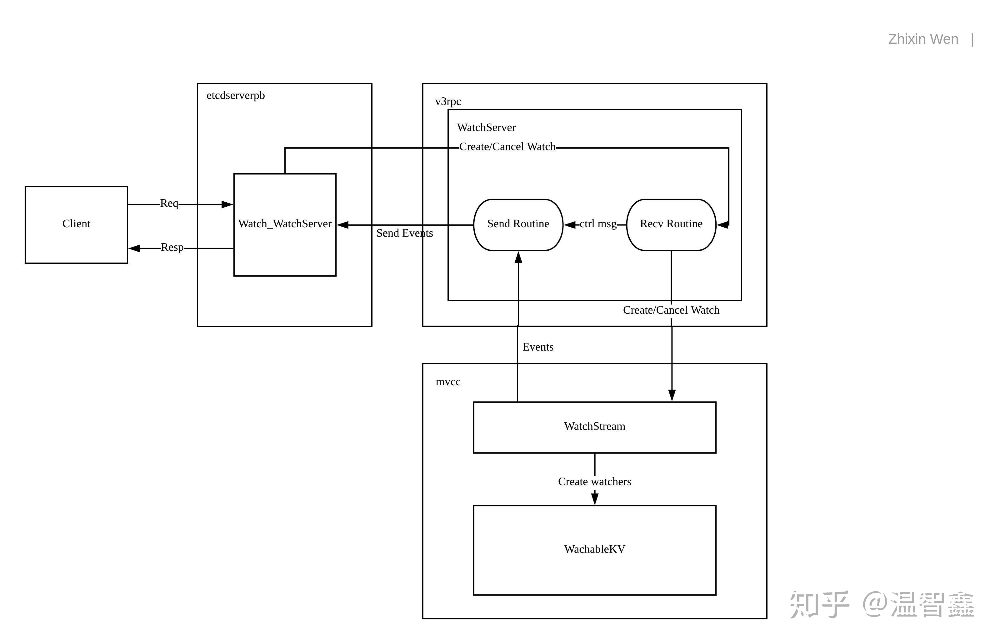

1 etcd简介
===
>- etcd is a distributed reliable key-value store for the most critical data of a distributed system, with a focus on being:
>- Simple: well-defined, user-facing API (gRPC)
>- Secure: automatic TLS with optional client cert authentication
>- Fast: benchmarked 10,000 writes/sec
>- Reliable: properly distributed using Raft
>- etcd包括用户管理、权限控制（key路径前缀实现)、集群操作、key操作(get set watcher)全部提供http API

2 etcd架构
===
2.1 etcd封装
---
>- 封装一层缓存层：map sync
>- 缓存->etcd server
>- watch后台执行，watch events自动更新map
>- watch封装支持回调函数
>

3 etcd watch实现
===
>- API： Watch和其它etcd v3 API一样，都是基于protobuf定义：
>
```
message WatchRequest {
  // request_union is a request to either create a new watcher or cancel an existing watcher.
  oneof request_union {
    WatchCreateRequest create_request = 1;
    WatchCancelRequest cancel_request = 2;
  }
}
message WatchResponse {
  ResponseHeader header = 1;
  // watch_id is the ID of the watcher that corresponds to the response.
  int64 watch_id = 2;
  // created is set to true if the response is for a create watch request.
  // The client should record the watch_id and expect to receive events for
  // the created watcher from the same stream.
  // All events sent to the created watcher will attach with the same watch_id.
  bool created = 3;
  // canceled is set to true if the response is for a cancel watch request.
  // No further events will be sent to the canceled watcher.
  bool canceled = 4;
  // compact_revision is set to the minimum index if a watcher tries to watch
  // at a compacted index.
  //
  // This happens when creating a watcher at a compacted revision or the watcher cannot
  // catch up with the progress of the key-value store.
  //
  // The client should treat the watcher as canceled and should not try to create any
  // watcher with the same start_revision again.
  int64 compact_revision  = 5;
  // cancel_reason indicates the reason for canceling the watcher.
  string cancel_reason = 6;
  repeated mvccpb.Event events = 11;
}
service Watch {
  // Watch watches for events happening or that have happened. Both input and output
  // are streams; the input stream is for creating and canceling watchers and the output
  // stream sends events. One watch RPC can watch on multiple key ranges, streaming events
  // for several watches at once. The entire event history can be watched starting from the
  // last compaction revision.
  rpc Watch(stream WatchRequest) returns (stream WatchResponse) {
      option (google.api.http) = {
        post: "/v3beta/watch"
        body: "*"
    };
  }
}
```

>- 相对应的HTTP API通过grpc-gateway自动生成的代码实现。其本质为将HTTP request翻译为grpc request，并由grpc client直接发给本地的grpc server。注意，因为grpc-gateway不支持real bidirectional stream, 所以需要使用websocket(#8237)做一层proxy:
>
```
httpmux.Handle(
        "/v3beta/",
        wsproxy.WebsocketProxy(  // grpc-websocket-proxy
            gwmux,
            wsproxy.WithRequestMutator(
                // Default to the POST method for streams
                func(incoming *http.Request, outgoing *http.Request) *http.Request {
                    outgoing.Method = "POST"
                    return outgoing
                },
            ),
        ),
    )
```
>- websocket使得client和server可以双向发送信息，其概念和用法可以参考这篇文章。
>
```
实现
API的实现由watchServer完成(etcdserver/api/v3rpc/watch.go)，其核心为WatchableKV。
// WatchableKV is a KV that can be watched.
type WatchableKV interface {
    KV
    Watchable
}
// Watchable is the interface that wraps the NewWatchStream function.
type Watchable interface {
    // NewWatchStream returns a WatchStream that can be used to
    // watch events happened or happening on the KV.
    NewWatchStream() WatchStream
}
```
这几个组件间的关系大致如图：

[etcd watch简介](https://zhuanlan.zhihu.com/p/41841562)

4 etcd client watch源码解析
===
>- etcd v3 client, watch实现为grpc stream
>
[etcd client v3 watch实现grpc http/2](https://www.jianshu.com/p/aedfb834614d)
>- etcd v2 client watch实现为http, 不断循环获取，cli忙轮询
>- watchoptions: afterindx从index>=xx时开始watch, recursive是否递归watch,否不watch子节点；
>
```
type KeysAPI interface {
	// Get retrieves a set of Nodes from etcd
	Get(ctx context.Context, key string, opts *GetOptions) (*Response, error)
	// Set assigns a new value to a Node identified by a given key. The caller
	// may define a set of conditions in the SetOptions. If SetOptions.Dir=true
	// then value is ignored.
	Set(ctx context.Context, key, value string, opts *SetOptions) (*Response, error)
	// Delete removes a Node identified by the given key, optionally destroying
	// all of its children as well. The caller may define a set of required
	// conditions in an DeleteOptions object.
	Delete(ctx context.Context, key string, opts *DeleteOptions) (*Response, error)
	// Create is an alias for Set w/ PrevExist=false
	Create(ctx context.Context, key, value string) (*Response, error)
	// CreateInOrder is used to atomically create in-order keys within the given directory.
	CreateInOrder(ctx context.Context, dir, value string, opts *CreateInOrderOptions) (*Response, error)
	// Update is an alias for Set w/ PrevExist=true
	Update(ctx context.Context, key, value string) (*Response, error)
	// Watcher builds a new Watcher targeted at a specific Node identified
	// by the given key. The Watcher may be configured at creation time
	// through a WatcherOptions object. The returned Watcher is designed
	// to emit events that happen to a Node, and optionally to its children.
	Watcher(key string, opts *WatcherOptions) Watcher
}
type WatcherOptions struct {
	// AfterIndex defines the index after-which the Watcher should
	// start emitting events. For example, if a value of 5 is
	// provided, the first event will have an index >= 6.
	//
	// Setting AfterIndex to 0 (default) means that the Watcher
	// should start watching for events starting at the current
	// index, whatever that may be.
	AfterIndex uint64
	// Recursive specifies whether or not the Watcher should emit
	// events that occur in children of the given keyspace. If set
	// to false (default), events will be limited to those that
	// occur for the exact key.
	Recursive bool
}
type Watcher interface {
	// Next blocks until an etcd event occurs, then returns a Response
	// representing that event. The behavior of Next depends on the
	// WatcherOptions used to construct the Watcher. Next is designed to
	// be called repeatedly, each time blocking until a subsequent event
	// is available.
	//
	// If the provided context is cancelled, Next will return a non-nil
	// error. Any other failures encountered while waiting for the next
	// event (connection issues, deserialization failures, etc) will
	// also result in a non-nil error.
	Next(context.Context) (*Response, error)
}
```
>- response结构体：
>
```
type Response struct {
	// Action is the name of the operation that occurred. Possible values
	// include get, set, delete, update, create, compareAndSwap,
	// compareAndDelete and expire.
	Action string `json:"action"`
	// Node represents the state of the relevant etcd Node.
	Node *Node `json:"node"`
	// PrevNode represents the previous state of the Node. PrevNode is non-nil
	// only if the Node existed before the action occurred and the action
	// caused a change to the Node.
	PrevNode *Node `json:"prevNode"`
	// Index holds the cluster-level index at the time the Response was generated.
	// This index is not tied to the Node(s) contained in this Response.
	Index uint64 `json:"-"`
	// ClusterID holds the cluster-level ID reported by the server.  This
	// should be different for different etcd clusters.
	ClusterID string `json:"-"`
}
type Node struct {
	// Key represents the unique location of this Node (e.g. "/foo/bar").
	Key string `json:"key"`
	// Dir reports whether node describes a directory.
	Dir bool `json:"dir,omitempty"`
	// Value is the current data stored on this Node. If this Node
	// is a directory, Value will be empty.
	Value string `json:"value"`
	// Nodes holds the children of this Node, only if this Node is a directory.
	// This slice of will be arbitrarily deep (children, grandchildren, great-
	// grandchildren, etc.) if a recursive Get or Watch request were made.
	Nodes Nodes `json:"nodes"`
	// CreatedIndex is the etcd index at-which this Node was created.
	CreatedIndex uint64 `json:"createdIndex"`
	// ModifiedIndex is the etcd index at-which this Node was last modified.
	ModifiedIndex uint64 `json:"modifiedIndex"`
	// Expiration is the server side expiration time of the key.
	Expiration *time.Time `json:"expiration,omitempty"`
	// TTL is the time to live of the key in second.
	TTL int64 `json:"ttl,omitempty"`
}
```

>- etcd 3.0 watch 的返回event:
>
```
type Event struct {
	// type is the kind of event. If type is a PUT, it indicates
	// new data has been stored to the key. If type is a DELETE,
	// it indicates the key was deleted.
	Type Event_EventType `protobuf:"varint,1,opt,name=type,proto3,enum=mvccpb.Event_EventType" json:"type,omitempty"`
	// kv holds the KeyValue for the event.
	// A PUT event contains current kv pair.
	// A PUT event with kv.Version=1 indicates the creation of a key.
	// A DELETE/EXPIRE event contains the deleted key with
	// its modification revision set to the revision of deletion.
	Kv *KeyValue `protobuf:"bytes,2,opt,name=kv,proto3" json:"kv,omitempty"`
	// prev_kv holds the key-value pair before the event happens.
	PrevKv               *KeyValue `protobuf:"bytes,3,opt,name=prev_kv,json=prevKv,proto3" json:"prev_kv,omitempty"`
	XXX_NoUnkeyedLiteral struct{}  `json:"-"`
	XXX_unrecognized     []byte    `json:"-"`
	XXX_sizecache        int32     `json:"-"`
}
```