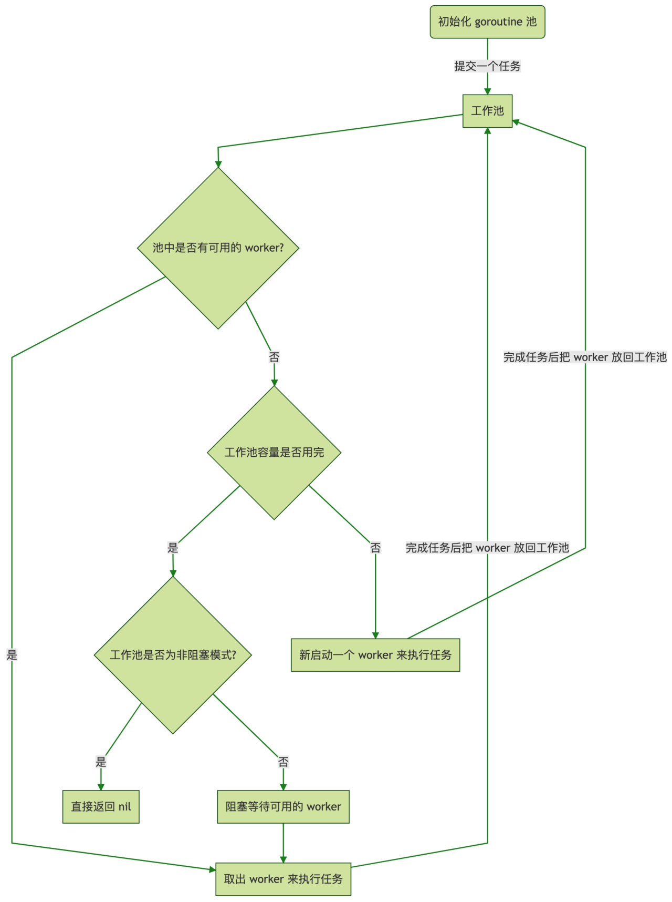
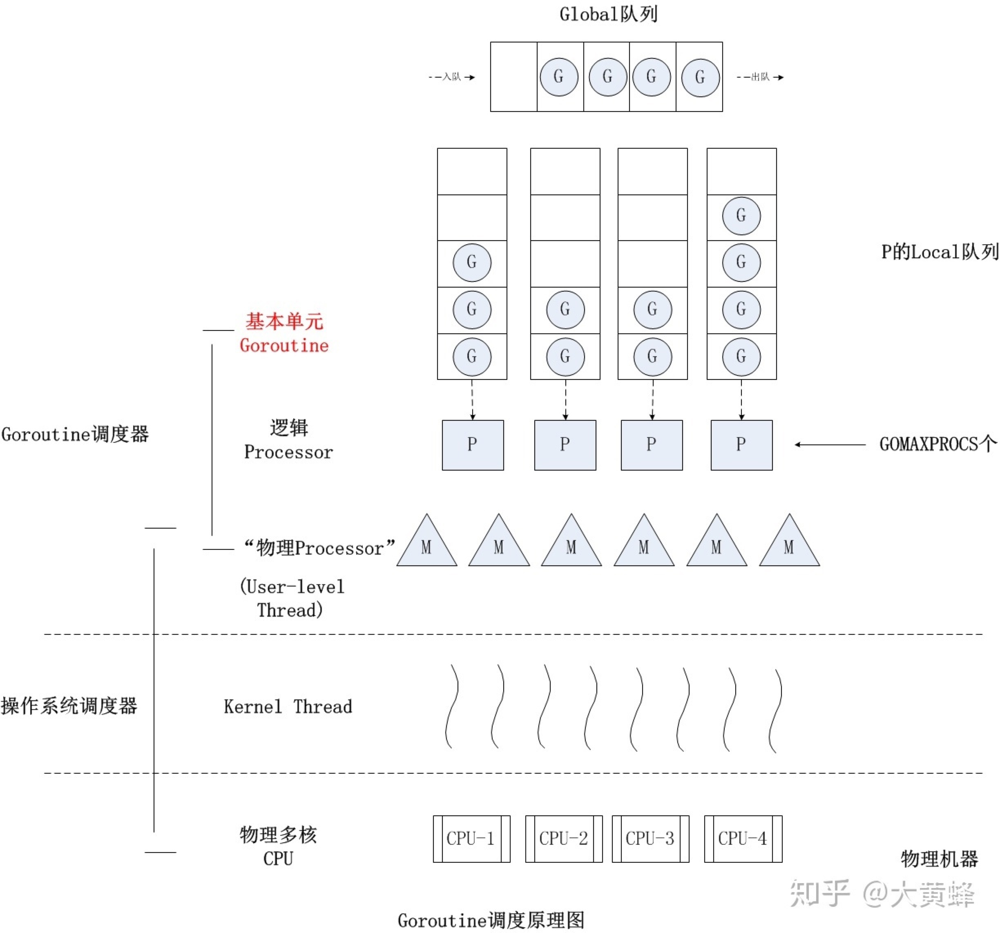
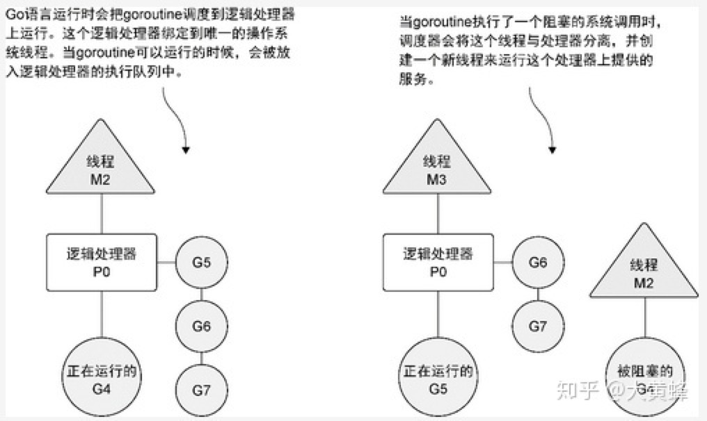
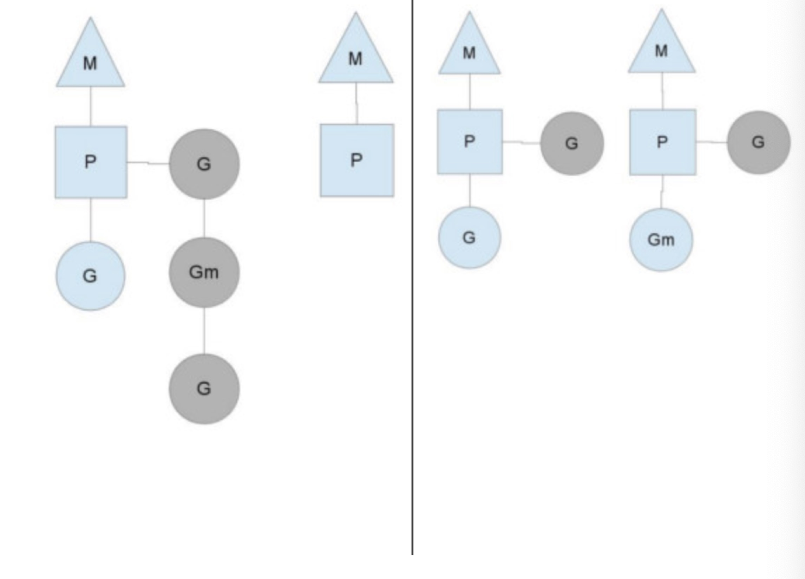
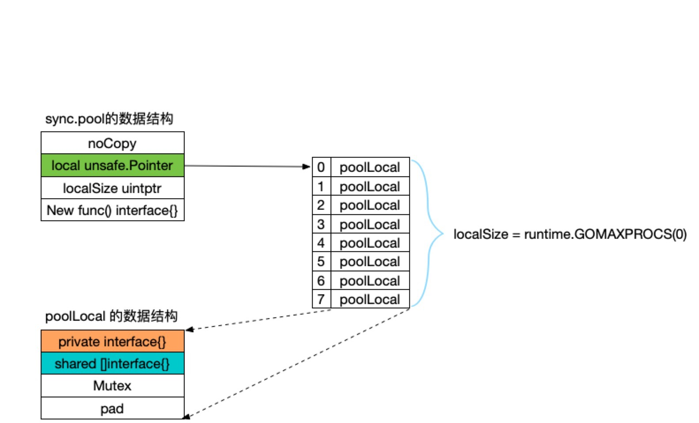

0 ***基础***
===
0.1 go闭包
---
>- 函数变量：函数被看作是第一类值，函数像变量一样，有类型、有值，其他普通变量能做的事它也可以。
>
```
// 定义函数类型：sumT
type sumT func(a, b int) (int,bool)
	res1 := make([]sumT, 1)
	res1[0] = func(a, b int) (int,bool) {
		return a + b,false
	}
	sum, ifNot := res1[0](1,1)
	fmt.Println(sum, ifNot)
```
>- 闭包是由函数和与其相关的引用环境组合而成的实体。
>- 闭包对参数的引用为引用非值copy;变量地址一致
>	
```
var funcSlice []func()
for i := 0; i < 3; i++ {
//闭包：对i为引用，i的最终值为3
	funcSlice = append(funcSlice, func() {
		println(i)
	})
}
for j := 0; j < 3; j++ {
	funcSlice[j]() // 3
}
```
>- 避免值引用的方式：
>
```
1 新定义变量：同名不同名均可，作用域不通，自动覆盖
2 匿名函数传参数:
for i:=0;i<2;i++{
// i在外层匿名函数中为值copy,即产生新的变量
func(i int){
// 对i为引用，引用不通的变量i
funcSlice = append(funcSlice, func() {
		println(i)
	})
}(i)
}
```
[go闭包](https://juejin.im/post/5c850d035188257ec629e73e)

0.2 slice array
---
>- array的类型包含type&len,arry类似于可以index的struct
>- 新定义的array会自动初始化为零值
>- slice可以扩展，ptr len cap
>- slice引用底层array， s[m:n]指向array的第m+1个元素；
>- slice切片依然引用底层array，对new slice元素的修改会修改底层array
>- slice可以新建make([]int, len, cap)，新建的slice指向一个新的底层array，通过copy(dst, src)新建的slice拿到感兴趣的数据，old big array若无新的引用会gc回收释放内存;  

[go slice vs array](https://blog.golang.org/go-slices-usage-and-internals)

0.3 go签名算法(token)
---
```
// jwt为a.b.c其中a为加密算法，b为要传递的部分内容，ab均base64编码，c为利用密码及a中加密算法生成的密文；
import (
jwt "github.com/dgrijalva/jwt-go"
"time"
)
// CreateJwtToken _
func CreateJwtToken(user, secret string) (string, error) {
	claims := jwt.StandardClaims{
		IssuedAt: time.Now().Unix(),
		Issuer:   user,
	}
	tk := jwt.NewWithClaims(jwt.SigningMethodHS256, claims)
	return tk.SignedString([]byte(secret))
}

```
[基于HMAC-SHA256的base64加密](https://blog.csdn.net/js_sky/article/details/49024959)

0.4 golang序列化反序列化(json protobuff)
---
0.4.1 序列化选型
---
>- 序列化选型建议：1 IDL(interface define language) 2 序列化反序列化效率，时间消耗 3 空间消耗;4 兼容性；
>
```
1、对于公司间的系统调用，如果性能要求在100ms以上的服务，基于XML的SOAP协议是一个值得考虑的方案。
2、基于Web browser的Ajax，以及Mobile app与服务端之间的通讯，JSON协议是首选。对于性能要求不太高，或者以动态类型语言为主，或者传输数据载荷很小的的运用场景，JSON也是非常不错的选择。
3、对于调试环境比较恶劣的场景，采用JSON或XML能够极大的提高调试效率，降低系统开发成本。
4、当对性能和简洁性有极高要求的场景，Protobuf，Thrift，Avro之间具有一定的竞争关系。
5、对于T级别的数据的持久化应用场景，Protobuf和Avro是首要选择。如果持久化后的数据存储在Hadoop子项目里，Avro会是更好的选择。
6、由于Avro的设计理念偏向于动态类型语言，对于动态语言为主的应用场景，Avro是更好的选择。
7、对于持久层非Hadoop项目，以静态类型语言为主的应用场景，Protobuf会更符合静态类型语言工程师的开发习惯。
8、如果需要提供一个完整的RPC解决方案，Thrift是一个好的选择。
9、如果序列化之后需要支持不同的传输层协议，或者需要跨防火墙访问的高性能场景，Protobuf可以优先考虑。
```
[序列化选型建议](https://tech.meituan.com/2015/02/26/serialization-vs-deserialization.html)

0.4.2 protobuff
---
>- 变长变量编码，小端规则，8bit中首位代表是否结束，1代表后续还有，0代表已结束；14.3%的冗余（每8个bit有1个用于编码规则）
>- varint编码为大端模式
>- Non-varint numeric types are simple – double and fixed64 have wire type 1, which tells the parser to expect a fixed 64-bit lump of data; similarly float and fixed32 have wire type 5, which tells it to expect 32 bits. In both cases the values are stored in little-endian byte order.
>- 网络一般为大端模式（高位存放在低地址中）
>- arp架构一般为小端模式（低位存放在低地址中）
[protobuf协议](https://blog.csdn.net/zhaozheng7758/article/details/6749000)  
[protobuf协议](https://blog.csdn.net/erlib/article/details/46345111)
[protobuf官网格式](https://developers.google.com/protocol-buffers/docs/proto3#default)
[protobuf编码格式](https://developers.google.com/protocol-buffers/docs/encoding.html#structure)
[数据大端模式小端模式](https://blog.csdn.net/ce123_zhouwei/article/details/6971544)
[protobuf官方编码协议](https://developers.google.com/protocol-buffers/docs/encoding.html#structure)

0.4.3 json解析
---
[json解析](https://blog.csdn.net/zxy_666/article/details/80173288)

0.5 golang defer, return原理剖析
---
>- defer执行方式类似栈调用
>- return不是原子操作，先赋值+执行defer+退出
>
```
return xxx会被改写成:
返回值 = xxx
调用defer函数
空的return
```

0.6 go深入解析
---
[参考文档](https://tiancaiamao.gitbooks.io/go-internals/content/zh/02.3.html)

0.7 golang snowflake的生成
---
>- 64位，首位不用，41位为毫秒级时间戳，10位为机器ID，12位为自增id
>
[snowflake生成](https://segmentfault.com/a/1190000014767902)

0.8 go限流
---
[go限流的实现](https://blog.csdn.net/micl200110041/article/details/82013032)
[go限流rate/limit](https://juejin.im/post/5c6eb44d518825760d1ed8f8)


1 ***go方法***
===

>- 方法分为方法类型及方法值
>- 方法类型：方法接收器的类型+方法名
>- 方法值：方法接收器+方法名
>- 方法类型及方法值均可以直接作为函数调用，方法类型函数调用时第一个参数为接收器类型，类型不会自动转换
>- 方法值直接定义了接收器，接收器类型可自动转换，方法接收器的类型的实质不可以为指针或者interface；字面量取不到对应地址  

```
package main

import (
	"fmt"
)
type test struct{
a int
b int
}

func main() {
	fmt.Println("Hello, playground")
	b := test{2,2}
	b.show("直接调用")
	// 1 方法表达式
	c := test.show // 方法表达式
	c(b,"方法表达式调用") // 调用方法表达式需要指定接收器
	// 2 方法的值
	d := b.show  // 或者(&b).show 方法值调用自动指定接收器，类型可自动转换
	d("方法值调用方式")
	
	// 方法指针
	e := (*test).show1 // 方法表达式 为指针
	e(&b, "方法表达式调用") // 接收器为指针，不会自动转换
	
	
	f := (&b).show1  // 或者b.show1
	f("方法值调用")
	
}

func (a test) show(b string){
fmt.Printf("%s: %+v\n",b, a)
}
// 不可重名
func (a *test) show1(b string){
a.a=1
fmt.Printf("%s: pointer %+v\n",b, *a)
}
```

2 go接口
===

>- 接口定义了规约
>- 接口定义方法签名，interface{}类型为interface{}类型只是任意类型均实现了该接口，会隐士转换类型
>- 接口值包括type&&value
>- 接口为nil为接口值的type&&value均为nil
>- 接口值的type类型必须实现接口对应的方法；go语言为静态语言，编译时无法知道接口的动态类型，？？？？接口的编译
>- 接口初始化时会判定相应的初始化时是否实现了接口类型
>- 接口的实现为指针时，接口初始化值不可以为变量必须为指针(go传参数为值copy类型)
>- 接口的实现为值时，接口初始化可以为指针也可以为变量，指针可以隐式解引获取对应的底层变量
>- [***接口详细介绍及底层实现***](https://draveness.me/golang/basic/golang-interface.html)
>- 接口隐式实现：实现即接口
>- 看代码：flag及sort的实现
>- 示例：

>>
```
package main
import (
	"fmt"
)
type testInterface interface{
set(a string)
show()
}
type testHello struct{
info string
}
func (a *testHello) set(b string){
a.info=b
}
func (a *testHello) show(){
fmt.Println("here is: ", a.info)
}
func main() {
	var hello testHello	
	hello.info="123"
	var testType testInterface = &hello	//接口类型为testInterface,接口值为动态变量的类型及值，接口的值分为type&&value					//接口值： 1 type=*testHello 2 value=&hello；接口值中type必须实现接口定义的方法
						// testInterface=hello错误
					   	//cannot use hello (type testHello) as type testInterface in assignment:
					  	//testHello does not implement testInterface (set method has pointer receiver)
	testType.set("hello world")
	testType.show()
	fmt.Printf("%T",hello)
}
```
```
package main
import (
	"fmt"
)
type testInterface interface{
show()
}
type testHello struct{
info string
}
func (a testHello) show(){
fmt.Println("here is: ", a.info)
}
func main() {
	var hello testHello	
	hello.info="123"
	var testType testInterface = &hello	//接收类型为非指针类型，interface值的type可以为指针也可以为非指针
	testType.show()
	fmt.Printf("%T",hello)
}
```

2.1 反射
---

```
// resRaw为json byte,{"code": , "data": , "message": }
// 将[]byte解析为type res struct{Code int, Message string, Data interface{}}, json tag分别为code message data
// 兼容data为空及存在值时返回类型不同，data单独解析，首先判空
// resType struct{Code int, Message string, Data []byte}
func parser(resRaw []byte, res interface{}) error {
	if resRaw == nil {
		return errors.New("empty raw byte")
	}
	var resOri resType
	if err := json.Unmarshal(resRaw, &resOri); err != nil {
		return err
	}
	// 获取res的类型及值，解析通常传指针 map []slice
	t := reflect.TypeOf(res)
	v := reflect.ValueOf(res)
	// 指针处理 获取实际类型的type及值
	if t.Kind() == reflect.Ptr {
		t = t.Elem()
		v = v.Elem()
	}
	// 结构体
	if t.Kind() != reflect.Struct {
		log.Println("Check type error not Struct")
		return nil
	}
	members := t.NumField()
	// 处理方式1 fieldByName
	//v.FieldByName("Code").Set(reflect.ValueOf(resOri.Code))
	//v.FieldByName("Message").Set(reflect.ValueOf(resOri.Message))
	// 按照json Tag解析字串
	for i := 0; i < members; i++ {
	// 获取field tag json tag
		switch t.Field(i).Tag.Get("json") {
		case "data":
			if err := parseBody(resOri.Data, v.Field(i).Interface()); err != nil {
				return err
			}
		case "code":
			v.Field(i).Set(reflect.ValueOf(resOri.Code))
		case "message":
			v.Field(i).Set(reflect.ValueOf(resOri.Message))
		}
	}
	return err

}
```

3 Go工具
===

3.1 go test
---

3.2 go mock (单测数据模拟)
---

***Links***  
[ref-1](https://www.jianshu.com/p/598a11bbdafb)
[github gomock](https://github.com/golang/mock)

4 Go内存管理
===
见go_mem.md

5 Go并发
===
5.1 Go channel
---
>- 类似消息队列
>- 用锁实现
>- 容量固定
>- 无持久化机制
>- 类似带同步一致性原语生产消费模式
>- sendq为双向链表
>- recvq为双向链表
>- recv:
>
```
// recv processes a receive operation on a full channel c.
// There are 2 parts:
// 1) The value sent by the sender sg is put into the channel
//    and the sender is woken up to go on its merry way.
// 2) The value received by the receiver (the current G) is
//    written to ep.
// For synchronous channels, both values are the same.
// For asynchronous channels, the receiver gets its data from
// the channel buffer and the sender's data is put in the
// channel buffer.
// Channel c must be full and locked. recv unlocks c with unlockf.
// sg must already be dequeued from c.
// A non-nil ep must point to the heap or the caller's stack.
```
>- send:
>
```
// send processes a send operation on an empty channel c.
// The value ep sent by the sender is copied to the receiver sg.
// The receiver is then woken up to go on its merry way.
// Channel c must be empty and locked.  send unlocks c with unlockf.
// sg must already be dequeued from c.
// ep must be non-nil and point to the heap or the caller's stack.
```
>
```
// This file contains the implementation of Go channels.
// Invariants:
//  At least one of c.sendq and c.recvq is empty,
//  except for the case of an unbuffered channel with a single goroutine
//  blocked on it for both sending and receiving using a select statement,
//  in which case the length of c.sendq and c.recvq is limited only by the
//  size of the select statement.
//
// For buffered channels, also:
//  c.qcount > 0 implies that c.recvq is empty.
//  c.qcount < c.dataqsiz implies that c.sendq is empty.
// chan结构体包括存放数据的指针地址(循环数组类似，有缓冲chan)
// chan中包括待发送数据的goroutine队列
// chan中包括待接受数据的goroutine队列
// 向chan发送数据时，首先判定是否有wait队列，若有deque出来，直接将发送数据传递到等待数据队列的队首goroutine；若recvq无等待，若已有数据<size则直接写入数据，否则入度sendq并堵塞发送goroutine
// 无缓冲chan中发送数据队列跟等待数据队列必须同时存在数值（队列中goroutine堵塞）
// 关闭chan，遍历sendq令其panic
// 从chan接收数据，若chan已关闭赋予零值，若无缓冲chan直接从sendq中取g内存copy值，否则接受数据goroutine入队；对带缓冲chan，接收数据时若chan中无数据（也不可能有sendq)且chan未关闭，则初始化零值，获取不到数据；若sendq中有数据则从sendq中取；否则若chan中有数据则从chan中数据取
// 非堵塞状态会直接返回不会排队堵塞
	// Fast path: check for failed non-blocking operation without acquiring the lock.
	//
	// After observing that the channel is not ready for receiving, we observe that the
	// channel is not closed. Each of these observations is a single word-sized read
	// (first c.sendq.first or c.qcount, and second c.closed).
	// Because a channel cannot be reopened, the later observation of the channel
	// being not closed implies that it was also not closed at the moment of the
	// first observation. We behave as if we observed the channel at that moment
	// and report that the receive cannot proceed.
	//
	// The order of operations is important here: reversing the operations can lead to
	// incorrect behavior when racing with a close.
type hchan struct {
	qcount   uint           // total data in the queue
	dataqsiz uint           // size of the circular queue
	buf      unsafe.Pointer // points to an array of dataqsiz elements
	elemsize uint16
	closed   uint32
	elemtype *_type // element type
	sendx    uint   // send index
	recvx    uint   // receive index
	recvq    waitq  // list of recv waiters
	sendq    waitq  // list of send waiters
	// lock protects all fields in hchan, as well as several
	// fields in sudogs blocked on this channel.
	//
	// Do not change another G's status while holding this lock
	// (in particular, do not ready a G), as this can deadlock
	// with stack shrinking.
	lock mutex
}
type waitq struct {
	first *sudog
	last  *sudog
}
// sudog represents a g in a wait list, such as for sending/receiving
// on a channel.
//
// sudog is necessary because the g ↔ synchronization object relation
// is many-to-many. A g can be on many wait lists, so there may be
// many sudogs for one g; and many gs may be waiting on the same
// synchronization object, so there may be many sudogs for one object.
//
// sudogs are allocated from a special pool. Use acquireSudog and
// releaseSudog to allocate and free them.
type sudog struct {
	// The following fields are protected by the hchan.lock of the
	// channel this sudog is blocking on. shrinkstack depends on
	// this for sudogs involved in channel ops.
	g *g
	// isSelect indicates g is participating in a select, so
	// g.selectDone must be CAS'd to win the wake-up race.
	isSelect bool
	next     *sudog
	prev     *sudog
	elem     unsafe.Pointer // data element (may point to stack)
	// The following fields are never accessed concurrently.
	// For channels, waitlink is only accessed by g.
	// For semaphores, all fields (including the ones above)
	// are only accessed when holding a semaRoot lock.
	acquiretime int64
	releasetime int64
	ticket      uint32
	parent      *sudog // semaRoot binary tree
	waitlink    *sudog // g.waiting list or semaRoot
	waittail    *sudog // semaRoot
	c           *hchan // channel
}
```
[Go channel实现stackoverflow](https://stackoverflow.com/questions/19621149/how-are-go-channels-implemented)
[youtube讲解go channel](https://www.youtube.com/watch?reload=9&v=KBZlN0izeiY&feature=youtu.be)
[go channel讲解](https://medium.com/a-journey-with-go/go-buffered-and-unbuffered-channels-29a107c00268)
>- 非堵塞chan:
>
```
在看 chanrecv()方法 时，发现了一个 block 参数，代表操作是否阻塞。一般情况下，channel 都是阻塞的（不考虑buffer），那什么时候非阻塞呢？
第一个想到的就是 select, 在写了default case的时候，其他的channel是非阻塞的。
还有一个可能不常用，就是 channel 的反射 value, 可以是非阻塞的，这个方法是public的，我们先看下简单的。
```
[select的实现](https://segmentfault.com/a/1190000010813886)


5.2 调度模型:$GODEBUG=schedtrace=1000 查看go scheduler
---
[线程调度模型](https://blog.csdn.net/gatieme/article/details/51892437)

>- 两级线程模型(混合线程模型：用户线程:内核线程实现KSE=n:m)，即用户调度器实现用户线程到KSE的“调度”，内核调度器实现KSE到CPU上的调度。
>- Go运行时系统通过构造G-P-M对象模型实现了一套用户态的并发调度系统，可以自己管理和调度自己的并发任务，所以可以说Go语言原生支持并发。自己实现的调度器负责将并发任务分配到不同的内核线程上运行，然后内核调度器接管内核线程在CPU上的执行与调度。
>- 抢占式调度：如果某个G没有进行system call调用、没有进行I/O操作、没有阻塞在一个channel操作上，那么m是通过抢占式调度让G停下来并调度下一个runnable G的
除非极端的无限循环或死循环，否则只要G调用函数，Go runtime就有抢占G的机会（每个函数入口）。Go程序启动时，runtime会去启动一个名为sysmon的m(一般称为监控线程)，该m无需绑定p即可运行，该m在整个Go程序的运行过程中至关重要：
>
>- G: 表示goroutine，存储了goroutine的执行stack信息、goroutine状态以及goroutine的任务函数等；另外G对象是可以重用的。
>- P: 表示逻辑processor，P的数量决定了系统内最大可并行的G的数量（前提：系统的物理cpu核数>=P的数量）；P的最大作用还是其拥有的各种G对象队列、链表、一些cache和状态。
>- M: M代表着真正的执行计算资源。在绑定有效的p后，进入schedule循环；而schedule循环的机制大致是从各种队列、p的本地队列中获取G，切换到G的执行栈上并执行G的函数，调用goexit做清理工作并回到m，如此反复。M并不保留G状态，这是G可以跨M调度的基础。
>- G抢占式调用：若go中无函数调用则无法被抢占
>
```
和操作系统按时间片调度线程不同，Go并没有时间片的概念。如果某个G没有进行system call调用、没有进行I/O操作、没有阻塞在一个channel操作上，那么m是如何让G停下来并调度下一个runnable G的呢？答案是：G是被抢占调度的。
前面说过，除非极端的无限循环或死循环，否则只要G调用函数，Go runtime就有抢占G的机会。Go程序启动时，runtime会去启动一个名为sysmon的m(一般称为监控线程)，该m无需绑定p即可运行，该m在整个Go程序的运行过程中至关重要：
sysmon每20us~10ms启动一次，按照《Go语言学习笔记》中的总结，sysmon主要完成如下工作：
释放闲置超过5分钟的span物理内存；
如果超过2分钟没有垃圾回收，强制执行；
将长时间未处理的netpoll结果添加到任务队列；
向长时间运行的G任务发出抢占调度；
收回因syscall长时间阻塞的P；
```
>- channel阻塞或network I/O情况下的调度
如果G被阻塞在某个channel操作或network I/O操作上时，G会被放置到某个wait队列中，而M会尝试运行下一个runnable的G；如果此时没有runnable的G供m运行，那么m将解绑P，并进入sleep状态。当I/O available或channel操作完成，在wait队列中的G会被唤醒，标记为runnable，放入到某P的队列中，绑定一个M继续执行。
>- system call阻塞情况下的调度
如果G被阻塞在某个system call操作上，那么不光G会阻塞，执行该G的M也会解绑P(实质是被sysmon抢走了)，与G一起进入sleep状态。如果此时有idle的M，则P与其绑定继续执行其他G；如果没有idle M，但仍然有其他G要去执行，那么就会创建一个新M。
当阻塞在syscall上的G完成syscall调用后，G会去尝试获取一个可用的P，如果没有可用的P，那么G会被标记为runnable，之前的那个sleep的M将再次进入sleep。





>- Another way that the steady state of the system can change is when a context runs out of goroutines to schedule to. This can happen if the amount of work on the contexts' runqueues is unbalanced. This can cause a context to end up exhausting it's runqueue while there is still work to be done in the system. To keep running Go code, a context can take goroutines out of the global runqueue but if there are no goroutines in it, it'll have to get them from somewhere else.
>

[go pool的实现](https://taohuawu.club/high-performance-implementation-of-goroutine-pool)

5.2.1 MG模型
---
M代表OS线程
M创建完G必须保证另外一个M可以执行G(不是所有M都busy状态)
缺陷：

1. sched全局锁，中心化共享数据多（需要注意互斥）goroutine相关所有操作（创建、完成、重新调度等）必须获取锁
2. 工作线程不停在runnable的goroutine中流转(类似时间片)，导致时延及成本增加；每个M必须能够执行任意的G,尤其是M刚生成的G(减少上下文切换);Goroutine (G) hand-off (G.nextg).
3. 大量资源占用，弱数据局部性(M保存了大量不需要运行的go code)：M线程具有内存缓存及栈空间，其应该用于running的go code，M在系统调用中阻塞不需要mcache；M的running go code与所有M's比值高达1:100;Per-M memory cache (M.mcache). Memory cache and other caches (stack alloc) are associated with all M's, while they need to be associated only with M's running Go code (an M blocked inside of syscall does not need mcache). A ratio between M's running Go code and all M's can be as high as 1:100. This leads to excessive resource consumption (each MCache can suck up up to 2M) and poor data locality.
4. 过多的线程阻塞太/运行态切换：工作线程系统调用的时候频繁堵塞非堵塞，增加成本；

5.2.2 MPG模型: 将整个调度过程细粒度化提高性能
---
The goal is to split the whole thing into minimal parts that can be independently reviewed and submitted.
work-stealing scheduler on top of processor
steal失败从全局idle G list获取G
GOMAXPROCS P’s 个P
G包含栈、context等，上下文切换为用户态
系统线程包括的东西较多，抽象出两线程模型，P层 G层占用较少资源，且M量的变化保证p不空闲游荡提升资源利用率；

1. 一些sched的变量，去中心化给到P
2. 一些变量转移至p中管理，eg 运行go code需要的变量
所有的p在array中，GOMAXPROCS（P）数量的变化会stop the world扩展数组
3. 增加P（processor）， P代表需要执行go code的资源
4. M阻塞时自旋，避免被操作系统切换阻塞太非堵塞太，尽量多占用cpu，造成cpu浪费
5. M开始执行go code时，从p数组中pop出p, M执行完go code将P入队， M只有在执行go code时必须有关联P；When an M is willing to start executing Go code, it must pop a P form the list. When an M ends executing Go code, it pushes the P to the list. So, when M executes Go code, it necessary has an associated P. This mechanism replaces sched.atomic (mcpu/mcpumax).
6. M进入系统调用时，保证存在另外一个M可以执行go code: There are two options, we can either promptly block and unblock M’s, or employ some spinning. 自旋在性能与cpu资源浪费之间存在矛盾；方案最终选择自旋：use spinning and do burn CPU cycles
7. M idle时spin，保证新建G时可以运行G（除非所有M busy）,提升新能：Spinning is two-level（M等待关联P, M+P寻找runnable G）: (1) an idle M with an associated P spins looking for new G’s, (2) an M w/o an associated P spins waiting for available P’s. There are at most GOMAXPROCS spinning M’s (both (1) and (2)). Idle M’s of type (1) do not block while there are idle M’s of type (2).
When a new G is spawned, or M enters syscall, or M transitions from idle to busy, it ensures that there is at least 1 spinning M (or all P’s are busy). This ensures that there are no runnable G’s that can be otherwise running; and avoids excessive M blocking/unblocking at the same time.
Spinning is mostly passive (yield to OS, sched_yield()), but may include a little bit of active spinning (loop burnging CPU) (requires investigation and tuning).
9. P空闲，M不足，则新建M保证P下可用G可以运行；
10. 上下文切换为用户级
11. 新建G，排队至P的runqueue中
12. P从自己的runqueue中pop G执行
13. M系统调用堵塞，M系统调用堵塞则系统线程级堵塞；P迁移至新的M（新建M或者从缓存池取）
14. P无可用G从global获取或者从其他P偷取
15. P定期从global中获取G，避免全局G饥饿


调度：
1 新建可用G或者出现runnable G时，入队P的runnable list;
2 P执行完一个G，首先从自己的list pop G，若为空则选择P， steal half


```
struct P
{
Lock;
G *gfree; // freelist, moved from sched
G *ghead; // runnable, moved from sched
G *gtail;
MCache *mcache; // moved from M
FixAlloc *stackalloc; // moved from M
uint64 ncgocall;
GCStats gcstats;
// etc
...
};

P *allp; // [GOMAXPROCS]

There is also a lock-free list of idle P’s:

P *idlep; // lock-free list

```

```
The goal is to split the whole thing into minimal parts that can be independently reviewed and submitted.
1. Introduce the P struct (empty for now); implement allp/idlep containers (idlep is mutex-protected for starters); associate a P with M running Go code. Global mutex and atomic state is still preserved.
2. Move G freelist to P.
3. Move mcache to P.
4. Move stackalloc to P.
5. Move ncgocall/gcstats to P.
6. Decentralize run queue, implement work-stealing. Eliminate G hand off. Still under global mutex.
7. Remove global mutex, implement distributed termination detection, LockOSThread.
8. Implement spinning instead of prompt blocking/unblocking.
The plan may turn out to not work, there are a lot of unexplored details.

```

```
Potential Further Improvements
LIFO提高局部性避免饥饿保证一定公平性
提升P的局部性，p运行曾经运行过的M
限制M数量
1. Try out LIFO scheduling, this will improve locality. However, it still must provide some degree of fairness and gracefully handle yielding goroutines.
2. Do not allocate G and stack until the goroutine first runs. For a newly created goroutine we need just callerpc, fn, narg, nret and args, that is, about 6 words. This will allow to create a lot of running-to-completion goroutines with significantly lower memory overhead.
4. Better locality of G-to-P. Try to enqueue an unblocked G to a P on which it was last running.
5. Better locality of P-to-M. Try to execute P on the same M it was last running.
6. Throttling of M creation. The scheduler can be easily forced to create thousands of M's per second until OS refuses to create more threads. M’s must be created promptly up to k*GOMAXPROCS, after that new M’s may added by a timer.

```
[MG模型变更MPG模型官方文档](https://docs.google.com/document/d/1TTj4T2JO42uD5ID9e89oa0sLKhJYD0Y_kqxDv3I3XMw/edit#)

[go并发模型掘金](https://juejin.im/entry/59dc7bff6fb9a04500020217)
[go调度&channel](https://www.cnblogs.com/wdliu/p/9272220.html)
[go routine调度器](https://tonybai.com/2017/06/23/an-intro-about-goroutine-scheduler/)
[go官方post MPG模型](http://morsmachine.dk/go-scheduler)
[go调度模型源码剖析](https://segmentfault.com/a/1190000020254937)


5.2.3 测试go routine调度
---
>- M+G运行中的G可以新建G，某种意义G是由M创建
>- 单个P，G的队列顺序（FIFO），G的执行先后顺序？M+G堵塞（系统调用堵塞 channel堵塞？）是否新建M？回复堵塞G放置在全局队列？时间片？是否有抢占式？
>- M+G只可能由系统调用文件读取堵塞，若G通过channel或者网络（netpoll)堵塞，则会在相应的队列中（eg chan队列， epoll fd队列）,当G可用时才会被放置在P队列中；

5.2.4 源码剖析
---
proc.go

6 GO网络
===

>- 网络会话五元组：传输层协议、双方IP、双方端口port(16bit)
>- server端一个公知端口:eg 80
>- client端不通的连接端口不同操作系统分配，存在最大端口数限制(16bit，其中部分为预留公知端口)
>- server端可以处理的连接数与server本身的内存、CPU等相关：每个tcp连接需要分配缓存(读写);可以打开的最大文件数限制
>- 连接数、并发量、吞吐；大数目长连接

6.1 goroutine-per-connection模式
---
内存开销大
>- go对网络的处理为server端每accept一个连接，即开启一个goroutine，每个goroutine大小最小可以为2k
>- goroutine-per-connection模式对于百万连接:如果在每个goroutine中在分配byte buffer用以从连接中读写数据，几十G的内存轻轻松松就分配出去了。
>- goroutine从connection中获取数据需要分配buffer储存数据

6.2 epoll模式
---
减少goroutine使用&减少buffer占用，考虑并发及吞吐

>- 一个goroutine代替100wgoroutine&&使用ws减少buffer占用
>
>>- 百万连接但是并发量很小的场景，比如消息推送、页游等场景，这种实现应该是没有问题的
>>- 并发量很大，延迟要求比较低的场景，这种实现可能会存在问题
[百万连接吞吐](https://colobu.com/2019/02/23/1m-go-tcp-connection/)
[epoll go package](https://github.com/tidwall/evio)
[epool源码 go](https://github.com/mailru/easygo)
[websocket源码](https://github.com/gorilla/websocket)


7 GO编程之道
===
[go coding in go way](https://tonybai.com/2017/04/20/go-coding-in-go-way/?hmsr=toutiao.io&utm_medium=toutiao.io&utm_source=toutiao.io)

8 Go调试&性能调优
===
>- pprof&&go test
8.1 pprof程序性能测试，内存使用，cpu耗时
---
>- CPU Profiling：CPU 分析，按照一定的频率采集所监听的应用程序 CPU（含寄存器）的使用情况，可确定应用程序在主动消耗 CPU 周期时花费时间的位置
>- Memory Profiling：内存分析，在应用程序进行堆分配时记录堆栈跟踪，用于监视当前和历史内存使用情况，以及检查内存泄漏
>- Block Profiling：阻塞分析，记录 goroutine 阻塞等待同步（包括定时器通道）的位置
>- Mutex Profiling：互斥锁分析，报告互斥锁的竞争情况
>cpu（CPU Profiling）: $HOST/debug/pprof/profile，默认进行 30s 的 CPU Profiling，得到一个分析用的 profile 文件
>- block（Block Profiling）：$HOST/debug/pprof/block，查看导致阻塞同步的堆栈跟踪
>- goroutine：$HOST/debug/pprof/goroutine，查看当前所有运行的 goroutines 堆栈跟踪
>- heap（Memory Profiling）: $HOST/debug/pprof/heap，查看活动对象的内存分配情况
>- mutex（Mutex Profiling）：$HOST/debug/pprof/mutex，查看导致互斥锁的竞争持有者的堆栈跟踪
>- threadcreate：$HOST/debug/pprof/threadcreate，查看创建新OS线程的堆栈跟踪
8.1.1 数据收集
---
>- http服务(非web框架)用默认mutx, 只需要import _ “net/http/pprof”即可可到6060/debug/pprof/heap等即可
>- gin服务：https://github.com/gin-contrib/pprof
>- 非网络服务，import _ “net/http/pprof”, 并使用http.ListenAndServer(add, nil),handler为nil即可, addr端口可以为6060或者其他端口，
通过addr: port/debug/pprof/profile即可收集cpu信息
>- web框架：在没有使用任何框架的前提下，在程序中导入import _ "net/http/pprof"，然后同样监听本地的一个端口http.ListenAndServe("localhost:6060", nil），即可，启动程序，你可以访问localhost:6060/debug/pprof监控页面
>- golang内部包runtime/pprof
>- 可以直接import _ "net/http/pprof";注册路由为debug/pprof/**
>- 无http服务，可以自行启动http服务，端口6060
>- 
>- gin使用pprof
>
```
gin
import (
github.com/gin-contrib/pprof
)
func main() {
   router := gin.Default()
   // 默认路由：debug/pprof
   pprof.Register(router)
   router.Run(":8080")
}
func main() {
   router := gin.Default()
   // 路由前缀变更为debug/pprof/test;路由组
   pprof.Register(router, "/debug/pprof/test")
   router.Run(":8080")
}
```
>- 交互式终端收集：go tool pprof http://localhost:6060/debug/pprof/profile\?seconds\=60
8.1.2 数据展示
---
>- http://localhost:6060/debug/pprof/可以查看到相关数据
>- go自带分析工具:go tool pprof http://localhost:6060/debug/pprof/heap(端口与server启用端口相关)
>
```
// 获取相应数据并保存Fetching profile over HTTP from http://localhost:6060/debug/pprof/heap；Saved profile in /Users/yjj/pprof/pprof.alloc_objects.alloc_space.inuse_objects.inuse_space.005.pb.gz
// 获取数据命令
go tool pprof test(保存的资源名) http://localhost:6060/debug/pprof/heap(采样数据来源)
// web浏览：可以查看相应的路由对应的数据采集说明
http://localhost:6060/debug/pprof

生成ui图：在http网页中观看，相当于储存资源为http server
go tool pprof -http localhost:8090 $PPROF_BINARY_PATH/pprof.alloc_objects.alloc_space.inuse_objects.inuse_space.003.pb.gz
```
>- google: https://github.com/google/pprof
>
```
// 安装：go get -u github.com/google/pprof
// 分析：需要首先存在收集好的.pb.gz文件，-http，启动新的server，提供ui界面；
pprof -http localhost:8080 $PPROF_BINARY_PATH/pprof.alloc_objects.alloc_space.inuse_objects.inuse_space.001.pb.gz
pprof -web $PPROF_BINARY_PATH/pprof.alloc_objects.alloc_space.inuse_objects.inuse_space.001.pb.gz
pprof -http localhost:8080(展示url) 资源
其中资源可以是**pb.gz也可以是暴露的url路径：
eg: pprof -http localhost:8080 localhost:6060/debug/pprof/heap
```
>- cpu，访问 debug/pprof/profile 获得的数据就是cpu的profile
>- mem，访问 debug/pprof/heap 获得的数据就是mem的profile
[pprof&&🔥图](http://cizixs.com/2017/09/11/profiling-golang-program/)
[pprof官方资料](https://blog.golang.org/profiling-go-programs)
[pprof官方资料2](https://golang.org/pkg/net/http/pprof/)
[pprof官方资料3](https://blog.golang.org/profiling-go-programs)
[Golfing gc](https://yq.aliyun.com/articles/573743)
>- go torch:
>
```
// 安装go-torch
go get github.com/uber/go-torch
cd $GOPATH/src/github.com/uber/go-torch
git clone https://github.com/brendangregg/FlameGraph.git
// 收集：-u为暴露url及端口，-f为保存的文件
go-torch -u http://192.168.3.34:9909  --seconds 60 -f cpu.svg
//直接在浏览器中打开对应文件，可以看到火焰图
file:///Users/yjj/go/src/github.com/uber/go-torch/cpu.svg
```
[debugging](https://software.intel.com/en-us/blogs/2014/05/10/debugging-performance-issues-in-go-programs)
[性能分析](https://www.oschina.net/translate/debugging-performance-issues-in-go-programs)
8.2 go test
---
8.2.1 benchMark test
---
>- 测试函数在_test.go后缀结尾的文件中
>- 函数名以BenchmarkXXX开头，Benchmark后首字符大些
>- go test -bench=. -benchtime=10s -cpu=1,2,4 测试文件名;其中cpu大小可以以列表形式出现
>
```
import "testing"
func BenchmarkFib(b *testing.B) {
	// 输出内存分配信息
	b.ReportAllocs()
	for i := 0; i < b.N; i++ {
		Fib(100)
	}
}
// Fib _
func Fib(n int) int {
	if n == 1 || n == 0 {
		return n
	}
	res := make([]int, n+1)
	res[0] = 0
	res[1] = 1
	for i := 2; i <= n; i++ {
		res[i] = res[i-1] + res[i-2]
	}
	return res[n]
}
测试结果：
goos: darwin
goarch: amd64
BenchmarkFib            50664126               254 ns/op
BenchmarkFib-2          44881851               274 ns/op
BenchmarkFib-4          41682741               290 ns/op
PASS
ok      command-line-arguments  38.078s
```
[go测试benchmark](https://segmentfault.com/a/1190000016354758)
8.2.2 golang压力测试
---
>- benchaMark即为压力测试
>
```
go test [-c] [-i] [build flags] [packages] [flags for test binary]
参数解读：
-c : 编译go test成为可执行的二进制文件，但是不运行测试。
-i : 安装测试包依赖的package，但是不运行测试。
关于build flags，调用go help build，这些是编译运行过程中需要使用到的参数，一般设置为空
关于packages，调用go help packages，这些是关于包的管理，一般设置为空
关于flags for test binary，调用go help testflag，这些是go test过程中经常使用到的参数
-test.v : 是否输出全部的单元测试用例（不管成功或者失败），默认没有加上，所以只输出失败的单元测试用例。
-test.run pattern: 只跑哪些单元测试用例
-test.bench patten: 只跑那些性能测试用例
-test.benchmem : 是否在性能测试的时候输出内存情况
-test.benchtime t : 性能测试运行的时间，默认是1s
-test.cpuprofile cpu.out : 是否输出cpu性能分析文件
-test.memprofile mem.out : 是否输出内存性能分析文件
-test.blockprofile block.out : 是否输出内部goroutine阻塞的性能分析文件
-test.memprofilerate n : 内存性能分析的时候有一个分配了多少的时候才打点记录的问题。这个参数就是设置打点的内存分配间隔，也就是profile中一个sample代表的内存大小。默认是设置为512 * 1024的。如果你将它设置为1，则每分配一个内存块就会在profile中有个打点，那么生成的profile的sample就会非常多。如果你设置为0，那就是不做打点了。
你可以通过设置memprofilerate=1和GOGC=off来关闭内存回收，并且对每个内存块的分配进行观察。
-test.blockprofilerate n: 基本同上，控制的是goroutine阻塞时候打点的纳秒数。默认不设置就相当于-test.blockprofilerate=1，每一纳秒都打点记录一下
-test.parallel n : 性能测试的程序并行cpu数，默认等于GOMAXPROCS。
-test.timeout t : 如果测试用例运行时间超过t，则抛出panic
-test.cpu 1,2,4 : 程序运行在哪些CPU上面，使用二进制的1所在位代表，和nginx的nginx_worker_cpu_affinity是一个道理
-test.short : 将那些运行时间较长的测试用例运行时间缩短
```
[go测试&压力测试](https://blog.csdn.net/shenlanzifa/article/details/51451814)

9 压力测试
===

[wiki压测工具](http://cwiki.guazi.com/pages/viewpage.action?pageId=89339717)

10 go原理
===
go通过抢占保证公平调度，只要调用函数就有可能被抢占；
10.0 锁： lock: comAndSwap unlock: Add
---
>- 锁一般为硬件提供的多核机可以实现的原子操作
>
```
// Lock locks m.
// If the lock is already in use, the calling goroutine
// blocks until the mutex is available.
// 若需要排队，排队在sema信号队列中，不需要则spin
func (m *Mutex) Lock() {
	// Fast path: grab unlocked mutex.
	if atomic.CompareAndSwapInt32(&m.state, 0, mutexLocked) {
		if race.Enabled {
			race.Acquire(unsafe.Pointer(m))
		}
		return
	}
	// Slow path (outlined so that the fast path can be inlined)
	m.lockSlow()
}
```
>- golang的锁机制分为正常模式&饥饿模式，锁维护等待队列：
>
>>- 正常模式下，等待锁时FIFO，获取锁时需要跟新到的go routine竞争(已经在cpu上，寄存器&均有信息，切换代价低，提升性能，go routine即使在存在等待队列时依然可以多次获取锁；新到来的goroutine进入spin模式
>>- go routine超过1ms未获取到锁进入饥饿模式
>>- 饥饿模式：由队首goroutine获取锁；新到来的goroutine入队尾
>>- 获取锁的go routine为等待队列的最后一个goroutine或者其已等待1ms，则切换至正常模式；
>>- 正常模式保证高性能，饥饿模式避免病态尾延迟；
>
10.1 条件变量&信号量
---
10.1.1 cond基于sema实现
---
>- 
>
```
runtime/sema.go
信号量的实现暴露给go，用来提供用于其他底层同步机制的sleep和wakeup原始功能；sema在go这里与linux系统同步机制有同样的目的，go层面的语义更为简单；
// A semaRoot holds a balanced tree of sudog with distinct addresses (s.elem). 
// Each of those sudog may in turn point (through s.waitlink) to a list of other sudogs waiting on the same address.
// The operations on the inner lists of sudogs with the same address
// are all O(1). The scanning of the top-level semaRoot list is O(log n),
// where n is the number of distinct addresses with goroutines blocked on them that hash to the given semaRoot.
// See golang.org/issue/17953 for a program that worked badly
// before we introduced the second level of list, and test/locklinear.go
// for a test that exercises this.
type semaRoot struct {
	lock  mutex
	treap *sudog // root of balanced tree of unique waiters.
	nwait uint32 // Number of waiters. Read w/o the lock.
}
semacquire若不可以获取则sleep
semarelease释放并唤醒队列中等待的sudog
```

10.1.2 应用
---
>- 锁基于原子操作实现，lock为compareAndSwap(l, 1,0),unlock为原子操作Add(l, 1)
>- 总结一下，在硬件层面，CPU提供了原子操作、关中断、锁内存总线的机制；OS基于这几个CPU硬件机制，就能够实现锁；再基于锁，就能够实现各种各样的同步机制（信号量、消息、Barrier等等等等）。所以要想理解OS的各种同步手段，首先需要理解本文介绍的内容，这时最原点的机制，所有的OS上层同步手段都基于此。
>- 信号量基于锁实现: 链表实现（正常可以用链表）+锁；信号量限制进入临界区的线程数量；
>
```
func (c *Cond) Wait() {
	c.checker.check()
	t := runtime_notifyListAdd(&c.notify)
	c.L.Unlock()
	runtime_notifyListWait(&c.notify, t)
	c.L.Lock()
}
// Signal wakes one goroutine waiting on c, if there is any.
//
// It is allowed but not required for the caller to hold c.L
// during the call.
func (c *Cond) Signal() {
	c.checker.check()
	runtime_notifyListNotifyOne(&c.notify)
}
```
>- 条件变量基于锁实现
>- once的实现：锁+原子操作：双重判定;若f panic则之后f也不会再次执行；
>
```
func (o *Once) Do(f func()) {
	// Note: Here is an incorrect implementation of Do:
	//
	//	if atomic.CompareAndSwapUint32(&o.done, 0, 1) {
	//		f()
	//	}
	//
	// Do guarantees that when it returns, f has finished.
	// This implementation would not implement that guarantee:
	// given two simultaneous calls, the winner of the cas would
	// call f, and the second would return immediately, without
	// waiting for the first's call to f to complete.
	// This is why the slow path falls back to a mutex, and why
	// the atomic.StoreUint32 must be delayed until after f returns.
	if atomic.LoadUint32(&o.done) == 0 {
		// Outlined slow-path to allow inlining of the fast-path.
		o.doSlow(f)
	}
}
func (o *Once) doSlow(f func()) {
	o.m.Lock()
	defer o.m.Unlock()
	if o.done == 0 {
		defer atomic.StoreUint32(&o.done, 1)
		f()
	}
}
```
>- go原生pool的实现：缓存已分配暂时无用的量便于后续使用，减少gc压力，线程安全；主要用来分摊allocation造成的资源开销；不适合短期临时对象；
>
```
// An example of good use of a Pool is in the fmt package, which maintains a
// dynamically-sized store of temporary output buffers. The store scales under
// load (when many goroutines are actively printing) and shrinks when
// quiescent.
//
// On the other hand, a free list maintained as part of a short-lived object is
// not a suitable use for a Pool, since the overhead does not amortize well in
// that scenario. It is more efficient to have such objects implement their own
// free list.
```


>- 若本地P的prviate中有相应对象则从该处取，若无从shard取
>- 若shared也无则从其他P取
>- 若依然无返回nil或者新建
>- 无大小限制。
>- 自动清理，每次GC前会清掉Pool里的所有对象。所以不适用于做连接池。
>- 每个P都会有一个本地的poolLocal，Get和Put优先在当前P的本地poolLocal操作。其次再进行跨P操作。
>- 所以Pool的最大个数是runtime.GOMAXPROCS(0)。
>- pool的Get()并非成本低廉，最坏情况可能会上锁runtime.GOMAXPROCS(0)次。所以，多Goroutine与多P的情况下，使用Pool的效果才会突显。否则要经历无谓的锁成本。
>- bytes.buffer适合用pool实现
[sync pool的实现](http://cbsheng.github.io/posts/golang%E6%A0%87%E5%87%86%E5%BA%93sync.pool%E5%8E%9F%E7%90%86%E5%8F%8A%E6%BA%90%E7%A0%81%E7%AE%80%E6%9E%90/)
>- 读写锁：基于互斥锁&信号量实现（读写信号量，写限制1，读限制无数)
>- [读写锁](https://my.oschina.net/renhc/blog/2878292)
>- sync包的map带锁，相当于线程安全的map[interface{}]interface{};&sync.Map{}.Store(key interface{}, v interface{}); Load(key interface)(interface{}, bool)
>- 线程安全map基于锁实现
