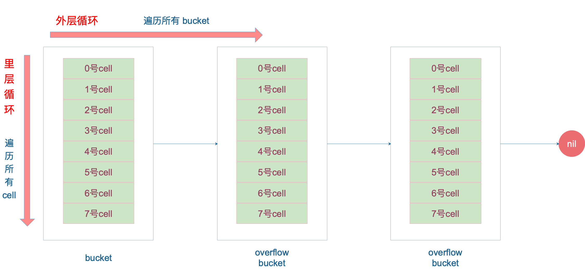

0 golang基础数据结构
===
>- Go 中函数传参仅有值传递一种方式；
slice、map、channel都是引用类型，但是跟c++的不同；
slice能够通过函数传参后，修改对应的数组值，是因为 slice 内部保存了引用数组的指针，并不是因为引用传递。
>- h.nevacuate:记录迁移位置(待迁移的下一位置)，若已迁移的key值的位置==h.nevacuate则h.nevacuate++；迁移完key时，若还需要迁移则迁移h.nevacuate位++；
>- chan: make chan返回的是chan head的指针，chan head带锁为线程安全
>- 

1 map基础数据结构
===
>- 先做迁移，不从oldbucket查找直接从buckets中查找（迁移后）
>- 迁移相应的查找或者删除值后若仍需要迁移，会按照迁移进度多迁移一个bmap
>- 非线程安全：设置 flags 标志位，表示有一个 goroutine 正在写入数据。因为 alg.hash 有可能出现 panic 导致异常
>- hmap定义：
>
```
// A header for a Go map.
type hmap struct {
	// Note: the format of the hmap is also encoded in cmd/compile/internal/gc/reflect.go.
	// Make sure this stays in sync with the compiler's definition.
	count     int // # live cells == size of map.  Must be first (used by len() builtin)
	flags     uint8
	B         uint8  // log_2 of # of buckets (can hold up to loadFactor * 2^B items)
	noverflow uint16 // approximate number of overflow buckets; see incrnoverflow for details
	hash0     uint32 // hash seed
	buckets    unsafe.Pointer // array of 2^B Buckets. may be nil if count==0.
	oldbuckets unsafe.Pointer // previous bucket array of half the size, non-nil only when growing
	nevacuate  uintptr        // progress counter for evacuation (buckets less than this have been evacuated)
	extra *mapextra // optional fields
}
```
>- 
>- bucket包括5个field类似为[]types：topbit为8Xunit8的数组(存放8个高八位)、keys为[]keytype8个key、elems为[]elem8个元素、随后为padding为对齐位(确保overflow溢出桶一定为最后元素)、overflow为指向bucket的指针；key&elem大于128变为指针类型；
>
```
见：src/cmd/compile/internal/gc/reflect.go
```
>- 当 map 的 key 和 value 都不是指针，并且 size 都小于 128 字节的情况下，会把 bmap 标记为不含指针，这样可以避免 gc 时扫描整个 hmap。但是，我们看 bmap 其实有一个 overflow 的字段，是指针类型的，破坏了 bmap 不含指针的设想，这时会把 overflow 移动到 extra 字段来。
>
```
// mapextra holds fields that are not present on all maps.
type mapextra struct {
	// If both key and elem do not contain pointers and are inline, then we mark bucket
	// type as containing no pointers. This avoids scanning such maps.
	// However, bmap.overflow is a pointer. In order to keep overflow buckets
	// alive, we store pointers to all overflow buckets in hmap.extra.overflow and hmap.extra.oldoverflow.
	// overflow and oldoverflow are only used if key and elem do not contain pointers.
	// overflow contains overflow buckets for hmap.buckets.
	// oldoverflow contains overflow buckets for hmap.oldbuckets.
	// The indirection allows to store a pointer to the slice in hiter.
	overflow    *[]*bmap
	oldoverflow *[]*bmap
	// nextOverflow holds a pointer to a free overflow bucket.
	nextOverflow *bmap
}
```

>- 上图就是 bucket 的内存模型，HOB Hash 指的就是 top hash。 注意到 key 和 value 是各自放在一起的，并不是 key/value/key/value/... 这样的形式。源码里说明这样的好处是在某些情况下可以省略掉 padding 字段，节省内存空间。
>
```
例如，有这样一个类型的 map：
map[int64]int8
如果按照 key/value/key/value/... 这样的模式存储，那在每一个 key/value 对之后都要额外 padding 7 个字节；而将所有的 key，value 分别绑定到一起，这种形式 key/key/.../value/value/...，则只需要在最后添加 padding。
每个 bucket 设计成最多只能放 8 个 key-value 对，如果有第 9 个 key-value 落入当前的 bucket，那就需要再构建一个 bucket ，通过 overflow 指针连接起来。
```

2 map操作
===
2.1 map创建
---
>- 基础语法：
>
```
ageMp := make(map[string]int)
// 指定 map 长度
ageMp := make(map[string]int, 8)
// ageMp 为 nil，不能向其添加元素，会直接panic
var ageMp map[string]int
```
>- make map:返回的为hmap指针：注意，这个函数返回的结果：*hmap，它是一个指针,makeslice为结构体
>
```
// makemap implements Go map creation for make(map[k]v, hint).
// If the compiler has determined that the map or the first bucket
// can be created on the stack, h and/or bucket may be non-nil.
// If h != nil, the map can be created directly in h.
// If h.buckets != nil, bucket pointed to can be used as the first bucket.
func makemap(t *maptype, hint int, h *hmap) *hmap {
	mem, overflow := math.MulUintptr(uintptr(hint), t.bucket.size)
	if overflow || mem > maxAlloc {
		hint = 0
	}
	// initialize Hmap
	if h == nil {
		h = new(hmap)
	}
	h.hash0 = fastrand()
	// Find the size parameter B which will hold the requested # of elements.
	// For hint < 0 overLoadFactor returns false since hint < bucketCnt.
	B := uint8(0)
	for overLoadFactor(hint, B) {
		B++
	}
	h.B = B
	// allocate initial hash table
	// if B == 0, the buckets field is allocated lazily later (in mapassign)
	// If hint is large zeroing this memory could take a while.
	if h.B != 0 {
		var nextOverflow *bmap
		h.buckets, nextOverflow = makeBucketArray(t, h.B, nil)
		if nextOverflow != nil {
			h.extra = new(mapextra)
			h.extra.nextOverflow = nextOverflow
		}
	}
	return h
}
```
>- makemap 和 makeslice 的区别，带来一个不同点：当 map 和 slice 作为函数参数时，在函数参数内部对 map 的操作会影响 map 自身；而对 slice 却不会。
>
```
主要原因：一个是指针（*hmap），一个是结构体（slice）。Go 语言中的函数传参都是值传递，在函数内部，参数会被 copy 到本地。*hmap指针 copy 完之后，仍然指向同一个 map，因此函数内部对 map 的操作会影响实参。而 slice 被 copy 后，会成为一个新的 slice，对它进行的操作不会影响到实参。
```

3 hash函数的选择&key的定位
===
3.1 hash函数的选择
---
>- map 的一个关键点在于，哈希函数的选择。在程序启动时，会检测 cpu 是否支持 aes，如果支持，则使用 aes hash，否则使用 memhash。这是在函数 alginit() 中完成，位于路径：src/runtime/alg.go 下。
>- hash 函数，有加密型和非加密型:性能高碰撞概率低
>
```
加密型的一般用于加密数据、数字摘要等，典型代表就是 md5、sha1、sha256、aes256 这种；
非加密型的一般就是查找。在 map 的应用场景中，用的是查找。
选择 hash 函数主要考察的是两点：性能、碰撞概率。
```

3.2 key的定位
---
>- hash结果一般为64bit；直接用最后B个bit位的值就是hash的定位，因为bucket数量就是B位；
>- 计算它到底要落在哪个桶时，只会用到最后 B 个 bit 位。还记得前面提到过的 B 吗？如果 B = 5，那么桶的数量，也就是 buckets 数组的长度是 2^5 = 32。
>
```
例如，现在有一个 key 经过哈希函数计算后，得到的哈希结果是：
 10010111 | 000011110110110010001111001010100010010110010101010 │ 01010
用最后的 5 个 bit 位，也就是 01010，值为 10，也就是 10 号桶。这个操作实际上就是取余操作，但是取余开销太大，所以代码实现上用的位操作代替。
```
>- 再用哈希值的高 8 位，找到此 key 在 bucket 中的位置，这是在寻找已有的 key。最开始桶内还没有 key，新加入的 key 会找到第一个空位，放入。
buckets 编号就是桶编号，当两个不同的 key 落在同一个桶中，也就是发生了哈希冲突。冲突的解决手段是用链表法：在 bucket 中，从前往后找到第一个空位。这样，在查找某个 key 时，先找到对应的桶，再去遍历 bucket 中的 key。

>
```
上图中，假定 B = 5，所以 bucket 总数就是 2^5 = 32。首先计算出待查找 key 的哈希，使用低 5 
位 00110，找到对应的 6 号 bucket，使用高 8 位 10010111，对应十进制 151，在 6 号 bucket 
中寻找 tophash 值（HOB hash）为 151 的 key，找到了 2 号槽位，这样整个查找过程就结束了。
如果在 bucket 中没找到，并且 overflow 不为空，还要继续去 overflow bucket 中寻找，直到找到或是所有的 key 槽位都找遍了，包括所有的 overflow bucket。
// 源码在 runtime/map.go mapaccess函数中
函数返回 h[key] 的指针，如果 h 中没有此 key，那就会返回一个 key 相应类型的零值，不会返回 nil。
```

>- mintophash:每个cell的迁移状态由minTopHash表示，为了区分正常tophash对<mintophash的值+mintophash;
>
```
再说一下 minTopHash，当一个 cell 的 tophash 值小于 minTopHash 时，标志这个 cell 的迁移状态。因为这个状态值是放在 tophash 数组里，为了和正常的哈希值区分开，会给 key 计算出来的哈希值一个增量：minTopHash。这样就能区分正常的 top hash 值和表示状态的哈希值。
下面的这几种状态就表征了 bucket 的情况：
// 空的 cell，也是初始时 bucket 的状态
empty          = 0
// 空的 cell，表示 cell 已经被迁移到新的 bucket
evacuatedEmpty = 1
// key,value 已经搬迁完毕，但是 key 都在新 bucket 前半部分，
// 后面扩容部分会再讲到。
evacuatedX     = 2
// 同上，key 在后半部分
evacuatedY     = 3
// tophash 的最小正常值
minTopHash     = 4
源码里判断这个 bucket 是否已经搬迁完毕，用到的函数：
func evacuated(b *bmap) bool {
    h := b.tophash[0]
    return h > empty && h < minTopHash
}
只取了 tophash 数组的第一个值，判断它是否在 0-4 之间。对比上面的常量，当 top hash 是 evacuatedEmpty、evacuatedX、evacuatedY 这三个值之一，说明此 bucket 中的 key 全部被搬迁到了新 bucket。
```
>- 如何判定一个bucket是否搬空：若bucket搬空，会设置tophash[0]数值并会给出在新hash的位置；
>
```
func evacuated(b *bmap) bool {
	h := b.tophash[0]
	return h > emptyOne && h < minTopHash
}
```
3.3 map get
---
>- Go 语言中读取 map 有两种语法：带 comma 和 不带 comma。当要查询的 key 不在 map 里，带 comma 的用法会返回一个 bool 型变量提示 key 是否在 map 中；而不带 comma 的语句则会返回一个 value 类型的零值。如果 value 是 int 型就会返回 0，如果 value 是 string 类型，就会返回空字符串。
>
```
// src/runtime/hashmap.go
func mapaccess1(t *maptype, h *hmap, key unsafe.Pointer) unsafe.Pointer
func mapaccess2(t *maptype, h *hmap, key unsafe.Pointer) (unsafe.Pointer, bool)
```

3.4 扩容
---
>- 空间时间的权衡：
>
```
使用哈希表的目的就是要快速查找到目标 key，然而，随着向 map 中添加的 key 越来越多，key 发生碰撞的概率也越来越大。bucket 中的 8 个 cell 会被逐渐塞满，查找、插入、删除 key 的效率也会越来越低。最理想的情况是一个 bucket 只装一个 key，这样，就能达到 O(1) 的效率，但这样空间消耗太大，用空间换时间的代价太高。
Go 语言采用一个 bucket 里装载 8 个 key，定位到某个 bucket 后，还需要再定位到具体的 key，这实际上又用了时间换空间。
当然，这样做，要有一个度，不然所有的 key 都落在了同一个 bucket 里，直接退化成了链表，各种操作的效率直接降为 O(n)，是不行的。
```
>- 装载因子：loadFactor := count / (2^B)；count为map的元素个数；2^B为bucket的数量（每个bucket不溢出可以装8个元素);
>- 触发扩容：装载因子超过阈值8或者；overflow bucket数量超过2^B；即溢出bucket较多时；
>
```
再来说触发 map 扩容的时机：在向 map 插入新 key 的时候，会进行条件检测，符合下面这 2 个条件，就会触发扩容：
装载因子超过阈值，源码里定义的阈值是 6.5。
overflow 的 bucket 数量过多：当 B 小于 15，也就是 bucket 总数 2^B 小于 2^15 时，如果 overflow 的 bucket 数量超过 2^B；当 B >= 15，也就是 bucket 总数 2^B 大于等于 2^15，如果 overflow 的 bucket 数量超过 2^15。
```
>- 扩容原理解释：装载因子过高，容量不够，查询低效率；装载因子不高频繁插入删除造成数据分散溢出桶较多，或者hash函数不均匀造成某个溢出桶溢出较多影响查询效率，此时需要新建bucket容量与之前一致然后做迁移，每次迁移不超过2个bucket；
>
```
第 1 点：我们知道，每个 bucket 有 8 个空位，在没有溢出，且所有的桶都装满了的情况下，装载因子算出来的结果是 8。因此当装载因子超过 6.5 时，表明很多 bucket 都快要装满了，查找效率和插入效率都变低了。在这个时候进行扩容是有必要的。
第 2 点：是对第 1 点的补充。就是说在装载因子比较小的情况下，这时候 map 的查找和插入效率也很低，而第 1 点识别不出来这种情况。表面现象就是计算装载因子的分子比较小，即 map 里元素总数少，但是 bucket 数量多（真实分配的 bucket 数量多，包括大量的 overflow bucket）。
不难想像造成这种情况的原因：不停地插入、删除元素。先插入很多元素，导致创建了很多 bucket，但是装
载因子达不到第 1 点的临界值，未触发扩容来缓解这种情况。之后，删除元素降低元素总数量，再插入很多
元素，导致创建很多的 overflow bucket，但就是不会触犯第 1 点的规定，你能拿我怎么办？overflow 
bucket 数量太多，导致 key 会很分散，查找插入效率低得吓人，因此出台第 2 点规定。这就像是一座空
城，房子很多，但是住户很少，都分散了，找起人来很困难。
```
```
对于命中条件 1，2 的限制，都会发生扩容。但是扩容的策略并不相同，毕竟两种条件应对的场景不同。
对于条件 1，元素太多，而 bucket 数量太少，很简单：将 B 加 1，bucket 最大数量（2^B）直接变成原来 bucket 数量的 2 倍。于是，就有新老 bucket 了。注意，这时候元素都在老 bucket 里，还没迁移到新的 bucket 来。而且，新 bucket 只是最大数量变为原来最大数量（2^B）的 2 倍（2^B * 2）。
对于条件 2，其实元素没那么多，但是 overflow bucket 数特别多，说明很多 bucket 都没装满。解决办法就是开辟一个新 bucket 空间，将老 bucket 中的元素移动到新 bucket，使得同一个 bucket 中的 key 排列地更紧密。这样，原来，在 overflow bucket 中的 key 可以移动到 bucket 中来。结果是节省空间，提高 bucket 利用率，map 的查找和插入效率自然就会提升。
对于条件 2 的解决方案，曹大的博客里还提出了一个极端的情况：如果插入 map 的 key 哈希都一样，就会落到同一个 bucket 里，超过 8 个就会产生 overflow bucket，结果也会造成 overflow bucket 数过多。移动元素其实解决不了问题，因为这时整个哈希表已经退化成了一个链表，操作效率变成了 O(n)。
再来看一下扩容具体是怎么做的。由于 map 扩容需要将原有的 key/value 重新搬迁到新的内存地址，如果有大量的 key/value 需要搬迁，会非常影响性能。因此 Go map 的扩容采取了一种称为“渐进式”地方式，原有的 key 并不会一次性搬迁完毕，每次最多只会搬迁 2 个 bucket。
上面说的 hashGrow() 函数实际上并没有真正地“搬迁”，它只是分配好了新的 buckets，并将老的 buckets 挂到了 oldbuckets 字段上。真正搬迁 buckets 的动作在 growWork() 函数中，而调用 growWork() 函数的动作是在 mapassign 和 mapdelete 函数中。也就是插入或修改、删除 key 的时候，都会尝试进行搬迁 buckets 的工作。先检查 oldbuckets 是否搬迁完毕，具体来说就是检查 oldbuckets 是否为 nil。
```
>- map的遍历：
>
```
map 在扩容后，会发生 key 的搬迁，原来落在同一个 bucket 中的 key，搬迁后，有些 key 就要远走高飞了（bucket 序号加上了 2^B）。而遍历的过程，就是按顺序遍历 bucket，同时按顺序遍历 bucket 中的 key。搬迁后，key 的位置发生了重大的变化，有些 key 飞上高枝，有些 key 则原地不动。这样，遍历 map 的结果就不可能按原来的顺序了。
当然，如果我就一个 hard code 的 map，我也不会向 map 进行插入删除的操作，按理说每次遍历这样的 
map 都会返回一个固定顺序的 key/value 序列吧。的确是这样，但是 Go 杜绝了这种做法，因为这样会
给新手程序员带来误解，以为这是一定会发生的事情，在某些情况下，可能会酿成大错。
当然，Go 做得更绝，当我们在遍历 map 时，并不是固定地从 0 号 bucket 开始遍历，每次都是从一个
随机值序号的 bucket 开始遍历，并且是从这个 bucket 的一个随机序号的 cell 开始遍历。这样，即使
你是一个写死的 map，仅仅只是遍历它，也不太可能会返回一个固定序列的 key/value 对了。
```
[golang map的实现](https://www.cnblogs.com/qcrao-2018/p/10903807.html)

7 slice
===
>- makeslice 函数返回的是 Slice 结构体：
>
```
func makeslice(et *_type, len, cap int) slice
// runtime/slice.go
type slice struct {
    array unsafe.Pointer // 元素指针
    len   int // 长度 
    cap   int // 容量
}
```
