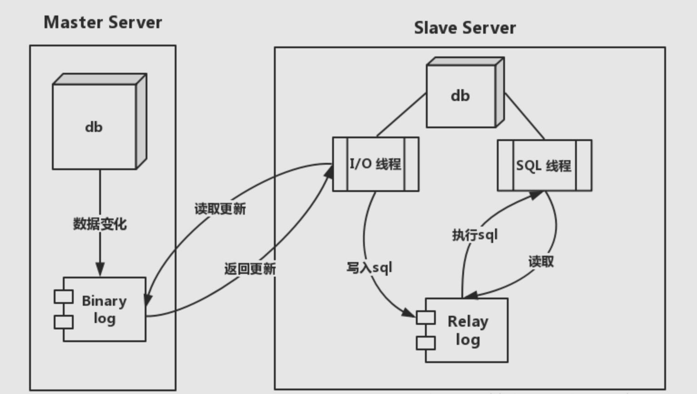

0 数据库基本概念
===
0.1 事务ACID
---
事务其实就是单个数据逻辑单元组成的对象操作集合，而数据库的终极目标就是使数据库从一个一致的状态转换到另一个一致的状态，这就是ACID中的一致性（Consistency），而原子性（Atomicity）、隔离性（Isolation）、持久性（Durability）是为了实现这个目标的手段。
>- 原子性：事务中的操作集合要么全部执行成功要么全部不执行；原子性是一致性的必要条件，但是只要保证了原子性无法保证一致性了，原子性是一致性的一个必要条件，但是不充分条件。
>- 持久性（通过binlog，binlog写入后才算commit）：持久性就保证了，但你当你提交事务commit之后，它一定会持久化到数据库中。尽管你写了一半的数据到数据库中，然后数据库宕机了，当你下一次重启的时候，数据库根据提交日志进行回滚，将另一半的数据写入；事务一致的充分条件；
>- 隔离性（并发事务）：数据库是支持并发访问，这是毫无疑问的。隔离性，官方解释是说“在并发事务下，多个事务有自己的事务空间，相互独立互不干扰。我们在一个事务中是感觉不到其他并发事务的存在；
>- 回到隔离性，很显然事务的隔离性，说的就是，多个并发事务实际上都是独立事务上下文，多个事务上下文之间彼此隔离，互不干扰。但是多个事务如果对共享数据进行查看，删除，修改如果不加以修改，就会出现线程安全问题。如何避免，你可能会使用一把锁，当线程A修改共享数据的时候，让线程B不要来查看共享数据，除非等我修改完毕（串行级）；或者说，我不让别人读取到我修改共享数据的中间值，只能读取到初始值，和我修改完成之后的值（提交读）。但是这些都是你根据业务来操作的，所以数据库为我们封装了‘四把锁’，对应四种隔离级别：
>
>>- 读未提交，其隔离级别最低，允许脏读。换句话说就是，如果一个事务正在处理某一数据，并对其进行了更新，但是同时没有提交事务，允许另一个事务也可以访问;
>>- 读已提交，和读未提交的区别就是。读未提交可以读取到别人没有提交的数据，但是读已提交只能读取到别人提交后的值，事务进行的中间值不会读取到
>>- 可重复读，简单来说就是事务处理过程中多次读取同一个数据的时候，这个值不会发生改变，其值都和第一次查询到的数据是一致的
>>- 串行化，是最严格的隔离级别，他要求所有的事务都被串行执行，既事务只能一个接一个的进行处理，不能并发执行
[mysql事务及隔离级别](https://blog.csdn.net/qq_25448409/article/details/78110430)

0.2 数据类型
---
>- varchar与char的区别：char（10）固定10个字符，不够需要填充，字符并不是字节一个字符具体大小跟用的字符集类型相关；varchar(10)变长字符，需要多一个字节存储字符长度，不填充其他与char相同；[char vs varchar](https://www.jianshu.com/p/cc2d99559532)
>- 5.0版本以上，varchar(20)，指的是20字符，无论存放的是数字、字母还是UTF8汉字（每个汉字3字节），都可以存放20个，最大大小是65532字节 
>- varchar最多能存储65535个字节的数据。varchar 的最大长度受限于最大行长度（max row size，65535bytes）。65535并不是一个很精确的上限，可以继续缩小这个上限。65535个字节包括所有字段的长度，变长字段的长度标识（每个变长字段额外使用1或者2个字节记录实际数据长度）、NULL标识位的累计。
>- [mysql字符编码](https://www.cnblogs.com/gomysql/p/3615897.html)

1 mysql基础
===
1.1 架构
---
>- 三层逻辑架构
>- 查询处理与数据的存储/提取分离
>- 第一层：认证、连结管理、连结池、安全等
>- 第二层：查询缓存、解析器、优化器
>- 第三层（可插拔式引擎层）：储存引擎（表级），索引、缓存（索引、数据)
>- 最后为文件系统、文件&log&undo&data&index&binary&query&query&slow
[mysql三层逻辑架构](https://segmentfault.com/a/1190000010681611)
[mysql架构](https://www.jianshu.com/p/923c0a67e7b6)

1.2 基本数据类型
---
1.2.1 M&D解说
---
>- 整数类型, M 表示最大的显示宽度值. The maximum display width is 255.
>- For floating-point and fixed-point types, M is the total number of digits that can be stored.
>- For string types, M is the maximum length. 
>- D applies to floating-point and fixed-point types and 表示小数点后位数. 最大值30, D<=M−2

1.2.2 数据类型
---
>- SERIAL is an alias for BIGINT UNSIGNED NOT NULL AUTO_INCREMENT UNIQUE.
>- Bit[(M)]:A bit-value type. M indicates the number of bits per value, from 1 to 64. The default is 1 if M is omitted.
>- TINYINT[(M)] [UNSIGNED] [ZEROFILL]:A very small integer. The signed range is -128 to 127. The unsigned range is 0 to 255.
>- 
[参考官网](https://dev.mysql.com/doc/refman/5.5/en/numeric-type-overview.html)
[bit&byte单位制](https://blog.csdn.net/bigapple88/article/details/5601295)

1.3 mysql log
---
[redo log, undo log](https://juejin.im/entry/5ba0a254e51d450e735e4a1f)
[log简单版](https://www.cnblogs.com/wy123/p/8365234.html)

2 mysql面试详解
===


[常见一线大厂面试详解](https://juejin.im/post/5cb6c4ef51882532b70e6ff0)
[mysql数据库详解1](https://www.cnblogs.com/whgk/p/10993436.html)
[mysql索引详解](https://juejin.im/entry/5a448726f265da43062b10f1)
[mysql企业面试题合集](https://juejin.im/entry/5b57ec015188251aa8292a69)
3 mysql->innodb
===
3.1 innodb缓冲池
---
>- 需要LRU维护的页：数据页（data page)、索引页(index page)
>- LRU&free list
>- 不需要LRU维护的页：自适应hash索引、lock信息、innsert buffer
>- buffer pool hit rate:缓存命中率，通常不应低于95%
3.2 innodb LRU(latest recent used)更新缓存
---
>- 管理已读取的页
>- 添加midpoint(LRU队列尾部37%左右),midpoint之后的列表为old列表
>- midpoint比例由innodb_old_blocks_pct控制
>- 从磁盘读取新的数据需要缓存时若空间不够（首先从free列表取页）则old列表中数据可能被清除
>- 新读取即将入缓存数据插入在LRU的midpoint处，若插入头部可能造成热点数据被清除缓存（查表获取大量数据需要大量内存)
>- innodb_old_blocks_time定义了页读取到midpoint多久后可以插入到LRU的热端，一般默认设置为1000；
>- 若活跃热点数据>63%可以设置innodb_old_blocks_pct
>- 页从old部分移动到new部分称为page_made_yong，因为innodb_old_blocks_time设置问题导致没有made yong称为page_not_made_young;
>- buffer size单位为页，每页16k
>- innodb引擎支持压缩页，页大小不足16k放置在unzip_LRU列表管理；LRU会管理超过16k的压缩页
>- unzip_LRU列表分不同大小的页，eg: 4k大小的uznip_LRU， 8k大小的unzip_LRU，通过伙伴算法进行内存分配：
>
```
需要4k大小的页
1 从4k的unzip_LRU取空闲页
2 1不可用从8k的unzip_LRU取空闲页分裂成两个4k存放在4k的unzip_LRU中
3 2不可用，从LRU列表申请16k，分裂成8k 2*4k分别存放在不同的unzip_LRU中
```
>- LRU中页若更改则为脏页（缓冲池与磁盘数据不一致），数据库通过checkpoint机制讲脏页刷新回磁盘，flush列表中的页为脏页，脏页既存在于LRU中也存在于flush中，二者不影响；

3.3 重做日志缓存(binlog)
---
write ahead log, 事务提交时先写重做日志再修改页，若宕机导致数据丢失通过重做日志恢复数据（acid中的duration)
>- 8M足够用，每1s将重做日志缓存刷新到磁盘，用户只需保证每秒产生的日志量在此内存范围内
重做日志缓存的刷新:
>
>>-
>- master thread每1s将缓存刷新到文件
>- 事物提交时刷新到文件
>- 缓存剩余空间低于50%，刷新到文件

>- 若重做日志可以无限增加，缓冲池足够大（可以容下所有数据），则不需要将内存数据刷新至磁盘，宕机后通过重做日志回复即可；
>
>>- 数据库大小>>内存大小
>>- 磁盘空间运维问题
>>- 宕机恢复时间

>- checkpoint用处：
>
>>- 缩短宕机恢复时间
>>- 缓存不够时将数据刷新到磁盘：LRU算法溢出强制checkpoint->脏页刷新回磁盘
>>- 重做日志不可用刷新脏页：重做日志不是无限大，循环使用，要用日志空间时强制checkpoint

>- checkpoint的种类：sharp checkpoint, fuzzy checkpoint
>
>>- sharp checkpoint: 数据库关闭时，所有脏页刷新回磁盘
>>- fuzzy checkpoint: 刷新一部分脏页
>>- mysql 5.6后，async/sync flush checkpoint全部放置单独的page clean线程不会堵塞用户查询线程

3.4 innodb特性
---
3.4.1 insert buffer： 降低辅助非唯一索引插入i/0次数
---
主键聚簇索引，递增顺序插入，不需要磁盘随机读写；uuid类主键索引，插入随机；
数据页的存放按照主键进行顺序存放，非聚集索引叶子结点插入非顺序，离散访问非聚集索引页，随机读取造成插入性能下降；
聚簇索引页（数据页）、非唯一（非聚簇）索引页
>- insert buffer对非聚簇索引的插入或者更新操作，不是每一次直接插入到索引页，1判定非聚簇索引页是否在缓冲池，yes直接插入，no放入到insert buffer中，以一定频率或者情况进行insert buffer和辅助索引页子节点merge合并操作；将多个插入合并为一个操作；
>- 索引为辅助索引
>- 索引非唯一（唯一索引需要随机读确定记录唯一性，随机读)
>- 若mysql宕机，insert buffer未合并到非聚簇索引页，恢复需要较长时间，极端情况需要几小时；
>- 写密集insert buffer占用过多内存(默认1/2 buffer pool）
>- insert buffer升级为change buffer (insert delete update都进行缓冲) insert buffer delete buffer purge buffer;update分为标记删除(delete buffer)&真正删除(purge buffer)
>- insert buffer为B+树，merge insert buffer发生时机：
>
```
1 辅助索引页被读取到缓冲池
2 insert buffer bitmap追踪到辅助索引页无可用空间
3 master thread
```

3.4.2 double write双写：double buffer顺序写入共享表空间，&离散写入各个表空间页中数据
---
提高innodb引擎数据页的可靠性，innodb页大小为16k若写入时只有4k写入到磁盘，为partial page write问题，16k页本身已损坏无法通过redo log恢复；
>- partial page write 问题 : 
    InnoDB 的Page Size一般是16KB，其数据校验也是针对这16KB来计算的，将数据写入到磁盘是以Page为单位进行操作的。而计算机硬件和操作系统，在极端情况下（比如断电）往往并不能保证这一操作的原子性，16K的数据，写入4K 时，发生了系统断电/os crash ，只有一部分写是成功的，这种情况下就是 partial page write 问题。
很多DBA 会想到系统恢复后，MySQL 可以根据redolog 进行恢复，而mysql在恢复的过程中是检查page的checksum，checksum就是pgae的最后事务号，发生partial page write 问题时，page已经损坏，找不到该page中的事务号，就无法恢复。
>- double write介绍：内存中double buffer:2M,物理磁盘共享表空间连续128页，2个区，2M
>
>>- 缓冲池刷新脏页时，不直接刷磁盘，通过memcopy将脏页复制到doublewrite buffer
>>- doublewrite buffer分两次每次1M写入共享表空间的物理磁盘（顺序写，开销小)
>>- doublerwrite页写完后，将double buffer中数据写入各个表空间文件中，离散写，（较为耗时）
>
>- 操作系统写入磁盘时崩溃，恢复过程中，innodb从共享表空间doublewrite中找到损坏页副本，将其复制到表空间文件，再应用重做日志恢复；
>- 可以跳过double write设置：

```
a 多个slave server，需要较快性能
b ZFS文件提供部分写失效防范机制
c master确保写可靠性，任何时候确保开启double write
```
[double write简介](http://blog.itpub.net/22664653/viewspace-1140915/)
[double write介绍](https://blog.csdn.net/bohu83/article/details/81252045)

3.4.3 自适应hash索引
---
>- innodb存储引擎监控索引页查询，b+数查询与层数相关，一般为3-4层，innodb自行判定若增加hash索引可以提升查询效率则创建hash索引
>- hash索引不适合范围查询
>- 访问模式一致建立hash索引(>=100次)，交替访问模式不建立
>- innodb 引擎自身控制

3.4.4 异步IO
---
>- 系统自带native AIO
>- 提升io性能
>- 系统可执行IO合并：提交多个io操作，可合并执行
>- read ahead、脏页刷新利用AIO

4 文件
---
参数文件（动态、静态）、错误日志文件、慢查询日志文件可以设置时间阈值、查询日志（记录所有对mysql的请求信息）、二进制日志(binlog)
4.1 二进制日志
---
记录对mysql数据库执行更改的所有操作，但不包括select&show此类操作（对数据本身无修改）；若操作本身没有引起数据变化也会被记录在二进制日志(eg update但是没有引起数据变更)；
对使用事务的表存储引擎，未提交的二进制日志记录在缓存汇总，事务提交时写入二进制日志，若缓存不够用则写入临时文件；
>- 二进制日志的作用
>
>>- 恢复：通过二进制日志进行point-in-time的恢复
>>- 复制：从库(relay log）
>>- 审计：判断是否有数据库注入攻击
>
>- 二进制日志默认情况下不启动，开启使性能下降1%
>- 二进制日志相关参数设置：
>
>>- binlog_cache_size: 日志缓存大小，基于session，一个线程开启事务会自动分配一定缓存大小，不宜过大，一般32k
>>- binlog_cache_disk_use：用临时文件写二进制日志次数，次数过多说明缓存不够用
>>- sync_binlog=[N]:每次写缓冲N次就写入到磁盘，设置为1为同步写磁盘写二进制日志，不使用操作系统缓冲来写二进制日志；使用缓冲时若宕机，会导致最后一部分日志没有写入二进制日志，导致恢复及复制困难；
>>- sync_binlog=1,同步磁盘写问题：事务A，同步写入二进制日志文件，innodb引擎在A commit之前宕机，恢复后由于A没有commit需要回滚，但是由于同步写二进制日志文件，A被写入二进制日志文件，二进制日志文件记录了事务A信息不能回滚，通过设置参数innodb_support_xa=1来解决，与XA事务（分布式事务）相关，同时确保二进制日志与innodb数据文件的同步；
>>- binlog_do_db&binlog_ignore_db需要写入或者忽略某些库的二进制日志文件
>>- slave需要设置log-slave-update：从master取得二进制日志文件并写入自己的二进制日志文件中
>>- binlog_format:statement(逻辑sql语句)、row（每行数据变更)、mix（大多为逻辑sql语句，个别为row格式);主机运行rand、uuid、触发器、用户自定义函数、使用了临时表、NDB引擎等使用statement格式会导致主从不一致问题；row格式日志容量相较于statement格式增长较快，占用较多储存空间；利用mysqlbinlog查看binlog日志；
>
>- 套接字文件：unix系统本地通过unix socket连接到mysql server
>- pid文件：mysql进程id
>- 表结构定义文件.frm：mysql插件式储存引擎，数据储存根据表进行，每个表都有表结构定义文件，无论储存引擎

4.2 innodb储存引擎文件
---
>- 表空间文件：innodb_file_per_table设置后每张表都有一个表空间文件，仅储存该表的数据、索引、插入缓冲bitmap等信息；其他放置在默认的表空间文件中；.ibd；管理inndob引擎的存储，分独立表空间文件&共享表空间文件（回滚信息undo、插入缓冲索引页、系统事务信息、二次写缓冲）
>- redo log：记录innodb事务日志，innodb可以恢复到掉电前时刻保持数据的完整性
>
>>- 日志组（组中日志循环写入）
>>- 多日志组保证高可用性
>>- redo log设置过大恢复时间较久，太小导致一个事务切换多个redo log文件，频繁发生asyn checkpoint导致性能抖动（日志大小不够用只能checkpoint更改数据)
>>- redo log仅记录储存引擎相关日志
>>- redo log为每个页的更改的物理日志（二进制日志为逻辑日志)
>>- 二进制日志在事务提交前提交，无论事务多大仅写磁盘一次
>>- redo log在一次事务中可以多次写入redo log
>>- redo log写入磁盘：顺序写，一次512字节为一个扇区，原子写，不需要double write
>>- redo log: redo_log_type（类型）、space（空间ID）、page_no（偏移量）、redo_log_body（数据部分）
>>- redo log从缓存刷到磁盘：master线程每秒刷新、提交事务时刷新、脏页过多时刷新
>>- innodb_flush_log_at_trx_commit：0事务提交时不刷新等主线程每秒刷新、1commit时同步磁盘伴随fsync调用、2commit时异步写入磁盘不一定写人磁盘（写入操作系统文件缓冲区）
>>- 保持持久性设置为1

5 表
===
>- 主键：未设置时使用第一个设置的非空唯一索引

5.1 innodb逻辑存储结构
---
分为段segement、区extent、页page
>- 段：数据段（B+树叶子节点）、索引段、回滚段
>- 区：连续页区总大小为1M，每页大小16K、2k、4k、8k
>- 页：innodb磁盘管理最小单位
>- 行：row-oriented面向行存储
>- 行储存格式：compact(null不占用储存空间）、redundant（char类型null值占用空间)
>- varchar最大长度为65535字节，为列长度总和，总和不可超出此范围；
>- 对blob、text、较大长度varchar，存储为溢出格式，prefix 768bytes+指向blog page的指针（偏移量）
>- innodb为b+树索引，至少存两行记录（否则为链表），若页只能存放单行记录则innodb引擎自动将行数据放置到溢出页;（blob跟varchar溢出格式一致）
>- innodb 1.0.x版本后引入新的文件格式：compressed&dynamic；新格式对blob中数据采取行溢出方式，compressed会对储存在其中的数据进行zlib算法压缩
>- 多字节字符集,char与varchar储存区别不大，char用varchar方式储存

5.2 约束
---
>- 唯一索引，主键约束，外键约束，not null，用来保证数据的完整性
>- 约束创建方式同索引：创建表时create table ( a int, b varchar, primary key uid (a));或者通过alter table add unidex index name (columns)
>- 约束为逻辑概念保证数据的完整性
>- 索引是数据结构，即有逻辑概念，在数据库中代表物理储存方式
>- sql mode设置为strict_trans_tables对输入值合法性进行约束(not null)
>- enum, set进行约束：create table a (id int, sex enum('male','female'));
>- 连续数值约束需要利用触发器
>- 触发器约束：一个表最多创建6个触发器，insert update delete, befor&after;触发器是for each row方式
>
>>- eg: usercash表，cash代表剩余金额，花销为正值，cash逐渐减少
>>
```
// 建立usercash 表
create table usercash (
userid int not null,
cash int unsigned not null);
// 建立err log表
create table usercash_err_log (
userid int not null,
old_cash int unsigned not null,
new_cash int unsigned not null,
user varchar(30),
time datetime);
// 建立触发器
create trigger tgr_usercash_update before update on usercash
for each row
begin
if new.cash-old.cash > 0 then
insert into usercash_err_log
select old.userid, old.cash, new.cash, USER(), NOW();
set new.cash=old.cash;
end if;
end;
```

>- 外键约束保证参照完整性：被引用表为父表，引用的表为子表，父表进行delete或者update操作时对子表操作为:cascade(对相应子表数据做delete or update)、set Null、No action、restrict（抛出错误，不允许发生，同no action）；innodb立刻检查，且会对外键约束自动创建索引；eg:
>
```
create table parent (
id int not null,
primary key (id)
)engine=innodb;
create table child (
id int, parent_id int, 
foreign key (parent_id) references parent(id)
)engine=innodb;
```

5.3 分区表
---
>- 分区功能不是在储存引擎层完成的，但有些引擎不支持分区功能
>- mysql支持水平分区（按行分区，因为mysql为行储存)
>- mysql分区是局部分区索引（一个分区中既存放数据又存放索引，全局分区为数据存放在各个分区中但所有数据的索引存放在一个对象中），暂不支持全局分区
>- 分区用于数据库的高可用管理，并一定会提升性能，虽然某些语句可以提升性能
>- mysql支持的分区类型：
>
>>- range分区：连续区间的列值，values less than
>>
```
create table sales (
money int unsigned not null,
date dateto,e
)engine=innodb
partition by range (to_days(date))
partition p201001
	values less than (to_days('2010-02-01')),
partition p201002
	values less than (to_days('2010-03-01')),
partition p201003
	values less than (to_days('2010-04-01'))
);
```
>>- list分区：类似range分区，面向离散值, values in
>>
```
create table t (
a int,
b int
)engine=innodb
partition by list(b)
partition p0
	values IN (1,4,6),
partition p1
	values IN (2,9,10)
);
```
>>- hash分区：根据用户自定义的表达式返回值进行分区，返回值不可为负值;mysql自动处理用户只需给出函数，以及分区数量
>>
```
create table t_hash(
a int, 
b DATETIME
)engine=innodb
partition by HASH (YEAR(b))
partitions 4;
```
>>- key分区：根据mysql提供的hash函数来进行分区;与hash分区类似，使用mysql自带函数
>>- range、list、hash、key分区数据必须整型，非整型需要先转换为整型
>>- columns分区：数据可以为非整型，无需转换；支持的类型：所有整型（float decimal不支持）、日期类型中的date&datetime、字符串类型除blob&text；支持多列分区
>>
```
create table t_col_ran (
a int,
b datetime
)engine=innodb
partition by range colums (b)(
partition p0 values less than ('2009-01-01'),
partition p0 values less than ('2010-01-01')
);
// 多列分区
create table t_col_ran (
a int,
b int,
c varchar(3),
d int
)engine=innodb
partition by range colums (a,d,c)(
partition p0 values less than (5,10,'ggg'),
partition p0 values less than (10,20,'mmm')
);
```
>>- range和list分区下支持hash&key子分区
>>- 分区中的NULL值：mysql认为null值小于任何值，range分区null放在最左分区，list分区必须显示指定null, hash&key对null返回0再执行分区
>>- 若mysql中存在主键或者唯一索引则分区列必须是唯一索引的一部分，若不存在则无此限制

>- 按分区特点进行表的查询，只查某些分区加快查询速度
>- 分区的性能：
>
>>- OLAP应用：统计可能需要扫描大表，分区后减少表的扫描加快统计速度（kafka数据入redash按照dt进行分区处理）
>>- OLTP应用：不会获取超过表中10%数据，一般通过索引查找，B+树索引一般2-3层，最多2-3次磁盘扫描，不需要分区帮助，设计不好分区会带来严重的性能问题（eg:对主键进行hash索引，10个分区，对nickname为字符串索引进行nickname="a"进行查找需要查找所有分区的索引每个分区大概执行2-3次磁盘读取，一共需要20-30次磁盘读取，而不分区仅需要2-3次磁盘读取，此类分区会减慢查询速度）

6 索引与算法
===
innodb主key为聚簇索引，辅助索引等均为b+树结构，一页中至少存在两行数据；   
主key索引查询一般需要2-3次读磁盘（b+树高度为2-3）；   
辅助索引查询需要先查辅助索引文件获取到主key，然后查主key索引文件获取相关内容；   
mysql5.7之后，innodb引擎存在index merge，A or B若A、B都带索引且mysql优化器分析得需要用A、B索引则用A、B索引之后做union；and索引merge之后做intersect；   
多个单列索引在多条件查询时优化器会选择最优索引策略，可能只用一个索引，也可能将多个索引全用上！ 但多个单列索引底层会建立多个B+索引树，比较占用空间，也会浪费一定搜索效率，故如果只有多条件联合查询时最好建联合索引！   
区分度（count(distinct a)/所有行）低的字段不需要加索引，浪费空间，优化查询不会用改索引；  
[索引概述](http://blog.codinglabs.org/articles/theory-of-mysql-index.html)
[mysql索引](https://blog.csdn.net/u012006689/article/details/73195837)
6.0 索引概述
---
>- b树，非叶节点也储存数据

>- b+树，仅叶子结点储存数据

>- myisam索引结构，索引与数据分离，叶子结点存数据的指针


>- innodb主键索引为聚集索引：

主键索引叶子结点双向链表：

innodb辅助索引，包含bookmark（辅助索引key值，主键key值)


6.1 联合索引
---
>- 联合索引也是一棵B+树，可以看到，联合索引中的索引项会先根据第一个索引列进行排序，第一个索引列相同的情况下，会再按照第二个索引列进行排序，依次类推。根据这种存储特点，B-Tree索引对如下类型的查找有效：

```
1 全值匹配：查找条件和索引中的所有列相匹配
2 匹配最左前缀：查找条件只有索引中的第一列
3 匹配列前缀：只匹配某一列值的开头部分。这里并不一定只能匹配第一个索引列的前缀。例如在确定第一个索引列的值时，也可以在第二个索引列上匹配列前缀。在上面例子中，对于查找姓为Allen，名为J开头的人，也可以应用到索引。
4 匹配范围值，或者精确匹配某一列并范围匹配另外一列：例如查找姓在Allen和Barrymore之间的人，或者查找姓为Allen，名字在某一个范围内的人。
5 只访问索引的查询，即要查询的值在索引中都包含，只需要访问索引就行了，无需访问数据行。这种索引被称作覆盖索引。
6 对于上面列出的查询类型，索引除了可以用来查询外，还可以用来排序。
```
>- 索引限制：
>
```
1 如果不是从索引的最左列开始查找，则无法使用索引。例如直接查找名字为Bill的人，或查找某个生日的人都无法应用到上面的索引，因为都跳过了索引的第一个列。此外查找姓以某个字母结尾的人，也无法使用到上面的索引。
2 不能在中间跳过索引中的某个列，例如不能查找姓为Smith，生日为某个特定日期的类。这样的查询只能使用到索引的第一列。
3 如果查询中有某个列的范围查询，则该列右边的所有列都无法使用索引优化查找。例如有查询WHERE last_name='Smith' AND first_name LIKE 'J%' AND dob='1976-12-23'，这个查询只能使用到索引的前两列，而不能使用整个索引。
```


联合索引可以用到索引的情况为：(col1) (col1, col2) (col1, col2, col3) (col1, col3)  
[复合索引，正确的解读](https://blog.csdn.net/Abysscarry/article/details/80792876)
[联合索引正确的解读](https://segmentfault.com/a/1190000010991930)
[错误示范，解读是错误的：联合索引数据结构](https://blog.csdn.net/weixin_30531261/article/details/79329722)

6.2 其他索引
---
>- 主键索引（聚簇索引）：叶子节点存放行记录，数据量大
>- 辅助索引：叶子节点中并不包含行记录的全部数据。叶子节点除了包含键值以外，每个叶子节点的索引行还包含了一个书签（bookmark），该书签用来告诉InnoDB哪里可以找到与索引相对应的行数据。
>- 覆盖索引： 即从辅助索引中就可以得到查询的记录，而不需要查询聚集索引中的记录。
>
>>
```
覆盖索引：
  CREATE TABLE `student` (
  `id` bigint(20) NOT NULL,
  `name` varchar(255) NOT NULL,
  `age` varchar(255) NOT NULL,
  `school` varchar(255) NOT NULL,
  PRIMARY KEY (`id`),
  KEY `idx_name` (`name`),
  KEY `idx_school_age` (`school`,`age`)
) ENGINE=InnoDB DEFAULT CHARSET=utf8;
select count(*) from student;explain会走idx_name，因为走idx_name能达到效果，且减少大量I/O操作
explain select * from student where age>10 and age<20;无法走索引；
explain select count(*) from student where age>10 and age<20;走复合索引idx_school_age,即为覆盖索引；
```

>- 如果要查询辅助索引中不含有的字段，得先遍历辅助索引，再遍历聚集索引，而如果要查询的字段值在辅助索引上就有，就不用再查聚集索引了，这显然会减少IO操作。

[覆盖索引&复合索引](https://blog.csdn.net/u012006689/article/details/73195837)
6.3 优化器索引选择
---
>- 若sql语句不能通过覆盖索引解决，则需要首先从辅助索引查找然后根据辅助索引的bookmark（书签访问）走离散读获取整行数据
>- sql中用到索引但优化器不走索引直接做聚集索引（全表扫描)用顺序读代替离散读：
>
>>- 范围查找，join连接
>>- 访问数据占整表很大部分，一般20%
>>- 顺序读远快于离散读
>>- 不能使用覆盖索引的情况，通过辅助索引查找少量数据时走索引
>>- 若固态硬盘，且确信辅助索引带来更好性能，则可以force index
>
>- 索引提示：提示优化器可以用的索引，但优化器不一定选择该索引，可以force index(xx)；select * from t use index(a) where a=1 and b=2;
>
>>- mysql优化器选择错误索引导致sql慢
>>- 可选择索引较多，优化器选择执行计划的时间开销大于sql本身
>
>- multi range read优化：MRR,使用range ref eq_ref类查询
>
>>- 使数据访问变得比较顺序
>>- 辅助索引+主键索引：辅助索引查询完按照主键索引排序，然后根据书签查询进行查询
>>- 减少缓冲池页被替换的次数
>>- 批量处理对键值的查询操作
>>- 查询得到辅助索引放在缓存中（辅助索引键值排序）&& 缓存中键值根据rowID排序 && 根据rowID排序顺序访问实际数据
>
>- index condition pushdown（ICP)优化：mysql数据库会在取索引时判定是否可以进行where过滤（过滤操作放在储存引擎层），减少上层sql对记录的索取,提升性能
>
>>- 支持range ref eq_ref ref_or_null
>>- 支持innodb myisam
>>- where过滤条件为索引可以覆盖的范围
>>- explain执行计划为using index condition

6.4 hash
---
>- 碰撞：一般选择最简单的链接法；innodb利用链表方式
>- hash函数：一般为关键字转为自然数，利用除法；h(k)=k mod m；innodb除法散列
>- innodb: K = space_id<<20+space_id+offset;m取略大于2的倍数的质数
>- 适用于field查找，无法用于范围查找

6.5 全文索引:类似es，innodb 1.2.X支持全文索引
---
>- 倒排索引(inverted file index):{单词，单词所在文档ID}
>- full inverted index: {单词，(单词所在文档ID,在文档的具体位置)}；搜索性能好，空间占用多
>- 需要分词
>- 倒排索引需要将word存在auxiliary table（辅助表，持久表，存放在磁盘）中
>- innodb 为了提高全文搜素的并行性共6张辅助表，每张表根据word的latin编码进行分区
>- (documentationID, position)称为ilist
>- FTS index cache(全文检索索引缓存):红黑树，根据（word, ilist)进行排序
>- 事务提交时分词写入FTS index cache, innodb会批量更新缓存到辅助表中
>- FTS index cache缓存大小一般为32M，过大主机崩溃恢复时间久；
>- 文档中分词的插入操作在事务提交时完成，删除操作事务提交时不删除辅助表，删除缓存索引同时将删除的FIS documentID保存在deleted auxialiary table中；
>- 全文索引会不断壮大（没有实际意思删除，删除反而增加删除表记录)可以通过optimize table真正删除

6.5.1 限定
--
>- 每张表只能有一个全文索引
>- 多列组合全文索引必须使用相同的字符集与排序规则
>- 不支持没有单词界定符号的语言，eg：中文 日文 韩文

7.0 mysql锁
===
>- 死锁检测：有向图，通过入度解决，取入度为0的节点入队，广度遍历其临界点入度，循环操作，直到存在入度不为0的节点，存在环；剩余节点围城环；
>- 死锁检测为图的环检测：或者深度优先遍历，某个节点在一条线路遍历中出现两次
>- 死锁避免：同时上锁；增加上锁顺序；发现死锁立刻抢占或者释放其他资源；发现死锁，锁等待，超时重试；


9.0 其他
===
9.1 mysql查询语句
---
>- limit m,n;其中m为满足where子句（order by）的偏移量，第一条满足where子句的偏移量为0，n为条数限制
>- limit n;限制数据条数
>
```
// 满足选择条件倒序排序的中间第501条，取10条
select * from table
where a.ss > 100 
order by id desc
limit 500,10
```
>- 分页：若按照索引分页，则可以嵌套子查询先查到分页的索引值，或者用join
>
```
SELECT * FROM articles WHERE  id >=  
(SELECT id FROM articles  WHERE category_id = 123 ORDER BY id LIMIT 10000, 1) LIMIT 10
SELECT * FROM `content` AS t1   
JOIN (SELECT id FROM `content` ORDER BY id desc LIMIT ".($page-1)*$pagesize.", 1) AS t2   
WHERE t1.id <= t2.id ORDER BY t1.id desc LIMIT $pagesize; 
```
>- 遇到大量查询时，可以做分页，前端传页码&每页容量，后端利用limit m,n处理分页问题
[mysql limit用法&分页](https://segmentfault.com/a/1190000008859706)

10.0 面试相关
===
10.1 mysql索引为何为b+树
---
>- 磁盘读取，随机读耗时，尽量减少随机读，减小树高
>- 红黑树，二叉树，树的高度较高，avl平衡二叉树的一种（红黑树确保没有一条路径比其他路径长两倍）(树根为黑色、叶子节点为黑色叶子一般为null、红色节点的两个子节点为黑色、任意路径上黑色节点相同)
>- b+树叶子结点存放值，叶子结点双向链表，便于范围查找，顺序读
>- b树非叶子结点也存放具体的值，（随机读？）
>- 聚簇索引
>- b+树带索引查找仅需要2-3层，即2-3次随机读取，非primary key需要先读索引找到primary key再查聚簇索引
>- 他们认为数据库索引采用B+树的主要原因是：B树在提高了IO性能的同时并没有解决元素遍历的效率低下的问题，正是为了解决这个问题，B+树应用而生。B+树只需要去遍历叶子节点就可以实现整棵树的遍历。而且在数据库中基于范围的查询是非常频繁的，而B树不支持这样的操作或者说效率太低。
>- B+树范围查询遍历叶子结点即可；
>- B树需要中序遍历才可以
>- B+树索引占据磁盘空间少：B+树的磁盘读写代价更低：B+树的内部节点并没有指向关键字具体信息的指针，因此其内部节点相对B树更小，如果把所有同一内部节点的关键字存放在同一盘块中，那么盘块所能容纳的关键字数量也越多，一次性读入内存的需要查找的关键字也就越多，相对IO读写次数就降低了。
>- B+树的查询效率更加稳定：由于非终结点并不是最终指向文件内容的结点，而只是叶子结点中关键字的索引。所以任何关键字的查找必须走一条从根结点到叶子结点的路。所有关键字查询的路径长度相同，导致每一个数据的查询效率相当。
>- 由于B+树的数据都存储在叶子结点中，分支结点均为索引，方便扫库，只需要扫一遍叶子结点即可，但是B树因为其分支结点同样存储着数据，我们要找到具体的数据，需要进行一次中序遍历按序来扫，所以B+树更加适合在区间查询的情况，所以通常B+树用于数据库索引。
[mysql索引选取原因b/b-树、b+树、红黑树](https://blog.csdn.net/xlgen157387/article/details/79450295)

10.2 mysql索引模型
---
>- 大量查询、排序等需要建立索引
>- 表较小，update insert del为主不需要建立索引
>- 主键索引（唯一非空）、唯一索引（唯一可空）、辅助索引、hash索引、全文索引（红黑树）、复合索引（多列组合非空）；索引过长可以取字段的某几个字符，最左原则；
>- hash索引无范围&排序
>- B+ Tree索引和Hash索引区别 哈希索引适合等值查询，但是不无法进行范围查询 哈希索引没办法利用索引完成排序 哈希索引不支持多列联合索引的最左匹配规则 如果有大量重复键值得情况下，哈希索引的效率会很低，因为存在哈希碰撞问题
>- 非主键索引查询完需要查询主键索引获取相关字段（仅根据非主键索引无法获取），若存在索引覆盖则不需要查主键索引；主键索引查询较快；
>
```
科普时间——覆盖索引 覆盖索引（covering index）指一个查询语句的执行只用从索引中就能够取得，不必从数据表中读取。也可以称之为实现了索引覆盖。 当一条查询语句符合覆盖索引条件时，MySQL只需要通过索引就可以返回查询所需要的数据，这样避免了查到索引后再返回表操作，减少I/O提高效率。 如，表covering_index_sample中有一个普通索引 idx_key1_key2(key1,key2)。当我们通过SQL语句：select key2 from covering_index_sample where key1 = 'keytest';的时候，就可以通过覆盖索引查询，无需回表。
```
>- 联合索引，最左匹配：识别度高的放在左侧，查询需求才会加，索引建立实际是根据最左侧的索引建立的，其他为排序，只要最左侧值在就有可能匹配到索引；
>
```
在创建多列索引时，我们根据业务需求，where子句中使用最频繁的一列放在最左边，因为MySQL索引查询会遵循最左前缀匹配的原则，即最左优先，在检索数据时从联合索引的最左边开始匹配。所以当我们创建一个联合索引的时候，如(key1,key2,key3)，相当于创建了（key1）、(key1,key2)和(key1,key2,key3)三个索引，这就是最左匹配原则。
```
>- 索引下推：减少回表次数，innodb索引层处理判定条件，不用回到mysql层
>
```
 Index Condition Pushdown（索引下推） MySQL 5.6引入了索引下推优化，默认开启，使用SET optimizer_switch = 'index_condition_pushdown=off';可以将其关闭。官方文档中给的例子和解释如下： people表中（zipcode，lastname，firstname）构成一个索引
SELECT * FROM people WHERE zipcode='95054' AND lastname LIKE '%etrunia%' AND address LIKE '%Main Street%';
如果没有使用索引下推技术，则MySQL会通过zipcode='95054'从存储引擎中查询对应的数据，返回到MySQL服务端，然后MySQL服务端基于lastname LIKE '%etrunia%'和address LIKE '%Main Street%'来判断数据是否符合条件。 如果使用了索引下推技术，则MYSQL首先会返回符合zipcode='95054'的索引，然后根据lastname LIKE '%etrunia%'和address LIKE '%Main Street%'来判断索引是否符合条件。如果符合条件，则根据该索引来定位对应的数据，如果不符合，则直接reject掉。 有了索引下推优化，可以在有like条件查询的情况下，减少回表次数。
```
>- 查询优化器：若sql语句用到索引但范围达到全表的20%可能会直接全表扫；mysql会对比全表扫、不同索引的执行计划花费时间，来处理最终选择哪种索引
>
```
查询优化器 一条SQL语句的查询，可以有不同的执行方案，至于最终选择哪种方案，需要通过优化器进行选择，选择执行成本最低的方案。 在一条单表查询语句真正执行之前，MySQL的查询优化器会找出执行该语句所有可能使用的方案，对比之后找出成本最低的方案。这个成本最低的方案就是所谓的执行计划。 优化过程大致如下： 1、根据搜索条件，找出所有可能使用的索引 2、计算全表扫描的代价 3、计算使用不同索引执行查询的代价 4、对比各种执行方案的代价，找出成本最低的那一个
```
[mysql索引](https://juejin.im/post/5d23ef4ce51d45572c0600bc)
>- 索引占用磁盘空间，需要保证建立的索引真正有用，可以查看监控
>- 索引创建时需要对表加锁，需要在业务空闲时加索引；
>- 索引加快搜索减少IO加快分组排序，统计count；
>- del update insert速度加慢，mysql innodb处理方式为增加插入缓冲，用缓冲来处理


10.3 事务&隔离级别&隔离级别的实现
---
>- 四种隔离级别：uncommited read、committed read、repeatable read、seriable
>- 四种隔离级别解决的问题：脏读、不可重复读（mvcc多版本)、幻读
>- 不可重复读重点解决update delete
>- 幻读解决插入问题
>- MVCC的全称是“多版本并发控制”。这项技术使得InnoDB的事务隔离级别下执行一致性读操作有了保证，换言之，就是为了查询一些正在被另一个事务更新的行，并且可以看到它们被更新之前的值。这是一个可以用来增强并发性的强大的技术，因为这样的一来的话查询就不用等待另一个事务释放锁。这项技术在数据库领域并不是普遍使用的。一些其它的数据库产品，以及mysql其它的存储引擎并不支持它。提升提交读的并发性
>
```
mvcc保存创建版本号&删除版本号：
SELECT时，读取创建版本号<=当前事务版本号，删除版本号为空或>当前事务版本号。
INSERT时，保存当前事务版本号为行的创建版本号
DELETE时，保存当前事务版本号为行的删除版本号
UPDATE时，插入一条新纪录，保存当前事务版本号为行创建版本号，同时保存当前事务版本号到原来删除的行
```
>- 快照读&当前读：
>
```
对于mvcc这种读取历史数据的方式，我们叫它快照读 (snapshot read)，而读取数据库当前版本数据的方式，叫当前读 (current read)。很显然，在MVCC中：
快照读：就是select
select * from table ....;
当前读：特殊的读操作，插入/更新/删除操作，属于当前读，处理的都是当前的数据，需要加锁。
select * from table where ? lock in share mode;
select * from table where ? for update;
insert;
update ;
delete;
因为更新数据、插入数据是针对当前数据的，所以不能以快照的历史数据为参考，此处就是这个意思
```

>- 悲观锁，正如它的名字那样，数据库总是认为别人会去修改它所要操作的数据，因此在数据库处理过程中将数据加锁。其实现依靠数据库底层。
乐观锁，如它的名字那样，总是认为别人不会去修改，只有在提交更新的时候去检查数据的状态。通常是给数据增加一个字段来标识数据的版本。
>- Record Locks（记录锁）：在索引记录上加锁。
Gap Locks（间隙锁）：在索引记录之间加锁，或者在第一个索引记录之前加锁，或者在最后一个索引记录之后加锁。
Next-Key Locks：在索引记录上加锁，并且在索引记录之前的间隙加锁。它相当于是Record Locks与Gap Locks的一个结合。
表锁：用不到索引，where时select * from xx where a=xx for update；
无索引时需要加锁时，MySQL会给整张表的所有数据行的加行锁。这里听起来有点不可思议，但是当sql运行的过程中，MySQL并不知道哪些数据行是 class_name = '初三一班'的（没有索引嘛），如果一个条件无法通过索引快速过滤，存储引擎层面就会将所有记录加锁后返回，再由MySQL Server层进行过滤。
但在实际使用过程当中，MySQL做了一些改进，在MySQL Server过滤条件，发现不满足后，会调用unlock_row方法，把不满足条件的记录释放锁 (违背了二段锁协议的约束)。这样做，保证了最后只会持有满足条件记录上的锁，但是每条记录的加锁操作还是不能省略的。可见即使是MySQL，为了效率也是会违反规范的。（参见《高性能MySQL》中文第三版p181）
>- 这段话的大致意思是，在默认的隔离级别中，普通的SELECT用的是一致性读不加锁。而对于锁定读、UPDATE和DELETE，则需要加锁，至于加什么锁视情况而定。如果你对一个唯一索引使用了唯一的检索条件，那么只需锁定索引记录即可；如果你没有使用唯一索引作为检索条件，或者用到了索引范围扫描，那么将会使用间隙锁或者next-key锁以此来阻塞其它会话向这个范围内的间隙插入数据。
>

```
举个很简单的例子，假设事务A更新表中id=1的记录，而事务B也更新这条记录，并且B先提交，如果按
照前面MVVC说的，事务A读取id=1的快照版本，那么它看不到B所提交的修改，此时如果直接更新的话
就会覆盖B之前的修改，这就不对了，可能B和A修改的不是一个字段，但是这样一来，B的修改就丢失了，这是不允许的。
```
>- 在修改的时候一定不是快照读，而是当前读。
而且，前面也讲过只有普通的SELECT才是快照读，其它诸如UPDATE、删除都是当前读。修改的时候加锁这是必然的，同时为了防止幻读的出现还需要加间隙锁。
>- 1、利用MVCC实现一致性非锁定读，这就有保证在同一个事务中多次读取相同的数据返回的结果是一样的，解决了不可重复读的问题
2、利用Gap Locks和Next-Key可以阻止其它事务在锁定区间内插入数据，因此解决了幻读问题
>- 可重复读隔离级别实现方式：一致性读&next-key-lock(>=)；gap-lock(>)
```
隔离级别					脏读	不可重复读	幻读
未提交读Read Uncommitted	是		是			是
已提交读Read Committed	否		是			是
可重复读Repeatable Read	否		否			是
可串行化Serializable		否		否			否
读未提交：就是一个事务可以读取另一个未提交事务的数据。
读提交：就是一个事务要等另一个事务提交后才能读取数据。若有事务对数据进行更新（UPDATE）操作时，读操作事务要等待这个更新操作事务提交后才能读取数据，可以解决脏读问题。（mysql innodb通过多版本控制解决，不需要共享锁，取最新版本）
重复读：就是在开始读取数据（事务开启）时，不再允许修改操作。重复读可以解决不可重复读问题。写到这里，应该明白的一点就是，不可重复读对应的是修改，即UPDATE操作。但是可能还会有幻读问题。因为幻读问题对应的是插入INSERT操作，而不是UPDATE操作。（mysql innodb通过多版本控制，不需要共享锁控制，版本改变）
Serializable:是最高的事务隔离级别，在该级别下，事务串行化顺序执行，可以避免脏读、不可重复读与幻读。但是这种事务隔离级别效率低下，比较耗数据库性能，一般不使用
隔离级别	操作 锁			生命周期
读未提交	读	否	
读未提交	写	行级排它锁	立即释放
读已提交	读	行级共享锁	立即释放
读已提交	写	行级排它锁	事务结束
可重复读	读	行级共享锁	事务结束
可重复读	写	行级排它锁	事务结束
可串行化	读	范围锁/表级别锁	事务结束
可串行化	写	行级排它锁	事务结束
可串行化简介：
序列化隔离级别下单纯的使用行锁已经实现不了，因为行锁不能阻止其他事务的插入操作，这就会导致幻读问题，这种情况下，我们可以把锁加到表上或者使用范围锁(间隙锁)。   
通过对锁的类型（读锁还是写锁），锁的粒度（行锁还是表锁），持有锁的时间（临时锁还是持续锁）合理的进行组合，就可以实现四种不同的隔离级别.这四种不同的加锁策略实际上又称为 封锁协议（Locking Protocol）
```
>- mysql inndob：repeatable read就是可串行化，通过next-key-lock，解决幻读问题；
>- mysql inndob解决幻读方案：next-key-lock锁定key本身及gap lock；eg id>20,锁定(20,+inf)；则无法在查找范围内插入造成幻读问题；
>- mysql inndb可以无锁读（不需要共享锁），多版本控制，mvcc
>- mysql inndb实现repeatable read默认每个用到索引的读加for update语句，即添加共享锁；
>- 原子性：事务的操作要么成功，要么失败;undo log，支持事务的回滚（UndoLog的原理很简单，为了满足事务的原子性，在操作任何数据之前，首先将数据备份到一个地方（这个存储数据备份的地方称为UndoLog）。然后进行数据的修改。如果出现了错误或者用户执行了ROLLBACK语句，系统可以利用Undo Log中的备份将数据恢复到事务开始之前的状态。）
>- 一致性:事务的一致性指的是在一个事务执行之前和执行之后数据库都必须处于一致性状态。如果事务成功地完成，那么系统中所有变化将正确地应用，系统处于有效状态。如果在事务中出现错误，那么系统中的所有变化将自动地回滚，系统返回到原始状态。通过锁方式实现,undo log实现；
>- 隔离性:是当多个用户并发访问数据库时，比如操作同一张表时，数据库为每一个用户开启的事务，不能被其他事务的操作所干扰，多个并发事务之间要相互隔离；锁，事务间实现隔离互不可见（悲观锁控制、乐观锁控制mvcc）
>- 持久性:是指一个事务一旦被提交了，那么对数据库中的数据的改变就是永久性的，即便是在数据库系统遇到故障的情况下也不会丢失提交事务的操作；持久性通过redo log（重做日志）来实现；（和Undo Log相反，RedoLog记录的是新数据的备份。在事务提交前，只要将RedoLog持久化即可，不需要将数据持久化。当系统崩溃时，虽然数据没有持久化，但是RedoLog已经持久化。系统可以根据RedoLog的内容，将所有数据恢复到最新的状态。）
>- redo log支持事务的恢复，binlog支持事务的恢复，double write
>- 内部事务锁XA（保持binlog与redo log的一致性): 用户提交事务、innodb准备数据（插入缓冲之类）搞定之后 写入事务ID 进入prepare阶段 binlog写入日志完成事务，写入redo log；若宕机可以先查看redo log中事务ID与记录事务ID是否一致，否则从binlog回复，一致从redo log恢复；
>- rollback:事务中可以设置回滚点，比如回滚点1 2 3 出现不同的事务回滚到不同的savepoint，但回滚到savepoint之后并不是一个事务，不满足事务的特性，之后需要明确给出commit或者rollback；
>
```
begin transaction
update t set a=1 where a=10
save point 1
....
save point 2
...
rollback 1
...
rollback/commit
```
[数据库事务的实现](https://www.jianshu.com/p/d75ecc545fda)
[mysql隔离级别的实现](https://blog.csdn.net/varyall/article/details/79749916)
[mysql事务的实现](https://blog.csdn.net/fanxing1964/article/details/82252774)
[innodb事务隔离级别的实现](https://blog.csdn.net/matt8/article/details/53096405)  
>- 主键索引间隙锁：对于指定查询某一条记录的加锁语句，如果该记录不存在，会产生记录锁和间隙锁，如果记录存在，则只会产生记录锁，如：WHERE id = 5 FOR UPDATE;
对于查找某一范围内的查询语句，会产生间隙锁，如：WHERE id BETWEEN 5 AND 7 FOR UPDATE;
>- 在普通索引列上，不管是何种查询，只要加锁，都会产生间隙锁，这跟唯一索引不一样
在普通索引跟唯一索引中，数据间隙的分析，数据行是优先根据普通索引排序，再根据唯一索引排序
>- 记录锁、间隙锁、后码锁，都属于排它锁；
记录锁就是锁住一行记录；
间隙锁只有在事务隔离级别 RR 中才会产生；
唯一索引只有锁住多条记录或者一条不存在的记录的时候，才会产生间隙锁，指定给某条存在的记录加锁的时候，只会加记录锁，不会产生间隙锁；
普通索引不管是锁住单条，还是多条记录，都会产生间隙锁；
间隙锁会封锁该条记录相邻两个键之间的空白区域，防止其它事务在这个区域内插入、修改、删除数据，这是为了防止出现 幻读 现象；
普通索引的间隙，优先以普通索引排序，然后再根据主键索引排序；
事务级别是RC（读已提交）级别的话，间隙锁将会失效。
[mysql间隙锁行锁nextkeylock](https://juejin.im/post/5dcd1206f265da0bbc306333)
[mysql间隙锁行锁](https://www.cnblogs.com/zhoujinyi/p/3435982.html)

10.4 索引优化相关
---
>- 使用explain
>- select type: simple(无嵌套子查询)、嵌套查询（两个type一个为主查询一个为子查询)、join两个type均为simple
>- type: ALL < index < range ~ index_merge < ref < eq_ref < const < system;full index;查询是否高效的判定，是否为全表扫描，全索引扫描；
>- possible keys:可能用到的索引
>- key:子句用到的索引
>- key len:用到的索引长度
>- ref:参考列，参考索引；ref列用来显示使用那一列或者常数与索引相比较；用来从表中选择行数据；
The ref column shows which columns or constants are compared to the index named in the key column to select rows from the table.
If the value is func, the value used is the result of some function. To see which function, use SHOW WARNINGS following EXPLAIN to see the extended EXPLAIN output. The function might actually be an operator such as an arithmetic operator.；
>
>- 无join查找ref指向where语句中索引等值右列值；eg id=xx, ref为const
>
>- join，等值查找ref为const，非驱动表为驱动表的关联columns；若created_at为范围，则驱动表无ref；
>- rows:扫描的行数；rows 也是一个重要的字段. MySQL 查询优化器根据统计信息, 估算 SQL 要查找到结果集需要扫描读取的数据行数.这个值非常直观显示 SQL 的效率好坏, 原则上 rows 越少越好.

>- filtered:取得结果数据占用扫描行数的百分比 
>- multi range read:对取到的索引进行主key排序，尽量顺序读
>- 索引merge，优化器认为读取两个索引并merge值之后再次读取主key索引快则可以
>- force index:认为优化器用错索引、随机读较快(ssd)、执行查询计划时间大于查询时间直接force index；  
[字段解释](https://segmentfault.com/a/1190000010293791)  
>- extra:using where(需要回表，查询的数据索引无法完全覆盖) using index（索引覆盖) using index condition(index condition pushdown）索引查询完存储引擎层过滤，减少不必要IO；using filesort(排序方式nested 排序&其他排序)、using temporary file   
>
>- 索引idx_agent_status为聚簇索引
[mysql extra字段解释](https://segmentfault.com/a/1190000008131735)  
[mysql explain解析](https://juejin.im/post/5b63ac5d5188251b1e1fea0f)  

10.5 分布式事务
---
10.5.1 分布式事务的实现
---
>- 分布式事务：分布式事务就是指事务的参与者、支持事务的服务器、资源服务器以及事务管理器分别位于不同的分布式系统的不同节点之上。简单的说，就是一次大的操作由不同的小操作组成，这些小的操作分布在不同的服务器上，且属于不同的应用，分布式事务需要保证这些小操作要么全部成功，要么全部失败。本质上来说，分布式事务就是为了保证不同数据库的数据一致性。
>Service多个节点：不同类型的服务，订单中心 支付中心 快递中心
Resource多个节点：北京服务器 杭州服务器
>- CAP定理，又被叫作布鲁尔定理。对于设计分布式系统来说(不仅仅是分布式事务)的架构师来说，CAP就是你的入门理论。
>
```
* C (一致性):对某个指定的客户端来说，读操作能返回最新的写操作。对于数据分布在不同节点上的数据上来说，如果在某个节点更新了数据，那么在其他节点如果都能读取到这个最新的数据，那么就称为强一致，如果有某个节点没有读取到，那就是分布式不一致。
* A (可用性)：非故障的节点在合理的时间内返回合理的响应(不是错误和超时的响应)。可用性的两个关键一个是合理的时间，一个是合理的响应。合理的时间指的是请求不能无限被阻塞，应该在合理的时间给出返回。合理的响应指的是系统应该明确返回结果并且结果是正确的，这里的正确指的是比如应该返回50，而不是返回40。
* P (分区容错性):当出现网络分区后，系统能够继续工作。打个比方，这里个集群有多台机器，有台机器网络出现了问题，但是这个集群仍然可以正常工作。
```
>- BASE原理
>
```
BASE 是 Basically Available(基本可用)、Soft state(软状态)和 Eventually consistent (最终一致性)三个短语的缩写。是对CAP中AP的一个扩展
基本可用:分布式系统在出现故障时，允许损失部分可用功能，保证核心功能可用。
软状态:允许系统中存在中间状态，这个状态不影响系统可用性，这里指的是CAP中的不一致。
最终一致:最终一致是指经过一段时间后，所有节点数据都将会达到一致。
BASE解决了CAP中理论没有网络延迟，在BASE中用软状态和最终一致，保证了延迟后的一致性。BASE和 ACID 是相反的，它完全不同于ACID的强一致性模型，而是通过牺牲强一致性来获得可用性，并允许数据在一段时间内是不一致的，但最终达到一致状态。
```
>- 资源管理器：本地事务管理（比如mysql库的事务管理)
>- 事务管理器：
>- 在XA协议中分为两阶段:
>
```
第一阶段：事务管理器要求每个涉及到事务的数据库预提交(precommit)此操作，并反映是否可以提交.
第二阶段：事务协调器要求每个数据库提交数据，或者回滚数据。
优点： 尽量保证了数据的强一致，实现成本较低，在各大主流数据库都有自己实现，对于MySQL是从5.5开始支持。
缺点:
* 单点问题:事务管理器在整个流程中扮演的角色很关键，如果其宕机，比如在第一阶段已经完成，在第二阶段正准备提交的时候事务管理器宕机，资源管理器就会一直阻塞，导致数据库无法使用。
* 同步阻塞:在准备就绪之后，资源管理器中的资源一直处于阻塞，直到提交完成，释放资源。
* 数据不一致:两阶段提交协议虽然为分布式数据强一致性所设计，但仍然存在数据不一致性的可能，比
如在第二阶段中，假设协调者发出了事务commit的通知，但是因为网络问题该通知仅被一部分参与者所
收到并执行了commit操作，其余的参与者则因为没有收到通知一直处于阻塞状态，这时候就产生了数据
的不一致性。
总的来说，XA协议比较简单，成本较低，但是其单点问题，以及不能支持高并发(由于同步阻塞)依然是其最大的弱点。
```

[分布式事务](https://juejin.im/post/5b5a0bf9f265da0f6523913b)

10.5.2 mysql的分布式事务
>- mysql支持XA两阶段提交
>- 数据库支持两阶段提交
>- 资源管理：提供访问事务资源的方法，通常一个数据库就是一个资源管理器。
>- 事务管理：协调参与全局事务中的各个事务，需要和参与全局事务的所有资源管理器进行通信。
>- 银行转账事务A B：客户端获取分布式事务api，执行事务A,执行事务B；若可以收到A、Bprepare则提交分布式事务，否则直接rollback
>- 应用程序：定义事务的边界，指定全局事务中的操作。
>- 分布式数据库系统设计：
>- tcc补偿机制，消息队列实现等
>- 基于状态变更回退
[mysql分布式事务](https://www.jianshu.com/p/c2d8f2bbcb6f)

10.6 主从复制&&备份
---
10.6.1 主从复制的作用
---
>- 读写分离。在业务复杂的系统中，有这么一个情景，有一句sql语句需要锁表，导致暂时不能使用读的服务，那么就很影响运行中的业务，使用主从复制，让主库负责写，从库负责读，这样，即使主库出现了锁表的情景，通过读从库也可以保证业务的正常运作。
>- 做数据的热备
>- 架构的扩展。业务量越来越大，I/O访问频率过高，单机无法满足，此时做多库的存储，降低磁盘I/O访问的频率，提高单个机器的I/O性能。

10.6.2 主从复制的实现
---
>- MySQL的主从复制是一个异步的复制过程（虽然一般情况下感觉是实时的），数据将从一个MySQL数据库（Master）复制到另一个MySQL数据库（Slave），在Master和Slave之间实现整个主从复制的过程是由三个线程参与完成的。其中两个线程（SQL线程和IO线程）在Slave端，另一个线程（I/O线程）在Master端。
>
>- master的I/O线程与slave的I/O线程建立连接，将binlog发送给slave的I/O线程，slave I/O线程将binlog写入relay log； slave 的sql线程执行binlog
>- 热备份：slave可以加快照（磁盘文件支持，数据 a b c d，若d数据变化则将历史数据b备份，查询的时候若无变化为查原数据有变化查快照，copy-on-write）；若无快照，master执行drop则slave也drop无法恢复（短时恢复）
>- 读库：robin 负载均衡
>- 写时复制(copy-on-write):

10.6.2 主从延迟的原因
---
>- Seconds_Behind_Master: slave的sql_thread执行的event的timestamp和io_thread复制好的 event的timestamp(简写为ts)进行比较，而得到的这么一个差值。
>- 若主从网络较差从线程落后于主线程则延时不准确
>- 主线程压力较大qps
>- 从线程ddl执行较慢（单线程，主线程可以并发执行)  
[mysql主从复制](https://blog.csdn.net/why15732625998/article/details/80463041)  
[mysql主从复制延迟原理剖析](https://www.cnblogs.com/cnmenglang/p/6393769.html)


10.7 其他
---
>- mysql 支持sendfile
>- sendfile: 数据从磁盘读入内核空间，内核空间直接将数据复制到socket内存区域（正常为从磁盘读入内核空间、内核空间复制到用户空间、用户空间复制到socket内存区域）减少了复制流程，内核身份切换；
>
11 sql语句
===
>- 索引&建表
>
```
create table testchat(
`id` bigint(20) not null auto_increment default 0 COMMENT '创建时间',
`a` int(8) not null default 0 COMMENT '创建时间',
`b` varchar(10) not null default "" COMMENT '创建时间',
`c` int(1) not null default 0 COMMENT '创建时间',
`created_at` timestamp NOT NULL DEFAULT CURRENT_TIMESTAMP COMMENT '创建时间',
`updated_at` timestamp NOT NULL DEFAULT CURRENT_TIMESTAMP ON UPDATE CURRENT_TIMESTAMP COMMENT '更新时间',
primary key idx_in (id) COMMENT '更新时间',
key idx_ch (a, c) COMMENT '更新时间'
)engine=innodb,char set=utf8, comment 'test';
alter table testchat add key idx_cc (b);
create key idx_tt on testchat(c); 
```

12 sql优化
===

12.1 in vs exist
---
[mysql in 与exist的区别](https://www.jianshu.com/p/b771f39d3fb8)
>- in 为范围查询，类似or，适用于外表大内表小
>- exist需要loop外表，适合外表小，内表大

12.2 count()用法
---
[mysql count](https://www.cnblogs.com/hider/p/11726690.html)

12.3 where & having
---
>- where和having都可以使用的场景
select goods_price,goods_name from sw_goods where goods_price > 100
select goods_price,goods_name from sw_goods having goods_price > 100
解释：上面的having可以用的前提是我已经筛选出了goods_price字段，在这种情况下和where的效果是等效的，但是如果我没有select goods_price 就会报错！！因为having是从前筛选的字段再筛选，而where是从数据表中的字段直接进行的筛选的。
>- 只可以用having，不可以用where情况
查询每种goods_category_id商品的价格平均值，获取平均价格大于1000元的商品信息

select goods_category_id , avg(goods_price) as ag from sw_goods group by goods_category having ag > 1000
select goods_category_id , avg(goods_price) as ag from sw_goods where ag>1000 group by goods_category //报错！！因为from sw_goods 这张数据表里面没有ag这个字段
注意:where 后面要跟的是数据表里的字段，如果我把ag换成avg(goods_price)也是错误的！因为表里没有该字段。而having只是根据前面查询出来的是什么就可以后面接什么。

[where vs having](https://segmentfault.com/a/1190000008284099)
>- having从已选取字段中筛选
>- where从数据库表中筛选

13 分库分表
===
>- [分库分表](https://blog.csdn.net/KingCat666/article/details/78324678)
>- 分库：表数量过多，单机qps无法支撑，分为多个库，降低单机tps
>- 分表：水平切分（字段过多，存在大字段，磁盘读扫描数据条数少），垂直切分（数据量过多，按范围）
>- 分区表：mysql提供还是一张表，在同一个磁盘上同一个实例，可以按照rang list hash或者混合切分法；
>- [分库分表](https://juejin.im/entry/5b5eb7f2e51d4519700f7d3c)
>

14 其他
===
>- [b+树高度的计算](https://www.cnblogs.com/tangchuanyang/p/6634581.html)


