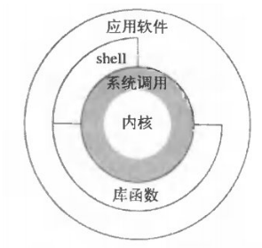
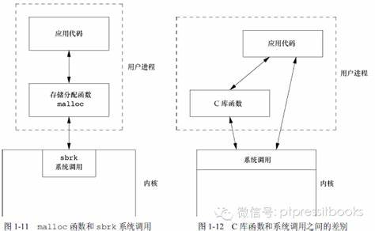
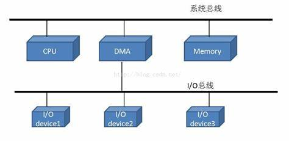
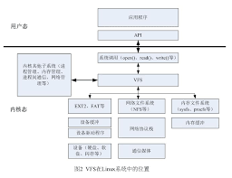
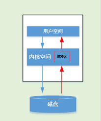
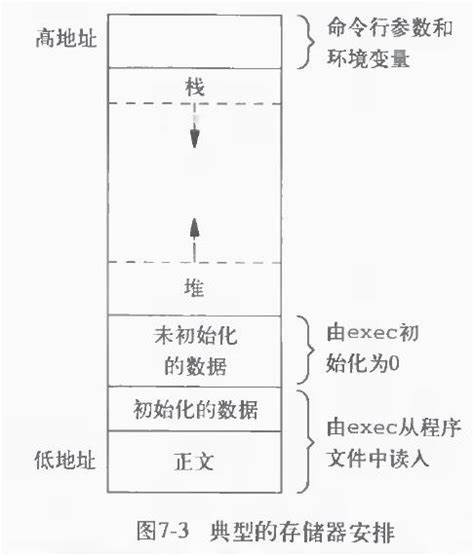
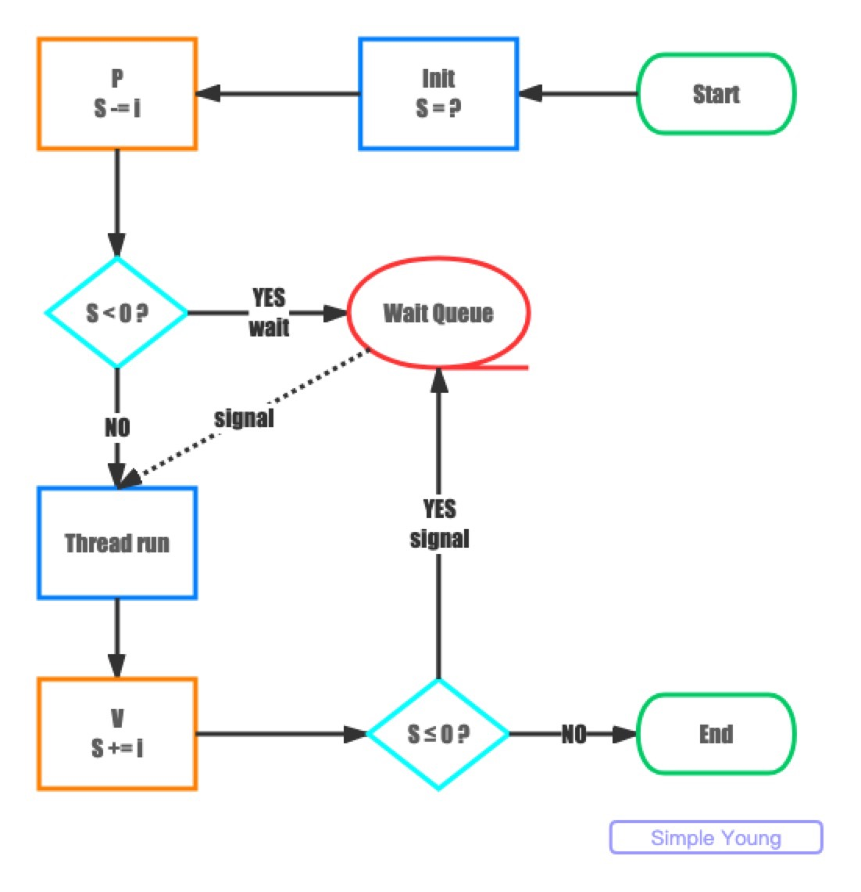
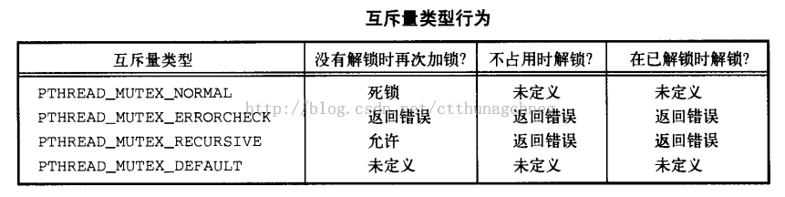

1 unix基础及标准
===

1.1 体系结构
---
>- 内核：控制计算机硬件资源，提供程序运行环境  
>- 系统调用：内核接口  
>- 应用程序：直接调用内核||通过库函数调用内核||通过shell程序
>- shell：特殊应用程序为其他应用程序提供接口；命令行解释器：读取用户输入然后执行命令；
>- 其他



1.2 login
---
>- 口令文件: /etc/passwd文件
>- 文件内容为7个以冒号分割的字段即："登陆名:加密口令:数字用户ID:数字组ID:注释字段:起始目录:shell程序", eg: "sar:x:205:105:Stephen Rago:/home/sar/:/bin/ksh"
>- 用户登陆后：a 系统显示系统消息； b 某些系统启动视窗管理程序，最终shell程序运行在视窗中； c 用户向shell程序键入命令

1.3 文件和目录
---
>- unix文件和目录为层次结构起始为:"/"
>- 目录：包含目录项的文件,包含一个文件名及文件属性；
>- 文件属性：文件类型(普通文件,目录)、文件大小、文件所有者、文件权限、文件最后修改时间等
>- stat、fstat:返回文件属性信息
>- 创建目录自动创建两个文件名:. ..
>- ls命令：遍历相应目录文件，获取记录输出记录的文件名
>- 工作目录：每个进程均有工作目录，可以通过chdir更改工作目录
>- 起始工作目录：login时从口令文件中获取，参考 ***1.2 login***
>- 每个文件均包括：所有者的用户ID及组ID

1.4 输入&&输出
---
>- 文件描述符：非负小整数，内核标识一个进程正在访问的文件
>- stdin stdout stderr
>- 不带缓冲IO(系统调用)：open read write lseek close
>- 标准IO(库函数)：提供带缓冲接口，调用方不用关心buffSize的选取, eg printf

1.5 程序&&进程
---
>- 程序：磁盘上可执行文件
>- 进程：程序执行实例，进程ID唯一标识
>- 进程存在进程所有者用户ID及组ID
>- 进程控制: fork exec waitpid
>- 线程: 线程ID，一个进程的所有线程共享同一地址空间、文件描述符、栈及与进程相关属性；线程访问共享数据需要做同步处理；

1.6 出错处理
---
>- 返回负值设置errno
>- 不同的线程有自己局部errno
>- 致命错误：输出错误并退出
>- 非致命错误：妥善处理，资源类错误可延迟重试，eg EAGAIN ENFILE ENOBUFS ENOLCK ENOSPC EWOULDBLOCK等

1.7 用户标识(用于权限控制)
---
>- 用户ID：login时获取系统管理员登陆时分配(/etc/passwd文件)，唯一，用户不可更改，0位根用户或超级用户
>- 组ID: login时获取，(/etc/group文件)
>- 附属组ID:用户可以配置多个附属组作权限控制，大多系统最多16个(/etc/group文件)

1.8 信号
---
>- 系统通知进程发生了某种情况：除0发送SIGFPE信号
>- 信号处理：a 忽略； b 系统默认处理方式; c 捕获信号，提供函数信号发生时调用
>- 产生信号：终端中断键del或ctrl+c，退出键ctrl+\，调用kill函数（向进程发送信号必须是进程所有者或者超级用户)
>- 捕获信号：发送信号到进程(系统设置进程的信号位)->内核在用户进程栈新建信号处理函数栈，进程从内核态转为用户态时执行信号处理函数，并接着信号中断处继续执行进程
>- 信号的传递：若进程屏蔽信号，则信号暂时不传递至进程，进程恢复信号屏蔽则传递至进程
>- 信号捕捉&处理：通过signal sigaction处理信号处理函数，若信号传递至进程则操作系统将相应信号处理函数加载到进程栈空间，当前线程被中断，处理完信号处理函数返回当前位置，带malloc&free等的函数对信号处理来说为非重入函数；

[信号机制参考](https://blog.csdn.net/Thanksgining/article/details/41824475)
[alarm信号](https://www.cnblogs.com/mickole/p/3190845.html)

1.9 时间值
---
>- 日历时间：协调世界时间(Coordinated Universal Time, UTC)1970/01/01 00:00:00后秒数累计，记录文件最近一次修改时间;
>- 进程时间：时钟滴答，cpu时间，度量进程使用的cpu时间，每秒曾取50、60或者100个时钟滴答
>- 进程时间：时钟时间(墙上时钟时间wall clock time，进程运行的总时间)、用户时间（执行用户指令所用时间）、系统时间

1.10 系统调用和库函数
---
>- 库函数封装系统调用，提供更复杂功能，系统调用提供一种最小接口；
>- eg sbrk为进程分配空间，地址空间管理由进程处理，内核中系统调用分配一块空间给进程，库函数malloc在用户层次管理进程的内存空间;  

  


1.11 [标准](https://www.jianshu.com/p/5841545715c8)
---
>- ISO C 规定了标准 C 的接口
>- POSIX 规定了Unix 系统的系统调用以及库函数， 还包括使用程序接口等
>- SUS(Single Unix Specification（SUS， 单一 Unix 规范) 规定了一些附加接口，扩展了POSIX
>- ***程序限制***

>> 某些限制在一个给定的 UNIX 实现中可能是固定的（由头文件定义），在另一个 UNIX 实现中可能是动态的（需要由进程调用一个函数获得限制值）。如文件名的最大字符数在不同的操作系统中，是属于动态/静态限制。因此提供了三种限制：  
1、编译时限制（由头文件给定）  
2、与文件或者目录无关的运行时限制（由 `sysconf`函数给定）:每个进程最大打开文件数，每个用户最大可用进程数，  
3、与文件或者目录相关的运行时限制（由 `pathconf`函数以及`fpathconf`函数给定）  
>>
```
long sysconf(int name);    
long pathconf(const char*pathname,int name);     
long fpathconf(int fd,int name); //fd 为文件描述符 
```
eg: linux系统通过ulimit -a命令查看相关限制
ulimit -a  
core file size          (blocks, -c) unlimited  
data seg size           (kbytes, -d) unlimited  
scheduling priority             (-e) 0  
file size               (blocks, -f) unlimited  
pending signals                 (-i) 450642  
max locked memory       (kbytes, -l) 64  
max memory size         (kbytes, -m) unlimited  
open files                      (-n) 1048576  
pipe size            (512 bytes, -p) 8 //管道缓冲区大小  
POSIX message queues     (bytes, -q) 819200  
real-time priority              (-r) 0  
stack size              (kbytes, -s) 8192  //线程栈大小  
cpu time               (seconds, -t) unlimited  
max user processes              (-u) 1048576  
virtual memory          (kbytes, -v) unlimited  
file locks                      (-x) unlimited   
[***linux系统限制及设置***：线程数 文件数](https://blog.csdn.net/gatieme/article/details/51058797)

2 I/O管理和磁盘调度
-----
2.1 概述（不分系统）
----
2.1.1 基本概念
---
>- 直接储存器访问DMA:

>- 磁盘性能远低于内存及cpu
>- 无I/O缓冲：磁盘通过操作系统读入用户进程空间，若用户进程空间内存正在进行I/O则相应内存不可换出（I/O时进程处于堵塞状态，内存不足时或者新进程调度时可能会换出内存）；若进程在相应内存锁定之前换出内存，则造成进程死锁（进程等待i/o执行激活状态，但相应内存已缓冲无法进行i/o操作)
<fancybox>

</fancybox>
>- I/O缓冲：系统开辟空间作为缓冲区，磁盘读入缓冲区，用户进程从系统缓冲区读入，进程调度时不影响进程的换入换出    
  
**缓冲区在内核空间，不影响系统对用户进程执行换入换出，不会造成死锁**


>- 磁盘性能：排队时间、等待I/O通道、寻道时间、旋转延迟、传送时间
>- 寻道时间：Ts平均小于10ms
>- 旋转延迟：1/2r
>- 传送时间: b/(rN)， b要传送字节数，N一个磁道中字节数，r转速
>- 总平均存取时间: Ts + 1/(2r) + b/(rN)
>- 顺序读取较随机读取快
>- 磁盘调度策略（尽可能顺序读取但又尽量公平）: FIFO SSTF(最短服务时间优先) SCAN(电梯算法：磁头臂仅沿一个方向移动并在途中满足所有未完成请求直到达到最后一个磁道或者没有请求；Look策略会接着反转扫描) C-SCAN（扫描策略仅在一个方向，扫描到末端后，磁头臂返回到末端反方向的末端，减少新请求的等待时间）
>- RAID磁盘阵列+冗余
>- 磁盘高速缓存(单独内存区作缓存):页面置换策略 最不常用(LFU) 最近最少使用(LRU）基于频率置换（新区 老区 && 新区 中间区 老区；只置换老区最少使用;新区时间过期换到中间区或者老区)  
***待用参考：***  
[linux系统I/O分析](https://blog.51cto.com/ccschan/2357207)  
[cpu、mem、网络I/O、磁盘I/O速度对比](https://xp-zhao.cn/2019/03/25/CPU-%E7%A1%AC%E7%9B%98-%E7%BD%91%E7%BB%9C%E9%80%9F%E5%BA%A6%E5%AF%B9%E6%AF%94/)

2.1.2 文件系统
---
>- 域：域名 值 长度
>- 域组成记录，记录组成文件，文件组成数据库
>- ***文件系统软件架构***缺图

>> a 设备驱动程序：直接与外围设备（或他们的控制器）通信
>> b 基本文件系统/物理I/O: 操作系统的一部分、外部环境的基本接口、关注块在二级存储和内存缓冲区的位置，不关注数据内容或文件结构
>> c 基本I/O管理程序:负责所有文件的I/O初始和终止、操作系统的一部分、维护设备输入输出、调度、文件状态，根据文件类型执行文件I/O设备，参与磁盘调度、I/O缓冲区的指定和辅存的分配
>> d 逻辑I/O：用户和应用程序能够访问到记录

>- ***文件管理的要素：*** 用户->目录管理->文件结构->访问方法文件操作类型->记录->组/块->内存缓冲区物理块->辅存中的物理块；缺图
>- ***常用文件组织***

>> 堆：最简单，数据按顺序到达，记录可以有不同的域，或域相似顺序不同，每个域自描述(域名:值)，域之间用划分符隐士指定或者包含在域中，或者为域类型默认长度；穷举查找，数据难以组织用堆文件；
>> 顺序文件（类mysql表）：记录格式完全统一，每个域的域名和长度为文件结构的属性；记录按关键域顺序存储，文本关键域按字母顺序，数字关键域按数字顺序；记录的第一个域通常为关键域，顺序扫描；物理组织对应文件的组织；查找更新性能差，通常存在日志文件或者事务文件，新记录放在堆文件，周期执行成批更新将新纪录合并至主文件并按照正确关键字顺序产生新文件；
>> 索引顺序文件：克服顺序文件缺点，保留顺序文件关键特征，快速接近目标，增加了文件索引及溢出文件，溢出文件类似日志堆文件；文件索引帮助快速定位记录：一级索引文件为顺序文件，存记录关键域及主文件中的位置；按索引查询定位到关键域等于或者小于需求关键域的最大值，之后顺序扫描主文件；多级索引加快文件查询速度；
>> 索引文件：多索引结构，每种可能成为查询条件的域都有一个索引，无顺序性和关键字概念，只能通过索引访问记录；记录位置无限制，可用变长记录；主文件增加记录，索引全部更新；用于查询及时性高很少对所有数据进行处理的应用程序中：公司订票系统；
>> 直接文件/散列文件：直接访问磁盘中任何一个地址已知块，每条记录存在关键域，无顺序排序，基于关键字散列，记录定长；类似散列表

>- ***记录组块二级储存管理空闲空间管理***

>> 块在扇区，块大小选择可能留下扇区空间，利用不足  
>> 块大小选择，块是否可变，块越大顺序读取局部性等好，但需要较大的内存缓冲区.   
>> 文件多条记录储存在物理磁盘块上，给定块大小存在三种组块方式：固定组块(固定长度记录，块末尾可能存在未用空间成为内部碎片);可变长度跨越式组块：可变长度记录，紧缩至块中，记录可以跨越组块；可变长度非跨越式组块：可变长度记录，记录不跨块，大多数块中存在未用空间；    
>> 文件的块分配，文件分配表：分区大小，可变大规模连续分区、按块分配  
>> 首次适配、最佳适配、最近适配（一个文件的不同块尽可能靠近）  
>> 分配方法：预分配、动态分配  
>> 连续分配（起始块 长度或块总数）、链接分配（起始块 长度，每个块都会链接下一个块）、索引分配（文件名->索引块，索引块中为文件对应块的列表）&可变分区索引分配（列表为起始块&&块大小）.  
>> 空闲空间管理：需要磁盘分配表.  
>> 位表每个位代表相应块，0 1标识是否空间，空间占用小，可完全放入内存  
>> 链接空闲区、索引（空闲去当作文件)  
>> 空闲块列表：磁盘保留区为所有空闲块的顺序号，相比较位分配空间占用大，单可以作为栈结构部分导入内存，分配块从栈顶取，释放入栈，若栈空或者栈满则与磁盘交互；（栈可替换为fifo队列）  
>> 卷为磁盘扇区集合，扇区可不连续  
>> 文件：基本信息（名 类型 组织）；地址信息（卷 起始地址 使用大小 分配大小）；访问信息控制（所有者 访问信息 权限控制）；使用信息（数据创建 创建者身份 修改时间 当前使用等)

2.2 select&poll&epoll
---
>- select与poll返回可用的数目，及fd_set bit或者结构体，用户遍历获取可用的fd进行相关处理
>- select与poll若总链接数百万级以上但活跃数几百，用户需要每次遍历返回结果确定可用的fd浪费cpu
>- select用32个整数的32位，即32*32= 1024来标识，fd值为1-1024，select存在最大数量限制
>- poll用数组标识无最大fd限制
>- select用bit标识，返回值会覆盖需要观测的fd位，每次select时均需要初始化
>-  poll与select不同，通过一个pollfd数组向内核传递需要关注的事件，故没有描述符个数的限制，pollfd中的events字段和revents分别用于标示关注的事件和发生的事件，故pollfd数组只需要被初始化一次。
>-  epoll还是poll的一种优化，返回后不需要对所有的fd进行遍历，在内核中维持了fd的列表。select和poll是将这个内核列表维持在用户态，然后传递到内核中。与poll/select不同，epoll不再是一个单独的系统调用，而是由epoll_create/epoll_ctl/epoll_wait三个系统调用组成，后面将会看到这样做的好处。epoll在2.6以后的内核才支持
>- select与poll每次调用均需要将fd_set从用户空间copy到内核空间
>- epoll：用户通过epoll_ctl注册fd_set及监听类型；epoll_wait堵塞直到超时、信号或者可用fd返回，；无最大数量限制
>- epoll仅返回可用的fd，对返回的fd进行遍历不会浪费cpu
>- select 和 poll 都是主動輪詢機制，需要拜訪每一個 FD；
>- epoll是被动触发方式，给fd注册了相应事件的时候，我们为每一个fd指定了一个回调函数，当数据准备好之后，就会把就绪的fd加入一个就绪的队列中，epoll_wait的工作方式实际上就是在这个就绪队列中查看有没有就绪的fd，如果有，就唤醒就绪队列上的等待者，然后调用回调函数。

[参考](https://www.jianshu.com/p/1b4b3c738d8c)
[epoll函数](http://man7.org/linux/man-pages/man2/epoll_ctl.2.html)
[linux](https://linux.die.net/man/4/epoll)
[epoll函数解析](https://blog.csdn.net/yusiguyuan/article/details/15027821)
[epoll用法](https://devarea.com/linux-io-multiplexing-select-vs-poll-vs-epoll/#.XSvqwJMzbI4)
[epoll内核实现](https://blog.csdn.net/wangpeihuixyz/article/details/41732127)
[epoll详解代码分析](https://tqr.ink/2017/10/05/implementation-of-epoll/)
3 进程&&线程&&IPC
----

3.1 进程
---
>- ***进程环境***
>-
>>- main(C): 调用特殊启动例程A-> A作为起始地址(编译器定)->A从内核获取命令行参数&环境变量->调用main函数
>>- 终止：main(控制线程、主线程)返回、调用exit(清理工作->内核)、_exit _EXIT（直接进入内核)、最后一个线程从启动历程返回、最后一个线程调用pthread_exit；异常终止：调用abort、信号、最后一个线程对cancel取消做响应(线程收到cancle后不会立即停止而是到特定取消点才回返回)；
>>- int atexit(void (*func)(void))类似go中defer函数，exit自动调用，atexit注册的函数成为终止处理程序
>>- 环境表：字符指针数组，getenv&putenv&setenv&unsetenv获取&设置特定环境变量，全部环境变量需要用environ指针
>>- c语言可以通过动态链接共享库：所有进程都可引用的存储区中保存共享库历程的副本；程序第一次执行动态链接与共享库链接；减少执行文件长度，增加第一次运行程序开销；
>>- 内存分配：malloc无初始化、calloc每bit初始化为0、realloc增加或减少以前分配的区域，若增加区域可能移动至另一比较大区域在尾端为新增区域，新增区域初始值不定；
>>- gettrlimit&settrlimit获取设置资源限制，进程继承，软限制<=硬限制；进程降低可以降低硬限制但普通进程无法增加硬限制；超级用户可以增加硬限制；
>>

>- ***进程控制***
>-
>>- fork：pid=fork();子进程返回0,父进程返回子进程pid
>>
```
子进程继承： 
实际用户ID、组，有效用户ID组
附属组ID
进程组ID、会话ID、控制终端
设置用户ID标志&设置组ID标志
当前工作目录、根目录
文件模式创建屏蔽字
信号屏蔽和安排
对任一打开文件描述符的执行时关闭标志(close-on-exec)
环境
连接的共享存储段
存储映像
资源限制
父子进程不同：
fork返回结果不同，子进程返回0（0为内核调度进程），父进程返回子进程pid
两者进程ID&父进程不同
文件锁不继承（文件范围锁关联具体的进程ID）
子进程未处理闹钟被清零
子进程未处理信号集设置为空
dup文件：共享文件表项
fork用法：
1 父进程复制自己，执行不同代码段(net server accept conn及conn处理函数)
2 进程执行不同程序：shell fork后执行exec 
```
>>- vfork:创建新进程，新进程目的执行exec，新进程执行exec或exit前在父进程空间；pid=vfork()
>>
```
子进程先运行
子进程调用exec或者exit之后父进程可运行
若子进程调用exec/exit之前依赖父进程的进一步动作则死锁
```
>>- wait waitpid：waittid类似waitpid wait3&wait4返回资源概况：CPU总时间、系统CPU总时间、缺页次数、接收到信号次数
>>
```
pid_t wait(int *staloc)
wait:任一子进程终止则返回子进程终止状态，无子进程出错返回，若无子进程终止，阻塞
子进程终止向父进程发送SIGCHLD信号
pid_t waitpid(pid_t pid, int *staloc, int options)
pid可以指定所有子进程 进程组 特定子进程 同一组ID的任一子进程
子进程结束后产生僵死进程保留子进程状态，直到父进程wait(若SIGCHLD设置为忽略则不产生僵死进程)
```
>>- exec：磁盘程序替换当前进程正文段、数据段、堆、栈、
>>
```
exec后新程序继承：
进程ID父进程ID
实际用户ID、组，有效用户ID组
附属组ID
进程组ID、会话ID、控制终端
当前工作目录、根目录
文件模式创建屏蔽字
文件锁
闹钟尚余留时间
未处理信号
进程信号屏蔽字
资源限制
```
>>- setuid setgid seteuid setegid设置用户/组ID 权限控制：实际ID有效ID保存ID
>>- 进程会计：进程结束时内核写会计记录包含命令名、CPU时间、用户/组ID、启动时间等，内核保存在进程表项中，不终止的进程无此记录(eg init pid=1）
>>- system函数:fork+exec

>- ***进程关系***
>
>>- 进程组、会话（会首进程不能是组长，fork setsid），前台进程组接受终端控制控制、作业控制
>>- 非孤儿进程组：进程组中存在某一进程其父进程为同一会话中另一组进程
>>- 会话包括进程组，进程组包括若干进程

[linux fork vfork clone](https://blog.csdn.net/gatieme/article/details/51417488)

3.2 信号:异步处理
---
信号可以在任何时候中断程序，信号处理中若对共享数据进行相关操作需要注意数据竞争，信号处理程序中可以使用自旋锁，不可使用休眠类锁，中断处理尽量快，不应该休眠
>- 信号处理方式：信号出现时告知内核处理方式；捕获(handler处理)、默认处理方式、忽略
>- SIGKILL(杀死进程) & SIGSTOP(作业控制)不可捕获或者忽略
>- exec将之前程序设置的捕获信号更改为默认处理方式(执行新程序)，进程映像改变，捕捉函数地址可能变成无意义
>- fork：子进程继承父进程信号处理方式(子进程复制父进程的进程映像)，进程函数地址有意义可用，直到子进程复写信号处理方式
>- signal函数
>>- 不可靠信号，信号可能丢失，signal捕捉信号后信号处理恢复默认值，重新设置时存在时间窗口

>- 中断系统调用：进程执行低速系统调用而阻塞期间捕捉到信号，系统调用被中断不再执行，系统调用出错设置errno；捕捉到信号时中断的是内核中执行的系统调用
>>- 慢系统调用：可能使进程永远阻塞的一类系统调用；读数据不存在、写数据文件类型不同、pause函数、wait函数、某些ioctl、某些进程间通信
>>- 自动重启系统调用：不希望可以禁用
>>- sigaction默认重启被中断
>- 不可重入函数：调用malloc/free; 使用全局数据结构；
>- 信号产生&递送
>
>>- 信号产生： 信号产生时，内核以某种形式在进程表中以某种形式设置标志
>>- 信号递送：对信号采取信号处理动作时称为向进程递送信号
>>- 信号产生与信号递送之间为未决状态
>>- 信号阻塞则不递送信号，接触阻塞才递送信号
>>- 递送信号时决定信号的处理方式
>>- 信号阻塞时若处理方式不是ignore则信号处于未决状态
>>- 信号递送时决定信号的处理方式，信号递送之前仍可以改变其处理方式
>>- 信号阻塞时设置信号处理方式为忽略则信号忽略不是未决状态
>
>- 信号发送：  
>
>>- kill:发送给进程/进程组
>>- raise发送给自己
>
>- 竟态条件：alarm到时发送sigalarm信号 pause阻塞直到信号中断
>
>>
```
#include <signal.h>
#include <unistd.h>
static void
sig_alarm(int signo)
{
/* do nothing just return */
}
unsigned int
sleep1(unsigned int seconds)
{
if (signal(SIGALARM, sig_alarm) == SIG_ERR 
	return(seconds);
alarm(seconds);
// 存在竞态条件，若pause之前产生信号，则pause永远阻塞，取消于系统进程调用及alarm的时间
pause();
return(alarm(0));
}
```

>- 阻塞信号: int sigpromask(int how, const sigset_t *restrict set, sigset_t *oldset)
>- 规定当前阻塞不能递送给进程的信号集
>- sigpending返回未决信号集(产生了未递送被阻塞的信号集)
>- sigaction: 信号处理方式一直存在除非重新设定，可以设置信号屏蔽字(信号处理时屏蔽某些信号)信号处理返回时恢复原信号屏蔽字;
>- longjmp阻塞其信号屏蔽字，sigsetjmp&siglongjmp会恢复信号屏蔽字
>- sigsuspen(const sigset_t *sigmask)屏蔽sigmask后再休眠，原子操作执行之后会恢复之前的信号屏蔽字；
>

3.3 IPC&&跳转
---
3.3.1 IPC(内核）
---
>- 管道：int pipe(int fd[2]) fd[0]读， fd[1]写， fd[1]->fd[0]
>
>>- 不用创建临时文件，系统内核map共享内存区域并创建文件表项，应用程序通过文件描述符对相关内存区域进行读写操作仅可一端写一端读，达到进程间通信；利用虚拟文件系统
>>- 半双工
>>- 具有公共祖先的进程间使用
>>- read写端关闭管道，所有数据读取后，read返回0，写端还有进程则不会产生文件结束
>>- write读端关闭的管道产生SIGPIPE信号write返回-1 errno设置为EPIPE
>>- PIPE_BUF限制了内核的管道缓冲区大小，<=PIPE_BUF字节的write操作为原子操作，不会交叉进行；pathconf fpatchconf可以确定PIPE_BUF值
>>- 用法 pipe(fd);产生管道，fork产生子进程，子进程中关闭fd[0] write(fd[1])，父进程关闭fd[1], read(fd[0])，则实现子进程写父进程读进程间通信，反之也可以；
>>- 标准I/O库提供FILE *popen(const chat *cmdstring, const char *type);int pclose(FILE *fp);创建一个管道，frok一个子进程，关闭未使用管道端，执行shell命令，等待命令终止；
>>- 存在引用计数，最后一个引用结束，管道被完全删除
>>
```
#include <stdio.h>
#include <stdlib.h>
#include <string.h>
#include <unistd.h>
#include <sys/types.h>
int main(void)
{
	int fd[2],nbytes;
	pid_t childpid;
	char string[] = "Hello, World!\n";
	char readbuffer[80];
	pipe(fd);
	int w_fd = fd[1];//写
	int r_fd = fd[0];//读
	if((childpid = fork()) == -1)
	{
		perror("fork");
		exit(1);	
	}
	if(childpid == 0)	//子进程
	{
		close(r_fd);//关闭读
		write(w_fd,string,strlen(string));
		exit(0);		
	}
	else	//父进程
	{
		close(w_fd);关闭写
		nbytes = read(r_fd, readbuffer,sizeof(readbuffer));
		printf("Received string:%s\n",readbuffer);		
	}
	return 0;
}
```

>- FIFO命名管道:一种文件类型，内存中不需要创建临时文件，操作系统处理
>
>>- 不相关进程可以交换数据
>>- 是一种文件类型
>>- 创建FIFO类似创建文件，FIFO路径存在文件系统中，但不存在磁盘快中，利用虚拟文件系统，在内核内存区域
>>- int mkfifo(const char *path, mode_t mode);类似于新建文件，创建后可以open(char *path,...)
>>- 可用open(O_NONBLOCK) read write close操作
>>- 可被原子写入的最大数据量为PIPE_BUF
>>- write为read进程的FIFO产生SIG_PIPE
>>- read时所有write端关闭，返回0， EOF
>>- 用途：1 shell命令无需创建中间临时文件，将数据从一条管道传送至另一条；2 客户进程-服务进程应用中，FIFO用作汇聚点，cli-server中传递数据
>>- 存在引用计数，最后一个引用进程终止，FIFO名字保留除非显式删除，FIFO中数据已删除；
>>
```
server.c
#include<stdio.h>
#include<sys/types.h>
#include<sys/stat.h>
#include<fcntl.h>
#include<unistd.h>
#define FIFO_CHANNEL "my_fifo"  /* 宏定义，fifo路径 */
int main()
{
 int fd;
 char buf[80];
 if(mkfifo(FIFO_CHANNEL,0777)==-1) /* 创建命名管道，返回-1表示失败 */
 {
  perror("Can't create FIFO channel");
  return 1;
 }
 if((fd=open(FIFO_CHANNEL,O_RDONLY))==-1)  /* 以只读方式打开命名管道 */
 {
  perror("Can't open the FIFO");
  return 1;
 }
 while(1)  /* 不断从管道中读取信息 */
 {
  read( fd, buf, sizeof(buf) );
  printf("Message from Client: %s\n",buf );
  sleep(3); /* sleep 3s */
 }
 close(fd);  /* 关闭管道 */
 return 0;
}
/*******客户端*****/
client.c
#include<stdio.h>
#include<sys/types.h>
#include<sys/stat.h>
#include<fcntl.h>
#include<unistd.h>
#define FIFO_CHANNEL "my_fifo"  /* 宏定义，fifo路径 */
int main()
{
 int fd;
 char s[]="Hello!";
 if((fd=open(FIFO_CHANNEL,O_WRONLY))==-1)  /* 以读写方式打开命名管道，返回-1代表失败 */
 {
  perror("Can't open the FIFO");
  return 1;
 }
 while(1)  /* 不断向管道中写信息 */
 {
  write( fd, s, sizeof(s) );
  printf("Write: %s\n",s);
  sleep(3);  /* sleep 3s */
 }
 close(fd);  /* 关闭管道 */
 return 0;
}
```

>- XSI IPC： 内核相关内存中

>>- 标识符内部命名
>>- key关联标识符，外部命名
>>- 任何时候需要指定key，内核换成标识符
>>- key必须放置在进程可以取到的位置或者某种共识：头文件、文件中、cli-server认可的同一路径名和项目ID，ftok(const chat *path, int id)变换成key；
>>- 存在权限结构
>>- 缺点：1无引用计数，除非显式删除 2 非文件，无法用select及其他
>>- 优点：可靠、流控制、面向记录
>>- 无连接：不需要调用某种形式打开函数就能发送消息
>>- 流控制：如果系统资源短缺（缓冲区），或者接受进程不能再接收更多消息，则发送进程进入休眠；流控制条件消失发送进程自动唤醒；
>>
~~消息队列(新应用程序不在使用)~~：内核 链表；msqid = msgget(key, flag)打开或创建创建队列获取队列ID；msgctl(msqid, cmd, *buf)队列操作，msgsnd(msqid, *ptr, nbytes, flag)数据放入队列flag可为no_wait；msgrcv(msqid, *ptr, nbytes, flag)接收

>>- 信号量：计数器，原子操作，通常在内核中实现，二元信号量控制单个资源；信号量可以为任意正值，控制多少个共享资源单位可以共享应用；semid = semget(key, nsems, flag); semctl(semid, semnum, cmd, .../*union semnum arg */); semop;
>>  [信号量机制](https://www.jianshu.com/p/93128a6cb0f0)   [信号量](https://juejin.im/post/5cb57b79518825327a059ea6)
>> 
```
信号量S，整型变量，需要初始化值大于0
P原语，荷兰语Prolaag(probeer te verlagen)，表示减少信号量，该操作必须是原子的
V原语，荷兰语Verhogen，表示增加信号量，该操作必须是原子的
P操作，原子减少S，然后如果S < 0，则阻塞当前线程
V操作，原子增加S，然后如果S <= 0，则唤醒一个阻塞的线程
信号量一般被用来控制多线程对共享资源的访问，允许最多S个线程同时访问临界区，多于S个的线程会被P操作阻塞，直到有线程执行完临界区代码后，调用V操作唤醒。所以PV操作必须是成对出现的。
那么信号量可以用来干什么呢？
信号量似乎天生就是为限流而生的，我们可以很容易用信号量实现一个限流器。
信号量可以用来实现互斥锁，初始化信号量S = 1，这样就只能有一个线程能访问临界区。很明显这是一个不可重入的锁。
信号量甚至能够实现条件变量，比如阻塞队列
```
>>- 信号量vs记录锁vs互斥量：信号量需要创建信号集semop操作；记录锁创建空文件，文件的第一个字节作为锁子节，锁持有者终止内核会自动释放锁；互斥量需要所有进程将相同的文件映射到他们的地址空间，使用pthread_process_sharded，若进程没有释放互斥量终止，恢复很困难；因此优先选择记录锁自动释放鲁棒性强；
>>- 条件变量：互斥锁&相应条件，满足一定条件时同步；[条件变量](https://www.jianshu.com/p/01ad36b91d39)
>>- 锁：[锁基于硬件级的内存总线的原子操作TestSet](https://blog.csdn.net/qq_35181209/article/details/78026636)
>>- 共享存储：多个进程共享给定的储存区，最快IPC；无文件，共享存储端为内存的匿名段；mmap与文件关联；
>>- POSIX信号：接口简单、无信号量集、删除完美最后一次饮用被释放；未命名仅存在内存中，命名管道可以通过名字访问；sem_close释放信号量资源，若进程没有close就退出，内核自动关闭打开的信号量；sem_open创建或者使用信号量(类似created open)
>>- sem_unlink(const char *name)销毁命名信号量
>>- sem_wait-1 sem_trywait sem_timewait sem_post+1
>>- linux实现将文件映射到了进程地址空间，没有使用系统调用操作各自信号量，提高94%相比较于XSI信号量
>>- unix域套接字：同一台计算机间通信，仅仅复制数据，不执行协议处理，不需要添加或者删除网络报头，无需校验和，无产生顺序号，不需发送确认报文；提供strean&数据报两种接口；像是管道和套接字的混合；可以使用面向网络接口，或者socketpair创建一对无命名相互连接的unix域套接字；cli端需要显式绑定地址（路径）；便于服务器区分各个cli进程

3.3.2 跳转
--
>- int setjmp(jmp_buf env); void longjmp(jmp_buf env, int val)；env存放在调用longjmp时能用来恢复栈的所有信息，env通常定义为全局变量；jmp_buf为特殊类型；只需定义可以直接在setjmp&longjmp中使用
>- [sigsetjmp,siglongjmp的使用](https://blog.csdn.net/ljx0305/article/details/2904221)

>>- sigsetjmp()会保存目前堆栈环境(只保存寄存器中信息，数据、计数器等)，然后将目前的地址作一个记号，而在程序其他地方调用siglongjmp()时便会直接跳到这个记号位置，然后还原堆栈，继续程序好执行。
>>- sigsetjmp()相当于goto，只是goto不能垮栈，sigsetjmp若实际执行跳转则返回值为siglongjump设置的值，可以标记具体位置
>>- 参数savesigs若为非0则代表搁置的信号集合也会一块保存
>>- 当sigsetjmp()返回0时代表已经做好记号上，若返回非0则代表由siglongjmp（）跳转回来。 
>>- 返回值：返回0代表寄存好目前的堆栈环境，随时可供siglongjmp()调用， 若返回非0值则代表由siglongjmp()返回 
>>- sigsetjmp&siglongjmp为信号安全函数，相比较于setjmp&longjmp
>>- eg: alarm信号处理函数调用siglongjump,主程序中某个位置调用sigsetjump，若发生alarm信号则siglongjump自动跳回至sigsetjump函数处并恢复sigsetjump函数保存的堆栈信息，同时sigsetjump返回值非0，此时表明已经发生了超时信号则退出主程序
>>- longjump若信号产生时调用则屏蔽该信号，sigsetjmp会保存信号屏蔽字，因此sigsetjmp组合siglongjmp会恢复阻塞的信号屏蔽字
>>-
```
#include <unistd.h>
#include <setjmp.h>
#include <stdlib.h>
#include <stdlib.h>
#include <signal.h>
static jmp_buf env_alrm;
void alarm_fun()
{
printf("time out/n");
siglongjmp(env_alrm,1);
}
int test_alrm()
{
int test_value = 0;
signal(SIGALRM,alarm_fun);
if ( sigsetjmp(env_alrm, 1) != 0 )
    {
        alarm( 0 );
        signal( SIGALRM, SIG_IGN );
        return -1;    /* timeout */
    }
alarm(5);//5 sec;
sleep(10);//改变这里看效果
alarm(0);
signal( SIGALRM, SIG_IGN );//忽略信号
return 1;
}
int main()
{
printf("%d",test_alrm());
return 0;
}
```

3.4 线程
---
***定义***：线程包含有执行环境所必需的所有信息，其中包括线程ID、一组寄存器值(支持线程上下文保存)、栈、调度优先级和策略、信号屏蔽字、errno变量以及线程私有数据；一个进程的所有信息对该进程的所有线程是共享的，包括可以执行程序的代码、程序的全局内存和堆内存、栈以及文件描述符；
>- int pthread_equal(pthread_t tid1, pthread_t tid1)相等返回0
>- pthread_t pthread_self(void)
>- 作业管理：主线程维护作业队列指定每个作业可以处理的线程，线程根据线程ID取自己可以处理的作业
>- 线程创建：pthread_create
>- 线程终止：exit _exit _EXIT 终止整个进程，SIGCHLD信号默认处理终止整个进程；

>>- 线程从启动历程返回 return
>>- 线程被同一进程中其他线程取消cancel， pthread_cancel(pthread_t pid)不等待线程终止仅仅提出终止请求；
>>- void pthread_exit(void *rval_ptr);rval_ptr为线程退出状态码或其他相关信息；
>>- int pthread_join(pthread_t thread, void **rval_ptr);线程分离(否则为僵死线程)可以获取其退出码；调用线程一直阻塞直到指定的线程退出
>>- 默认情况，线程终止状态保存直到对线程调用pthread_join；
>>- 线程若已分离，线程的底层资源存储在线程终止时可以立即回收
>>- 线程被分离后，调用pthread_join函数等待线程终止状态产生未定义行为
>>- pthread_detach(pthread_t pid)可以分离线程

>- 线程清理程序：类似进程的atexit函数

>>- void pthread_cleanup_push(void (*rtn)(void *), void *arg); void pthread_cleanup_pop(int execute);
>>- rtn为注册的清理函数，执行顺序与push顺序相反
>>- pthread_exit退出进程时，响应cacel时，execute不为0时执行清理函数；
>>- push&pop需要成对使用
>>
|进程原语|线程原语|描述|
|:------:|:------:|:------:|
|fork|pthread_created|创建新的控制流|
|exit|pthread_exit|从现有控制流退出|
|waitpid|pthread_join|从控制流得到退出状态，占有资源得以回收|
|atexit|pthread_cancel_push_pop|注册在退出控制流时的清理函数|
|getpid|pthread_self|获取控制流ID|
|abort|pthread_cancel|请求控制流的非正常退出|

>- ***线程同步：***增量操作非原子三步，1 读入寄存器 2 寄存器运算 3 写回内存; 互斥量、读些锁、条件变量、自旋锁、屏障

>>- 互斥量：本质为一把锁，每次只有一个线程可以向前执行；
>>
|函数|作用|
|:------:|:------|
|int pthread\_mutex\_init(pthread\_mutex\_t *restrict mutex, const pthread\_mutexattr\_t *restrict attr);|互斥量初始化|
|int pthread\_mutex\_destory(pthread\_mutex\_t *mutex)|释放内存|
|int pthread\_mutex\_lock(pthread\_mutex\_t *mutex)|获取锁，阻塞|
|int pthread\_mutex\_unlock(pthread\_mutex\_t *mutex)|释放锁|
|int pthread\_mutex\_trylock(pthread\_mutex\_t *mutex)|非阻塞，可以锁定则锁定返回0，否则返回EBUSY|
|int pthread\_mutex\_timelock(pthread\_mutex\_t *restrict mutex, const struct timespec *restrict tsptr);|tsptr绝对时间，超时未获取锁返回ETIMEOUT|

>>- 避免死锁：注意锁顺序，A|B A|B,用trylock
>>- 锁粒度：过粗并发性低，过细锁开销过多影响性能，增加代码复杂度
>>- 读写锁：并发性高，写模式为独占：类似互斥量
>>- 条件变量(与互斥量配套使用)：init destory wait timewait signal至少能唤起等待该条件的一个线程 broadcat唤醒等待该条件的所有线程
>>- 自旋锁：类似互斥量，其不会堵塞，忙等，适用于锁被持有时间短&线程不希望在重新调度上费太多成本
>>- 屏障，允许所有线程等待直到合作线程达到某个点从该点继续执行：类似go中wg.add(n) wg.done() wg.wait(),只是wg.done&wg.wait合为wait函数，wait的调用达到n个即达到合作点
>>
|屏障函数|desc|
|:------:|:------:|
|int pthread\_barrier\_init(pthread\_barrier\_t *restrict barrier, const pthread\_barrierattr\_t *restrict attr, unsigned int count);|初始化，获取屏障，attr指定属性，count指定合作线程|
|pthread\_barrier\_destroy(pthread\_barrier\_t *barrier);|释放内存|
pthread\_barrier\_wait(pthread\_barrier\_t *barrier);|调用线程屏障计算未满足count则进入休眠，最后一个线程满足count唤醒所有线程|

>- 线程&信号：每个线程有自己的信号屏蔽字(pthread_sigmask函数)，共享信号处理函数；进程信号所有线程均可接收，但线程可以设置自己的信号屏蔽字屏蔽某些信号，可以设置专门的信号处理线程，处理相关信号
>- 线程等待信号出现(异步信号处理转为同步，可以让某个线程专门处理):int sigwait(const sigset_t *restrict set, int *restrict signop)；调用之前需要阻塞set集，set集为sigwait需要等待的信号，signop为等到的信号；sigwait函数会原子取消信号集的阻塞状态；
[参考文章](https://blog.csdn.net/yusiguyuan/article/details/14237277)
>- 线程限制：最大keys(线程专有数据)、stack_min栈可用最小字节、进程可以创建的最大线程数、
>- 线程属性：线程可以设置分离状态(创建线程时设置attr的detachstate为pthread_create_detached)则操作系统在线程退出时自动回收其资源、设置栈位置、设置stacksize

|func|desc|
|:------:|:------:|
|pthread\_attr\_init(pthread\_attr\_t *attr);|初始化线程属性|
|pthread\_attr\_destroy(pthread\_attr\_t *attr);|free,失败则内存泄漏|
|pthread\_attr\_getdetachstate(const pthread\_attr\_t *restrict attr, int *detachstate);|获取线程分离状态|
|pthread\_attr\_setdetachstate(pthread\_attr\_t *attr, int *detachstate);|将分离状态设置在attr中|
|pthread\_attr\_getstack(const pthread\_attr\_t *restrict attr, void **restrict stackaddr, size_t *restrict stacksize);|获取栈，attr属性，stackaddr栈的最低地址，stacksize栈的大小|
|pthread\_attr\_setstack(pthread\_attr\_t *attr, void *stackaddr, size_t stacksize);|设置栈，线程栈的虚拟地址空间用完，可以使用malloc或者mmap为可替代的栈分配空间，setstack函数改变新建线程的栈位置；进程虚拟地址空间大小固定，线程共享虚拟地址空间，若进程开启很多线程，所有线程的虚拟地址空间超过了进程的可用虚拟地址空间，需要减少默认的线程栈大小|
|pthread\_attr\_getstacksize(const pthread\_attr\_t *restrict attr, size_t *restrict stacksize);|获取stacksize|
|pthread\_attr\_setstacksize(pthread\_attr\_t *attr, size_t stacksize);|设置stacksize|
|pthread\_attr\_getguardsize(const pthread\_attr\_t *restrict attr, size_t *restrict guardsize);|设置栈警戒区大小，线程栈指针溢出到境界去应用程序通过信号接收到错误,控制线程栈末尾之后，避免栈溢出的扩展内存的大小;由具体实现定义，常用值为系统页大小，大小为0不提供警戒缓冲区，若修改线程属性，系统认为我们自己管理栈，使警戒缓冲机制无效，类似将guardsize设置为0|
|pthread\_attr\_setguardsize(pthread\_attr\_t *attr, size_t guardsize);|设置guardsize大小|
```
#include "apue.h"
#include <pthread.h>
int makethread(void *(*fn)(void *), void *arg)
{
int err;
pthread_t tid; //线程id
pthread_attr_t attr; //线程属性
err = pthread_attr_init(&attr); //初始化属性malloc
if (err != 0)
	return (err);
err = pthread_attr_setdetachstate(&attr, PTHREAD_CREAT_DETACHED); //设置分离状态
if (err == 0)
	err = pthread_create(&tid, &attr, fn, arg);//创建线程
pthread_attr_destroy(&attr);//销毁attr资源，失败则资源泄漏
return (err);
}
```
>- 同步属性：进程共享属性、健壮属性（与多进程间共享的互斥量相关，互斥量的进程终止时，解决互斥量状态恢复问题pthread_mutext_consistent(pthread_mutex_t *mutex))，不同进程的线程共享；pthread_atfork(void (*prepare)(void), void (*parent)(void), void (*child)(void));prepare在父进程调用fork时创建子进程前使用，parent在fork返回父进程前使用，child在fork返回子进程前使用；

>- pread pwrite多线程环境线程安全
>- 线程和fork：写时复制(copy-on-write)父子进程不更改内容则共享内存页副本；子进程继承地址空间继承互斥量、读写锁、条件变量的状态，子进程内部只存在一个线程：父进程中调用fork的线程副本构成；若父进程中的线程占有锁，子进程同样占有这些锁（线程恭喜那个内存空间)；子进程并不包含占有锁的线程副本，子进程无法知道自己占用哪些锁需要释放哪些锁；fork之后调用exec可以避免此问题，旧地址空间被丢弃；

4 I/O模型
===
>- [同步异步&堵塞非堵塞的区别](https://www.jianshu.com/p/aed6067eeac9)
>- 
>- 等待数据&将数据从内核复制到用户空间均被阻塞
>- 
>- 等待数据为轮询，不阻塞
>- 
```
当用户进程发出read操作时，如果kernel中的数据还没有准备好，那么它并不会block用户进程，而是立刻返回一个error。从用户进程角度讲，它发起一个read操作后，并不需要等待，而是马上就得到了一个结果。用户进程判断结果是一个error时，它就知道数据还没有准备好，于是它可以再次发送read操作。一旦kernel中的数据准备好了，并且又再次收到了用户进程的system call，那么它马上就将数据拷贝到了用户内存，然后返回。
优点：能够在等待任务完成的时间里干其他活了（包括提交其他任务，也就是 “后台” 可以有多个任务在同时执行）。
缺点：任务完成的响应延迟增大了，因为每过一段时间才去轮询一次read操作，而任务可能在两次轮询之间的任意时间完成。这会导致整体数据吞吐量的降低。
```
>- i/o多路复用：轮询查询多个状态
>
```
由于同步非阻塞方式需要不断主动轮询，轮询占据了很大一部分过程，轮询会消耗大量的CPU时间，而 “后台” 可能有多个任务在同时进行，人们就想到了循环查询多个任务的完成状态，只要有任何一个任务完成，就去处理它。如果轮询不是进程的用户态，而是有人帮忙就好了。那么这就是所谓的 “IO 多路复用”。UNIX/Linux 下的 select、poll、epoll 就是干这个的（epoll 比 poll、select 效率高，做的事情是一样的）。
IO多路复用有两个特别的系统调用select、poll、epoll函数。select调用是内核级别的，select轮询相对非阻塞的轮询的区别在于---前者可以等待多个socket，能实现同时对多个IO端口进行监听，当其中任何一个socket的数据准好了，就能返回进行可读，然后进程再进行recvform系统调用，将数据由内核拷贝到用户进程，当然这个过程是阻塞的。select或poll调用之后，会阻塞进程，与blocking IO阻塞不同在于，此时的select不是等到socket数据全部到达再处理, 而是有了一部分数据就会调用用户进程来处理。如何知道有一部分数据到达了呢？监视的事情交给了内核，内核负责数据到达的处理。也可以理解为"非阻塞"吧。
```
>- 

```
I/O复用模型会用到select、poll、epoll函数，这几个函数也会使进程阻塞，但是和阻塞I/O所不同
的的，这两个函数可以同时阻塞多个I/O操作。而且可以同时对多个读操作，多个写操作的I/O函数进行
检测，直到有数据可读或可写时（注意不是全部数据可读或可写），才真正调用I/O操作函数。
```
>- select poll epoll堵塞
```
IO multiplexing就是我们说的select，poll，epoll，有些地方也称这种IO方式为event driven IO。select/epoll的好处就在于单个process就可以同时处理多个网络连接的IO。它的基本原理就是select，poll，epoll这个function会不断的轮询所负责的所有socket，当某个socket有数据到达了，就通知用户进程。
当用户进程调用了select，那么整个进程会被block，而同时，kernel会“监视”所有select负责的socket，当任何一个socket中的数据准备好了，select就会返回。这个时候用户进程再调用read操作，将数据从kernel拷贝到用户进程。
```
>- 两次系统调用，适合连接数较多的情况
>
```
所以，如果处理的连接数不是很高的话，使用select/epoll的web server不一定比使用multi-
threading + blocking IO的web server性能更好，可能延迟还更大。（select/epoll的优势并
不是对于单个连接能处理得更快，而是在于能处理更多的连接。）
在IO multiplexing Model中，实际中，对于每一个socket，一般都设置成为non-blocking，但
是，如上图所示，整个用户的process其实是一直被block的。只不过process是被select这个函数
block，而不是被socket IO给block。所以IO多路复用是阻塞在select，epoll这样的系统调用之
上，而没有阻塞在真正的I/O系统调用如recvfrom之上。
```
>- 第一个阶段有的阻塞，有的不阻塞，有的可以阻塞又可以不阻塞。第二个阶段都是阻塞的。
>- 从整个IO过程来看，他们都是顺序执行的，因此可以归为同步模型(synchronous)。都是进程主动等待且向内核检查状态。(selec poll epoll 同步堵塞 同步非堵塞均为同步模型)
>- 
```
同步是需要主动等待消息通知，而异步则是被动接收消息通知，通过回调、通知、状态等方式来被动获取
消息。IO多路复用在阻塞到select阶段时，用户进程是主动等待并调用select函数获取数据就绪状态消
息，并且其进程状态为阻塞。所以，把IO多路复用归为同步阻塞模式。
```
>- 
>- [io讲解](https://www.jianshu.com/p/486b0965c296)

5 并行、并发、同步、异步
===
>- 并行为多个程序在同一时刻发生（并行一般为多核，单核无法并行）
>- 并发尾多个程序在同一时段发生（并发属于并行）
>- 同步:假设A B必须A执行完执行B，A未完成某一事件时B不可以执行其他事件
>- 异步:线程B在等待A的结果时还可以执行其他操作
>
[同步异步](https://blog.csdn.net/gogokongyin/article/details/9797363)