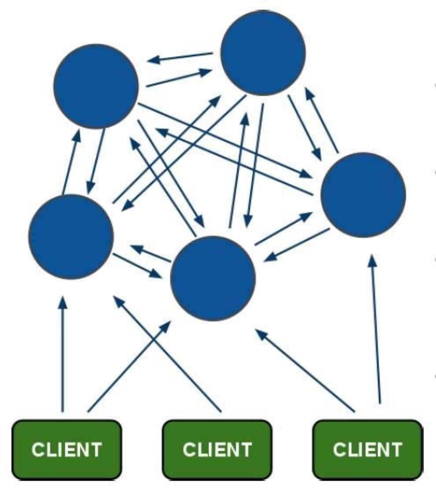
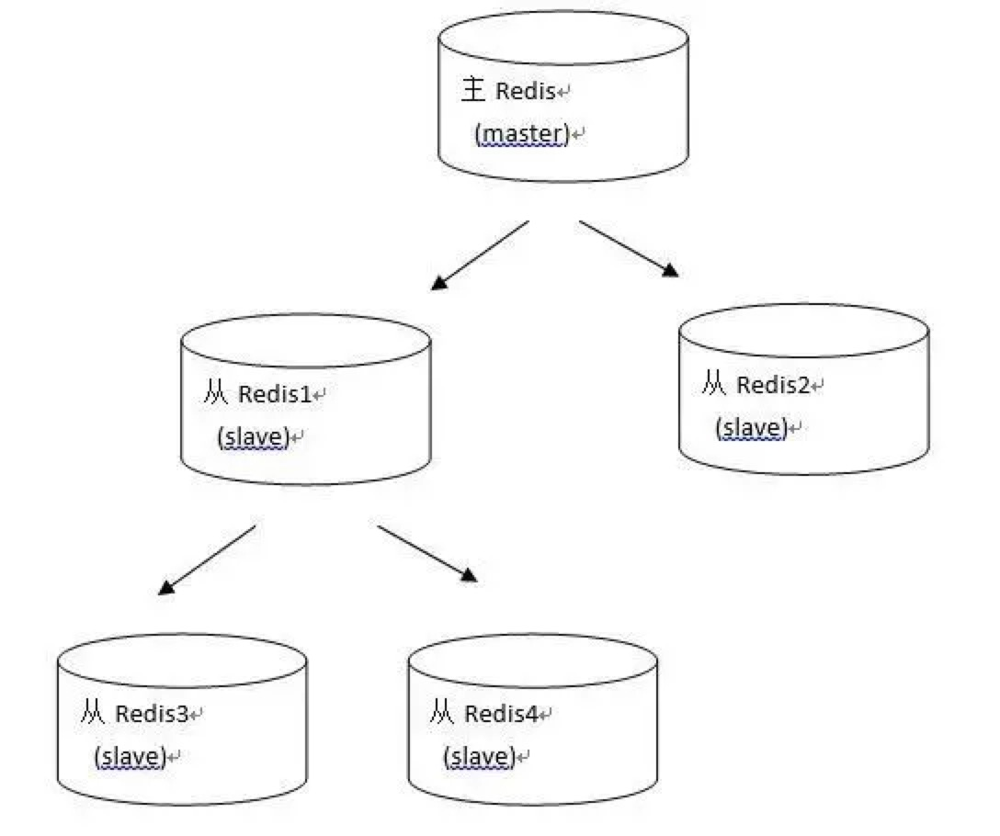

1 redis基础数据结构&算法复杂度解析
===
[redis命令](https://www.redis.net.cn/tutorial/3512.html)  
[redis命令官网带算法复杂度](https://redis.io/commands#sorted_set)  
redis用到内存极致
>- 存储效率（memory efficiency）。Redis是专用于存储数据的，它对于计算机资源的主要消耗就在于内存，因此节省内存是它非常非常重要的一个方面。这意味着Redis一定是非常精细地考虑了压缩数据、减少内存碎片等问题。
>- 快速响应时间（fast response time）。与快速响应时间相对的，是高吞吐量（high throughput）。Redis是用于提供在线访问的，对于单个请求的响应时间要求很高，因此，快速响应时间是比高吞吐量更重要的目标。有时候，这两个目标是矛盾的。
>- 单线程（single-threaded）。Redis的性能瓶颈不在于CPU资源，而在于内存访问和网络IO。而采用单线程的设计带来的好处是，极大简化了数据结构和算法的实现。相反，Redis通过异步IO和pipelining等机制来实现高速的并发访问。显然，单线程的设计，对于单个请求的快速响应时间也提出了更高的要求。
>- 非pipeline：client一个请求，redis server一个响应，期间client阻塞
>- pipeline:redis的管道命令，允许client将多个请求依次发给服务器（redis的客户端，如jedisCluster，lettuce等都实现了对pipeline的封装），过程中而不需要等待请求的回复，在最后再一并读取结果即可。
>- pipeline:cli可以批量发送req不需要等待res返回，server将req入队列，处理完成后可以批量写入结果；目的提高性能：cli&server均减少系统调用次数（读写socketIO)，且一个RTT可以发送多个req&res，提升性能；[pipeline官方解读](https://redis.io/topics/pipelining)
>

>
```
为了提升效率，这时候Pipeline出现了，它允许客户端可以一次发送多条命令，而不等待上一条命令执行
的结果，这和网络的Nagel算法有点像（TCP_NODELAY选项）。不仅减少了RTT，同时也减少了IO调用次
数（IO调用涉及到用户态到内核态之间的切换）
客户端这边首先将执行的命令写入到缓冲中，最后再一次性发送Redis。但是有一种情况就是，缓冲区的大小是有限制的，比如Jedis，限制为8192，超过了，则刷缓存，发送到Redis，但是不去处理Redis的应答;
要支持Pipeline，其实既要服务端的支持，也要客户端支持。对于服务端来说，所需要的是能够处理一个客户端通过同一个TCP连接发来的多个命令，可以理解为，这里将多个命令切分，和处理单个命令一样（之前老生常谈的黏包现象），Redis就是这样处理的。而客户端，则是要将多个命令缓存起来，缓冲区满了就发送，然后再写缓冲，最后才处理Redis的应答，如Jedis。
一个是RTT，节省往返时间，但是另一个原因也很重要，就是IO系统调用。一个read系统调用，需要从用户态，切换到内核态。
Redis的Pipeline和Transaction不同，Transaction会存储客户端的命令，最后一次性执行，而Pipeline则是处理一条，响应一条，但是这里却有一点，就是客户端会并不会调用read去读取socket里面的缓冲数据，这也就造就了，如果Redis应答的数据填满了该接收缓冲（SO_RECVBUF），那么客户端会通过ACK，WIN=0（接收窗口）来控制服务端不能再发送数据，那样子，数据就会缓冲在Redis的客户端应答列表里面。所以需要注意控制Pipeline的大小
```
> [redis pipeline解读](https://www.cnblogs.com/jabnih/p/7157921.html)
>- redis LRU: redis可以设置内存限制，超过内存限制后可以报错也可以设置evict策略清除一些数据；maxmemeory policy:
>
```
noeviction: return errors when the memory limit was reached and the client is trying to execute commands that could result in more memory to be used (most write commands, but DEL and a few more exceptions).
allkeys-lru: evict keys by trying to remove the less recently used (LRU) keys first, in order to make space for the new data added.
volatile-lru: evict keys by trying to remove the less recently used (LRU) keys first, but only among keys that have an expire set, in order to make space for the new data added.
allkeys-random: evict keys randomly in order to make space for the new data added.
volatile-random: evict keys randomly in order to make space for the new data added, but only evict keys with an expire set.
volatile-ttl: evict keys with an expire set, and try to evict keys with a shorter time to live (TTL) first, in order to make space for the new data added.
The policies volatile-lru, volatile-random and volatile-ttl behave like noeviction if there are no keys to evict matching the prerequisites.
```
>- [redis LRU](https://redis.io/topics/lru-cache)
[redis数据结构简介](https://juejin.im/post/5b53ee7e5188251aaa2d2e16)

1.1 string
---
>- string表示的是一个可变的字节数组，我们初始化字符串的内容、可以拿到字符串的长度，可以获取string的子串，可以覆盖string的子串内容，可以追加子串。
>- 字符串动态扩容：当字符串长度小于1M时，扩容都是加倍现有的空间，如果超过1M，扩容时一次只会多扩1M的空间。需要注意的是字符串最大长度为512M
>- 计数器 如果字符串的内容是一个整数，那么还可以将字符串当成计数器来使用。
>- 过期和删除 字符串可以使用del指令进行主动删除，可以使用expire指令设置过期时间，到点会自动删除，这属于被动删除。可以使用ttl指令获取字符串的寿命。
>
```
序号	命令及描述
1	SET key value 设置指定 key 的值
2	GET key 获取指定 key 的值。
3	GETRANGE key start end 返回 key 中字符串值的子字符
4	GETSET key value 将给定 key 的值设为 value ，并返回 key 的旧值(old value)。
5	GETBIT key offset 对 key 所储存的字符串值，获取指定偏移量上的位(bit)。
6	MGET key1 [key2..] 获取所有(一个或多个)给定 key 的值。
7	SETBIT key offset value 对 key 所储存的字符串值，设置或清除指定偏移量上的位(bit)。
8	SETEX key seconds value 将值 value 关联到 key ，并将 key 的过期时间设为 seconds (以秒为单位)。
9	SETNX key value 只有在 key 不存在时设置 key 的值。
10	SETRANGE key offset value 用 value 参数覆写给定 key 所储存的字符串值，从偏移量 offset 开始。
11	STRLEN key 返回 key 所储存的字符串值的长度。
12	MSET key value [key value ...] 同时设置一个或多个 key-value 对。
13	MSETNX key value [key value ...] 同时设置一个或多个 key-value 对，当且仅当所有给定 key 都不存在。
14	PSETEX key milliseconds value 这个命令和 SETEX 命令相似，但它以毫秒为单位设置 key 的生存时间，而不是像 SETEX 命令那样，以秒为单位。
15	INCR key 将 key 中储存的数字值增一。
16	INCRBY key increment 将 key 所储存的值加上给定的增量值（increment） 。
17	INCRBYFLOAT key increment 将 key 所储存的值加上给定的浮点增量值（increment） 。
18	DECR key 将 key 中储存的数字值减一。
19	DECRBY key decrement key 所储存的值减去给定的减量值（decrement） 。
20	APPEND key value 如果 key 已经存在并且是一个字符串， APPEND 命令将 value 追加到 key 原来的值的末尾。
```
[动态字符串讲解](http://zhangtielei.com/posts/blog-redis-sds.html)


1.2 list
---
>- A doubly linked list of ziplists
>- ziplist高校存储list，pop&push时间复杂度为1
>- The ziplist is a specially encoded dually linked list that is designed to be very memory efficient. It stores both strings and integer values, where integers are encoded as actual integers instead of a series of characters. It allows push and pop operations on either side of the list in O(1) time.
>- 实际上，ziplist充分体现了Redis对于存储效率的追求。一个普通的双向链表，链表中每一项都占用独立的一块内存，各项之间用地址指针（或引用）连接起来。这种方式会带来大量的内存碎片，而且地址指针也会占用额外的内存。而ziplist却是将表中每一项存放在前后连续的地址空间内，一个ziplist整体占用一大块内存。它是一个表（list），但其实不是一个链表（linked list）
>- 另外，ziplist为了在细节上节省内存，对于值的存储采用了变长的编码方式，大概意思是说，对于大的整数，就多用一些字节来存储，而对于小的整数，就少用一些字节来存储。我们接下来很快就会讨论到这些实现细节。
>- ziplist数据结构： <zlbytes><zltail><zllen><entry>...<entry><zlend>
>-
```
各个部分在内存上是前后相邻的，它们分别的含义如下：
<zlbytes>: 32bit，表示ziplist占用的字节总数（也包括<zlbytes>本身占用的4个字节）。
<zltail>: 32bit，表示ziplist表中最后一项（entry）在ziplist中的偏移字节数。<zltail>的存在，使得我们可以很方便地找到最后一项（不用遍历整个ziplist），从而可以在ziplist尾端快速地执行push或pop操作。
<zllen>: 16bit， 表示ziplist中数据项（entry）的个数。zllen字段因为只有16bit，所以可以表达的最大值为2^16-1。这里需要特别注意的是，如果ziplist中数据项个数超过了16bit能表达的最大值，ziplist仍然可以来表示。那怎么表示呢？这里做了这样的规定：如果<zllen>小于等于2^16-2（也就是不等于2^16-1），那么<zllen>就表示ziplist中数据项的个数；否则，也就是<zllen>等于16bit全为1的情况，那么<zllen>就不表示数据项个数了，这时候要想知道ziplist中数据项总数，那么必须对ziplist从头到尾遍历各个数据项，才能计数出来。
<entry>: 表示真正存放数据的数据项，长度不定。一个数据项（entry）也有它自己的内部结构，这个稍后再解释。
<zlend>: ziplist最后1个字节，是一个结束标记，值固定等于255。
上面的定义中还值得注意的一点是：<zlbytes>, <zltail>, <zllen>既然占据多个字节，那么在存储的时候就有大端（big endian）和小端（little endian）的区别。ziplist采取的是小端模式来存储，这在下面我们介绍具体例子的时候还会再详细解释。
```
>- entry构成：<prevrawlen><len><data>
>-
```
我们看到在真正的数据（<data>）前面，还有两个字段：
<prevrawlen>: 表示前一个数据项占用的总字节数。这个字段的用处是为了让ziplist能够从后向前遍历（从后一项的位置，只需向前偏移prevrawlen个字节，就找到了前一项）。这个字段采用变长编码。
<len>: 表示当前数据项的数据长度（即<data>部分的长度）。也采用变长编码。
那么<prevrawlen>和<len>是怎么进行变长编码的呢？各位读者打起精神了，我们终于讲到了ziplist的定义中最繁琐的地方了。
```
>- prerawlen:根据前一个数据项占用数据大小，其长度动态变化
>
```
先说<prevrawlen>。它有两种可能，或者是1个字节，或者是5个字节：
如果前一个数据项占用字节数小于254，那么<prevrawlen>就只用一个字节来表示，这个字节的值就是前一个数据项的占用字节数。
如果前一个数据项占用字节数大于等于254，那么<prevrawlen>就用5个字节来表示，其中第1个字节的值是254（作为这种情况的一个标记），而后面4个字节组成一个整型值，来真正存储前一个数据项的占用字节数。
有人会问了，为什么没有255的情况呢？
这是因为：255已经定义为ziplist结束标记<zlend>的值了。在ziplist的很多操作的实现中，都会根据数据项的第1个字节是不是255来判断当前是不是到达ziplist的结尾了，因此一个正常的数据的第1个字节（也就是<prevrawlen>的第1个字节）是不能够取255这个值的，否则就冲突了。
```
>- len字段：分字符串&整数，不同的值长度，len长度动态变化，首位区分
>
```
而<len>字段就更加复杂了，它根据第1个字节的不同，总共分为9种情况（下面的表示法是按二进制表示）：
|00pppppp| - 1 byte。第1个字节最高两个bit是00，那么<len>字段只有1个字节，剩余的6个bit用来表示长度值，最高可以表示63 (2^6-1)。
|01pppppp|qqqqqqqq| - 2 bytes。第1个字节最高两个bit是01，那么<len>字段占2个字节，总共有14个bit用来表示长度值，最高可以表示16383 (2^14-1)。
|10__|qqqqqqqq|rrrrrrrr|ssssssss|tttttttt| - 5 bytes。第1个字节最高两个bit是10，那么len字段占5个字节，总共使用32个bit来表示长度值（6个bit舍弃不用），最高可以表示2^32-1。需要注意的是：在前三种情况下，<data>都是按字符串来存储的；从下面第4种情况开始，<data>开始变为按整数来存储了。
|11000000| - 1 byte。<len>字段占用1个字节，值为0xC0，后面的数据<data>存储为2个字节的int16_t类型。
|11010000| - 1 byte。<len>字段占用1个字节，值为0xD0，后面的数据<data>存储为4个字节的int32_t类型。
|11100000| - 1 byte。<len>字段占用1个字节，值为0xE0，后面的数据<data>存储为8个字节的int64_t类型。
|11110000| - 1 byte。<len>字段占用1个字节，值为0xF0，后面的数据<data>存储为3个字节长的整数。
|11111110| - 1 byte。<len>字段占用1个字节，值为0xFE，后面的数据<data>存储为1个字节的整数。
|1111xxxx| - - (xxxx的值在0001和1101之间)。这是一种特殊情况，xxxx从1到13一共13个值，这时就用这13个值来表示真正的数据。注意，这里是表示真正的数据，而不是数据长度了。也就是说，在这种情况下，后面不再需要一个单独的<data>字段来表示真正的数据了，而是<len>和<data>合二为一了。另外，由于xxxx只能取0001和1101这13个值了（其它可能的值和其它情况冲突了，比如0000和1110分别同前面第7种第8种情况冲突，1111跟结束标记冲突），而小数值应该从0开始，因此这13个值分别表示0到12，即xxxx的值减去1才是它所要表示的那个整数数据的值。
```
>- quicklist设计原因：
>
```
双向链表便于在表的两端进行push和pop操作，但是它的内存开销比较大。首先，它在每个节点上除了要保存数据之外，还要额外保存两个指针（64位）；其次，双向链表的各个节点是单独的内存块，地址不连续，节点多了容易产生内存碎片。
ziplist由于是一整块连续内存，所以存储效率很高。但是，它不利于修改操作，每次数据变动都会引发一次内存的realloc。特别是当ziplist长度很长的时候，一次realloc可能会导致大批量的数据拷贝，进一步降低性能。
```
>- quicklist图结构解析：
>

>
```
typedef struct quicklistNode {
    struct quicklistNode *prev;
    struct quicklistNode *next;
    unsigned char *zl;
    unsigned int sz;             /* ziplist size in bytes */
    unsigned int count : 16;     /* count of items in ziplist */
    unsigned int encoding : 2;   /* RAW==1 or LZF==2 */
    unsigned int container : 2;  /* NONE==1 or ZIPLIST==2 */
    unsigned int recompress : 1; /* was this node previous compressed? */
    unsigned int attempted_compress : 1; /* node can't compress; too small */
    unsigned int extra : 10; /* more bits to steal for future usage */
} quicklistNode;
typedef struct quicklistLZF {
    unsigned int sz; /* LZF size in bytes*/
    char compressed[];
} quicklistLZF;
typedef struct quicklist {
    quicklistNode *head;
    quicklistNode *tail;
    unsigned long count;        /* total count of all entries in all ziplists */
    unsigned int len;           /* number of quicklistNodes */
    int fill : 16;              /* fill factor for individual nodes */
    unsigned int compress : 16; /* depth of end nodes not to compress;0=off */
} quicklist;
```
>- ziplist的合理长度：
>
```
这又是一个需要找平衡点的难题。我们只从存储效率上分析一下：
1 每个quicklist节点上的ziplist越短，则内存碎片越多。内存碎片多了，有可能在内存中产生很多无法
被利用的小碎片，从而降低存储效率。这种情况的极端是每个quicklist节点上的ziplist只包含一个数据
项，这就蜕化成一个普通的双向链表了。
2 每个quicklist节点上的ziplist越长，则为ziplist分配大块连续内存空间的难度就越大。有可能出现
内存里有很多小块的空闲空间（它们加起来很多），但却找不到一块足够大的空闲空间分配给ziplist的情
况。这同样会降低存储效率。这种情况的极端是整个quicklist只有一个节点，所有的数据项都分配在这仅
有的一个节点的ziplist里面。这其实蜕化成一个ziplist了。
```
>- ziplist长度配置参数:list-max-ziplist-size
>
```
当取正值的时候，表示按照数据项个数来限定每个quicklist节点上的ziplist长度。比如，当这个参数配置成5的时候，表示每个quicklist节点的ziplist最多包含5个数据项。
当取负值的时候，表示按照占用字节数来限定每个quicklist节点上的ziplist长度。这时，它只能取-1到-5这五个值，每个值含义如下：
-5: 每个quicklist节点上的ziplist大小不能超过64 Kb。（注：1kb => 1024 bytes）
-4: 每个quicklist节点上的ziplist大小不能超过32 Kb。
-3: 每个quicklist节点上的ziplist大小不能超过16 Kb。
-2: 每个quicklist节点上的ziplist大小不能超过8 Kb。（-2是Redis给出的默认值）
-1: 每个quicklist节点上的ziplist大小不能超过4 Kb。
```
>- list的设计目标是能够用来存储很长的数据列表的。比如，Redis官网给出的这个教程：Writing a simple Twitter clone with PHP and Redis，就是使用list来存储类似Twitter的timeline数据
>- 当列表很长的时候，最容易被访问的很可能是两端的数据，中间的数据被访问的频率比较低（访问起来性能也很低）。如果应用场景符合这个特点，那么list还提供了一个选项，能够把中间的数据节点进行压缩，从而进一步节省内存空间。Redis的配置参数list-compress-depth就是用来完成这个设置的。
>- list-compress-depth: quicklist节点两端不被压缩的个数;这里的节点个数是指quicklist双向链表的节点个数，而不是指ziplist里面的数据项个数。实际上，一个quicklist节点上的ziplist，如果被压缩，就是整体被压缩的
>- Redis对于quicklist内部节点的压缩算法，采用的LZF——一种无损压缩算法。
>
```
0: 是个特殊值，表示都不压缩。这是Redis的默认值。
1: 表示quicklist两端各有1个节点不压缩，中间的节点压缩。
2: 表示quicklist两端各有2个节点不压缩，中间的节点压缩。
3: 表示quicklist两端各有3个节点不压缩，中间的节点压缩。
依此类推…
```
[quicklist介绍](http://zhangtielei.com/posts/blog-redis-quicklist.html)
[quicklist代码](http://zhangtielei.com/posts/blog-redis-quicklist.html)
1.2.1 应用
---
>- 首位插入较快，随机定位慢
>- 负下标 链表元素的位置使用自然数0,1,2,....n-1表示，还可以使用负数-1,-2,...-n来表示，-1表示「倒数第一」，-2表示「倒数第二」，那么-n就表示第一个元素，对应的下标为0。
>- 队列／堆栈 链表可以从表头和表尾追加和移除元素，结合使用rpush/rpop/lpush/lpop四条指令，可以将链表作为队列或堆栈使用，左向右向进行都可以
>- 长度 使用llen指令获取链表长度
>- 插入元素 使用linsert指令在列表的中间位置插入元素，有经验的程序员都知道在插入元素时，我们经常搞不清楚是在指定位置的前面插入还是后面插入，所以antirez在linsert指令里增加了方向参数before/after来显示指示前置和后置插入。不过让人意想不到的是linsert指令并不是通过指定位置来插入，而是通过指定具体的值。这是因为在分布式环境下，列表的元素总是频繁变动的，意味着上一时刻计算的元素下标在下一时刻可能就不是你所期望的下标了。
>- 删除元素 列表的删除操作也不是通过指定下标来确定元素的，你需要指定删除的最大个数以及元素的值
>- 定长列表 在实际应用场景中，我们有时候会遇到「定长列表」的需求。比如要以走马灯的形式实时显示中奖用户名列表，因为中奖用户实在太多，能显示的数量一般不超过100条，那么这里就会使用到定长列表。维持定长列表的指令是ltrim，需要提供两个参数start和end，表示需要保留列表的下标范围，范围之外的所有元素都将被移除。
>
```
序号	命令及描述
1	BLPOP key1 [key2 ] timeout 移出并获取列表的第一个元素， 如果列表没有元素会阻塞列表直到等待超时或发现可弹出元素为止。
2	BRPOP key1 [key2 ] timeout 移出并获取列表的最后一个元素， 如果列表没有元素会阻塞列表直到等待超时或发现可弹出元素为止。
3	BRPOPLPUSH source destination timeout 从列表中弹出一个值，将弹出的元素插入到另外一个列表中并返回它； 如果列表没有元素会阻塞列表直到等待超时或发现可弹出元素为止。
4	LINDEX key index 通过索引获取列表中的元素
5	LINSERT key BEFORE|AFTER pivot value 在列表的元素前或者后插入元素
6	LLEN key 获取列表长度
7	LPOP key 移出并获取列表的第一个元素
8	LPUSH key value1 [value2] 将一个或多个值插入到列表头部
9	LPUSHX key value 将一个或多个值插入到已存在的列表头部
10	LRANGE key start stop 获取列表指定范围内的元素
11	LREM key count value 移除列表元素
12	LSET key index value 通过索引设置列表元素的值
13	LTRIM key start stop 对一个列表进行修剪(trim)，就是说，让列表只保留指定区间内的元素，不在指定区间之内的元素都将被删除。
14	RPOP key 移除并获取列表最后一个元素
15	RPOPLPUSH source destination 移除列表的最后一个元素，并将该元素添加到另一个列表并返回
16	RPUSH key value1 [value2] 在列表中添加一个或多个值
17	RPUSHX key value 为已存在的列表添加值
```
[ziplist简介](http://zhangtielei.com/posts/blog-redis-ziplist.html)

1.3 set
---
>- hash实现，所有的v为同一个数据
>- Java程序员都知道HashSet的内部实现使用的是HashMap，只不过所有的value都指向同一个对象。Redis的set结构也是一样，它的内部也使用hash结构，所有的value都指向同一个内部值。

1.4 sortedSet/zset
---
>- zset底层实现使用了两个数据结构，第一个是hash，第二个是跳跃列表，hash的作用就是关联元素value和权重score，保障元素value的唯一性，可以通过元素value找到相应的score值。跳跃列表的目的在于给元素value排序，根据score的范围获取元素列表。

1.4.1 skiplist简介
---
>- skiplist演化：多层链表的基础上，每个节点的层数随机出来的，每次插入都会随机得到一个层数


```
多层链表，第n层比第n-1层少一倍数据，查询时间为lgn；查找较快；不利于插入与删除维护严格的上下层数量关系
```
>- skiplist:skiplist为了避免这一问题，它不要求上下相邻两层链表之间的节点个数有严格的对应关系，而是为每个节点随机出一个层数(level)。比如，一个节点随机出的层数是3，那么就把它链入到第1层到第3层这三层链表中。为了表达清楚，下图展示了如何通过一步步的插入操作从而形成一个skiplist的过程（点击看大图）：


```
从上面skiplist的创建和插入过程可以看出，每一个节点的层数（level）是随机出来的，而且新插入一
个节点不会影响其它节点的层数。因此，插入操作只需要修改插入节点前后的指针，而不需要对很多节点都
进行调整。这就降低了插入操作的复杂度。实际上，这是skiplist的一个很重要的特性，这让它在插入性
能上明显优于平衡树的方案。这在后面我们还会提到。
```
>- skiplist层数随机：首先，每个节点肯定都有第1层指针（每个节点都在第1层链表里）。
如果一个节点有第i层(i>=1)指针（即节点已经在第1层到第i层链表中），那么它有第(i+1)层指针的概率为p。节点最大的层数不允许超过一个最大值，记为MaxLevel。redis中p为0.25，maxlevel为32；时间复杂度C(log1/pn-1)=(log1/pn-1)/p；平均时间复杂度O(log n)
>-
>
```
randomLevel()
    level := 1
    // random()返回一个[0...1)的随机数
    while random() < p and level < MaxLevel do
        level := level + 1
    return level
```
>- skiplist与平衡树hash表的对比：
>
```
skiplist和各种平衡树（如AVL、红黑树等）的元素是有序排列的，而哈希表不是有序的。因此，在哈希表上只能做单个key的查找，不适宜做范围查找。所谓范围查找，指的是查找那些大小在指定的两个值之间的所有节点。
在做范围查找的时候，平衡树比skiplist操作要复杂。在平衡树上，我们找到指定范围的小值之后，还需要以中序遍历的顺序继续寻找其它不超过大值的节点。如果不对平衡树进行一定的改造，这里的中序遍历并不容易实现。而在skiplist上进行范围查找就非常简单，只需要在找到小值之后，对第1层链表进行若干步的遍历就可以实现。
平衡树的插入和删除操作可能引发子树的调整，逻辑复杂，而skiplist的插入和删除只需要修改相邻节点的指针，操作简单又快速。
从内存占用上来说，skiplist比平衡树更灵活一些。一般来说，平衡树每个节点包含2个指针（分别指向左右子树），而skiplist每个节点包含的指针数目平均为1/(1-p)，具体取决于参数p的大小。如果像Redis里的实现一样，取p=1/4，那么平均每个节点包含1.33个指针，比平衡树更有优势。
查找单个key，skiplist和平衡树的时间复杂度都为O(log n)，大体相当；而哈希表在保持较低的哈希值冲突概率的前提下，查找时间复杂度接近O(1)，性能更高一些。所以我们平常使用的各种Map或dictionary结构，大都是基于哈希表实现的。
从算法实现难度上来比较，skiplist比平衡树要简单得多。
```

1.4.2 redis中skiplist的实现
---
>- 在Redis中，skiplist被用于实现暴露给外部的一个数据结构：sorted set。准确地说，sorted set底层不仅仅使用了skiplist，还使用了ziplist和dict（hash)。
>- 数据本身（在前面的例子中我们把名字存成了数据）。
每个数据对应一个分数(score)。
根据分数大小和数据本身的字典排序，每个数据会产生一个排名(rank)。可以按正序或倒序。
>- 当数据较少时，sorted set是由一个ziplist来实现的。
当数据多的时候，sorted set是由一个dict + 一个skiplist来实现的。简单来讲，dict用来查询数据到分数的对应关系，而skiplist用来根据分数查询数据（可能是范围查找）。
>- sortedSet与skiplist:
>
```
zscore的查询，不是由skiplist来提供的，而是由那个dict来提供的。
为了支持排名(rank)，Redis里对skiplist做了扩展，使得根据排名能够快速查到数据，或者根据分数查到数据之后，也同时很容易获得排名。而且，根据排名的查找，时间复杂度也为O(log n)。
zrevrange的查询，是根据排名查数据，由扩展后的skiplist来提供。
zrevrank是先在dict中由数据查到分数，再拿分数到skiplist中去查找，查到后也同时获得了排名。
zscore只用查询一个dict，所以时间复杂度为O(1)
zrevrank, zrevrange, zrevrangebyscore由于要查询skiplist，所以zrevrank的时间复杂度为O(log n)，而zrevrange, zrevrangebyscore的时间复杂度为O(log(n)+M)，其中M是当前查询返回的元素个数。
```
>- redis skiplist与经典skiplist的区别：
>
```
分数(score)允许重复，即skiplist的key允许重复。这在最开始介绍的经典skiplist中是不允许的。
在比较时，不仅比较分数（相当于skiplist的key），还比较数据本身。在Redis的skiplist实现中，数据本身的内容唯一标识这份数据，而不是由key来唯一标识。另外，当多个元素分数相同的时候，还需要根据数据内容来进字典排序。
第1层链表不是一个单向链表，而是一个双向链表。这是为了方便以倒序方式获取一个范围内的元素。
在skiplist中可以很方便地计算出每个元素的排名(rank)。
```


>- 注意：图中前向指针上面括号中的数字，表示对应的span的值。即当前指针跨越了多少个节点，这个计数不包括指针的起点节点，但包括指针的终点节点。
>
```
// skiplist数据定义
#define ZSKIPLIST_MAXLEVEL 32
#define ZSKIPLIST_P 0.25
typedef struct zskiplistNode {
    robj *obj;
    double score;
    struct zskiplistNode *backward;
    struct zskiplistLevel {
        struct zskiplistNode *forward;
        unsigned int span;
    } level[];
} zskiplistNode;
typedef struct zskiplist {
    struct zskiplistNode *header, *tail;
    unsigned long length;
    int level;
} zskiplist;
```
>- 可以根据score查到对应的key，或者根据排名查到对应的score&key；可见，在查找skiplist的过程中，通过累加span值的方式，我们就能很容易算出排名。相反，如果指定排名来查找数据（类似zrange和zrevrange那样），也可以不断累加span并时刻保持累加值不超过指定的排名，通过这种方式就能得到一条O(log n)的查找路径。
>- zplist转zset:
>
```
当sorted set中的元素个数，即(数据, score)对的数目超过128的时候，也就是ziplist数据项超过256的时候。
当sorted set中插入的任意一个数据的长度超过了64的时候。
typedef struct zset {
    dict *dict;
    zskiplist *zsl;
} zset;
```
>- 官方解读选择ziplist不选择平衡树的原因:
>
```
1) They are not very memory intensive. It's up to you basically. Changing parameters about the probability of a node to have a given number of levels will make then less memory intensive than btrees.(节省内存)
2) A sorted set is often target of many ZRANGE or ZREVRANGE operations, that is, traversing the skip list as a linked list. With this operation the cache locality of skip lists is at least as good as with other kind of balanced trees.（方便范围查询）
3) They are simpler to implement, debug, and so forth. For instance thanks to the skip list simplicity I received a patch (already in Redis master) with augmented skip lists implementing ZRANK in O(log(N)). It required little changes to the code.（简单易于debug，实现性能与平衡树差不多）
```
[redis跳表讲解](https://juejin.im/post/57fa935b0e3dd90057c50fbc)

1.5 hash
---
>- 数组链表法，防碰撞
>
>- 扩容 当hash内部的元素比较拥挤时(hash碰撞比较频繁)，就需要进行扩容。扩容需要申请新的两倍大小的数组，然后将所有的键值对重新分配到新的数组下标对应的链表中(rehash)。如果hash结构很大，比如有上百万个键值对，那么一次完整rehash的过程就会耗时很长。这对于单线程的Redis里来说有点压力山大。所以Redis采用了渐进式rehash的方案。它会同时保留两个新旧hash结构，在后续的定时任务以及hash结构的读写指令中将旧结构的元素逐渐迁移到新的结构中。这样就可以避免因扩容导致的线程卡顿现象。
>- 缩容 Redis的hash结构不但有扩容还有缩容，从这一点出发，它要比Java的HashMap要厉害一些，Java的HashMap只有扩容。缩容的原理和扩容是一致的，只不过新的数组大小要比旧数组小一倍。
>- 在field比较少，各个value值也比较小的时候，hash采用ziplist来实现；而随着field增多和value值增大，hash可能会变成dict来实现。当hash底层变成dict来实现的时候，它的存储效率就没法跟那些序列化方式相比了。
>- 当我们为某个key第一次执行 hset key field value 命令的时候，Redis会创建一个hash结构，这个新创建的hash底层就是一个ziplist。
>- 每执行一次hset命令，插入的field和value分别作为一个新的数据项插入到ziplist中（即每次hset产生两个数据项）。
>- 当随着数据的插入，hash底层的这个ziplist就可能会转成dict。那么到底插入多少才会转呢？
>
```
hash-max-ziplist-entries 512
hash-max-ziplist-value 64
这个配置的意思是说，在如下两个条件之一满足的时候，ziplist会转成dict：
当hash中的数据项（即field-value对）的数目超过512的时候，也就是ziplist数据项超过1024的时候（请参考t_hash.c中的hashTypeSet函数）。
当hash中插入的任意一个value的长度超过了64的时候（请参考t_hash.c中的hashTypeTryConversion函数）。
```
>- Redis的hash之所以这样设计，是因为当ziplist变得很大的时候，它有如下几个缺点：
>
```
每次插入或修改引发的realloc操作会有更大的概率造成内存拷贝，从而降低性能。
一旦发生内存拷贝，内存拷贝的成本也相应增加，因为要拷贝更大的一块数据。
当ziplist数据项过多的时候，在它上面查找指定的数据项就会性能变得很低，因为ziplist上的查找需要进行遍历。
```
>- 总之，ziplist本来就设计为各个数据项挨在一起组成连续的内存空间，这种结构并不擅长做修改操作。一旦数据发生改动，就会引发内存realloc，可能导致内存拷贝。

1.5.1 hash的增删改查
---
>- hash get会引擎hash迁移， hash数据中存在新旧hash，若需要迁移会先迁移，再get,迁移为深copy，添加在链表表头；
>- hash add会引起rehash，可能会扩容；先rehash，rehash完插入新的hash中
>- dic replace:在key已经存在的情况下，dictReplace会同时调用dictAdd和dictFind，这其实相当于两次查找过程。这里Redis的代码不够优化。
>- dict的删除（dictDelete）:dictDelete也会触发推进一步重哈希（_dictRehashStep）
如果当前不在重哈希过程中，它只在ht[0]中查找要删除的key；否则ht[0]和ht[1]它都要查找。
删除成功后会调用key和value的析构函数（keyDestructor和valDestructor）。

>- dictentry用**table的原因：一级指针指向链表地址，二级指针代表数组；
>
```
typedef struct dictEntry {
	// 键
	void *key
	// 值
	union {
		void *val;
		unit64_tu64;
		int64_ts64;
	} v
	// next指针
	struct dictEntry *next;
}
```
rehashidx:当前重哈希索引（rehashidx）。如果rehashidx = -1，表示当前没有在重哈希过程中；否则，表示当前正在进行重哈希，且它的值记录了当前重哈希进行到哪一步了。
当前正在进行遍历的iterator的个数。这不是我们现在讨论的重点，暂时忽略
>- dict不光有扩容，也有缩容，当删除元素时，会检测装载因子是否小于HASHTABLE_MIN_FILL（默认10%），此时进行缩容，通过调用dictResize函数将size缩小为最接近used的数组2的n次方的大小。
>- dict扩容：
>
```
1，如果在重哈希的过程中，则直接返回
2，如果此时dict的容量为0，也就是才进行了初始化，则将其容量扩容从DICT_HT_INITIAL_SIZE，默认为4
3，如果dict装载因子used/size>1.0且此时可以进行扩容，或者装载因子大于dict_force_resize_ratio（设置为5）时，此时强制进行扩容
4，扩容过程中，容量提升一倍，此时初始化ht[1]，同时更新rehashidx为0，代表要进行重哈希过程了
```
>- dict rehash
>
```
dictRehash每次将重哈希至少向前推进n步（除非不到n步整个重哈希就结束了），如果dictRehash被调用的时候，rehashidx指向的bucket里一个dictEntry也没有，那么它就没有可迁移的数据。这时它尝试在ht[0].table数组中不断向后遍历，直到找到下一个存有数据的bucket位置。最多走n*10步找bucket，找不到rehash结束
每一步都将ht[0]上某一个bucket（即一个dictEntry链表）上的所有dictEntry移动到ht[1]上，在ht[1]上的新位置根据ht[1]的sizemask进行重新计算。
每次移动的dictEntry都会插入ht[1]的链表上的第一个位置
rehashidx记录了当前尚未迁移（有待迁移）的ht[0]的bucket位置。
最后，如果ht[0]上的数据都迁移到ht[1]上了（即d->ht[0].used == 0），那么整个重哈希结束，ht[0]变成ht[1]的内容，而ht[1]重置为空。
```
>- rehash的结束：
>
```
1，移动了ht[0]上n个dictEntry链表
2，虽然没有移动ht[0]上n个dictEntry链表，但是遍历空的ht[0]的bucket已经达到n*10
3，整个ht[0]所有的dictEntry已经重哈希到ht[1]
int dictRehash(dict *d, int n) {
    int empty_visits = n*10; /* Max number of empty buckets to visit. */
    if (!dictIsRehashing(d)) return 0;
    while(n-- && d->ht[0].used != 0) {
        dictEntry *de, *nextde;
        /* Note that rehashidx can't overflow as we are sure there are more
         * elements because ht[0].used != 0 */
        assert(d->ht[0].size > (unsigned long)d->rehashidx);
        while(d->ht[0].table[d->rehashidx] == NULL) {
            d->rehashidx++;
            if (--empty_visits == 0) return 1;
        }
        de = d->ht[0].table[d->rehashidx];
        /* Move all the keys in this bucket from the old to the new hash HT */
        while(de) {
            unsigned int h;
            nextde = de->next;
            /* Get the index in the new hash table */
            h = dictHashKey(d, de->key) & d->ht[1].sizemask;
            de->next = d->ht[1].table[h];
            d->ht[1].table[h] = de;
            d->ht[0].used--;
            d->ht[1].used++;
            de = nextde;
        }
        d->ht[0].table[d->rehashidx] = NULL;
        d->rehashidx++;
    }
    /* Check if we already rehashed the whole table... */
    if (d->ht[0].used == 0) {
        zfree(d->ht[0].table);
        d->ht[0] = d->ht[1];
        _dictReset(&d->ht[1]);
        d->rehashidx = -1;
        return 0;
    }
    /* More to rehash... */
    return 1;
}
```
[redis dict底层数据结构](http://zhangtielei.com/posts/blog-redis-dict.html)
[redis dict rehash简单讲解](https://www.jianshu.com/p/47610d34c50c)
[redis dict简介](https://www.jianshu.com/p/7f53f5e683cf)
1.6 redis对象：底层以上5种数据类型及其他基础类型的封装
---
[redis object](http://zhangtielei.com/posts/blog-redis-robj.html)


2 redis基础概念&实现原理
===
>- Redis 内置了复制（Replication），LUA脚本（Lua scripting）， LRU驱动事件（LRU eviction），事务（Transactions） 和不同级别的磁盘持久化（Persistence），并通过 Redis哨兵（Sentinel）和自动分区（Cluster）提供高可用性（High Availability）。
>- 持久化： Redis也提供了持久化的选项，这些选项可以让用户将自己的数据保存到磁盘上面进行存储。根据实际情况，可以每隔一定时间将数据集导出到磁盘（快照），或者追加到命令日志中（AOF只追加文件），他会在执行写命令时，将被执行的写命令复制到硬盘里面。您也可以关闭持久化功能，将Redis作为一个高效的网络的缓存数据功能使用。

2.1 redis为何快？
---
>- 大块内存，快速cpu；
>- 单进程、单线程
>- qps:官方提供的数据是可以达到100000+的QPS（每秒内查询次数）。这个数据不比采用单进程多线程的同样基于内存的 KV 数据库 Memcached 差！
>
>- 快的原因
>- 1、完全基于内存，绝大部分请求是纯粹的内存操作，非常快速。数据存在内存中，类似于HashMap，HashMap的优势就是查找和操作的时间复杂度都是O(1)；
>- 2、数据结构简单，对数据操作也简单，Redis中的数据结构是专门进行设计的；
>- 3、采用单线程，避免了不必要的上下文切换和竞争条件，也不存在多进程或者多线程导致的切换而消耗 CPU，不用去考虑各种锁的问题，不存在加锁释放锁操作，没有因为可能出现死锁而导致的性能消耗；
>- 4、使用多路I/O复用模型，非阻塞IO；
>
```
多路I/O复用模型是利用 select、poll、epoll 可以同时监察多个流的 I/O 事件的能力，在空闲的时
候，会把当前线程阻塞掉，当有一个或多个流有 I/O 事件时，就从阻塞态中唤醒，于是程序就会轮询一遍
所有的流（epoll 是只轮询那些真正发出了事件的流），并且只依次顺序的处理就绪的流，这种做法就避免了大量的无用操作。
这里“多路”指的是多个网络连接，“复用”指的是复用同一个线程。
采用多路 I/O 复用技术可以让单个线程高效的处理多个连接请求（尽量减少网络 IO 的时间消耗），且 
Redis 在内存中操作数据的速度非常快，也就是说内存内的操作不会成为影响Redis性能的瓶颈，主要由
以上几点造就了 Redis 具有很高的吞吐量。
```
>- 5、使用底层模型不同，它们之间底层实现方式以及与客户端之间通信的应用协议不一样，Redis直接自己构建了VM机制 ，因为一般的系统调用系统函数的话，会浪费一定的时间去移动和请求；
>- 为什么单线程：发挥cpu多核性能开多个redis server
>
```
我们首先要明白，上边的种种分析，都是为了营造一个Redis很快的氛围！官方FAQ表示，因为Redis是基于内存的操作，CPU不是Redis的瓶颈，Redis的瓶颈最有可能是机器内存的大小或者网络带宽。既然单线程容易实现，而且CPU不会成为瓶颈，那就顺理成章地采用单线程的方案了（毕竟采用多线程会有很多麻烦！）
```
>- 单线程的限定：
>
```
这里我们一直在强调的单线程，只是在处理我们的网络请求的时候只有一个线程来处理，一个正式的Redis Server运行的时候肯定是不止一个线程的，这里需要大家明确的注意一下！例如Redis进行持久化的时候会以子进程或者子线程的方式执行（具体是子线程还是子进程待读者深入研究）；例如我在测试服务器上查看Redis进程，然后找到该进程下的线程：
```
>- 注意项！！！！！！：耗时命令会降低redis并发，单线程被堵塞(hgetall 大key)
>
```
我们知道Redis是用”单线程-多路复用IO模型”来实现高性能的内存数据服务的，这种机制避免了使用锁，但是同时这种机制在进行sunion之类的比较耗时的命令时会使redis的并发下降。
因为是单一线程，所以同一时刻只有一个操作在进行，所以，耗时的命令会导致并发的下降，不只是读并发，写并发也会下降。而单一线程也只能用到一个CPU核心，所以可以在同一个多核的服务器中，可以启动多个实例，组成master-master或者master-slave的形式，耗时的读命令可以完全在slave进行。
```
>- 固定cpu，不由操作系统负载均衡：
>
```
2、“我们不能任由操作系统负载均衡，因为我们自己更了解自己的程序，所以，我们可以手动地为其分配CPU核，而不会过多地占用CPU，或是让我们关键进程和一堆别的进程挤在一起。”
CPU 是一个重要的影响因素，由于是单线程模型，Redis 更喜欢大缓存快速 CPU， 而不是多核。
在多核 CPU 服务器上面，Redis 的性能还依赖NUMA 配置和处理器绑定位置。最明显的影响是 redis-benchmark 会随机使用CPU内核。为了获得精准的结果，需要使用固定处理器工具（在 Linux 上可以使用 taskset）。最有效的办法是将客户端和服务端分离到两个不同的 CPU 来高校使用三级缓存。
```
>- 扩展：
>
```
1、单进程多线程模型：MySQL、Memcached、Oracle（Windows版本）；
2、多进程模型：Oracle（Linux版本）；
3、Nginx有两类进程，一类称为Master进程(相当于管理进程)，另一类称为Worker进程（实际工作进程）。启动方式有两种：
（1）单进程启动：此时系统中仅有一个进程，该进程既充当Master进程的角色，也充当Worker进程的角色。
（2）多进程启动：此时系统有且仅有一个Master进程，至少有一个Worker进程工作。
（3）Master进程主要进行一些全局性的初始化工作和管理Worker的工作；事件处理是在Worker中进行的。
```
[redis为何快](https://juejin.im/entry/5b7cfe976fb9a01a13366d95)

2.2 redis持久化
---
>- RDB&AOF，若开启AOF优先选择AOF
>- RDB二进制文件，类似redis数据的全备份，可以快速恢复;而RDB文件的载入一般情况是自动的，redis服务器启动的时候，redis服务器再启动的时候如果检测到RDB文件的存在，那么redis会自动载入这个文件。
>
>>- copy on write模式，全量备份
>>- 可以设置自动保存间隔
>
```
RDB文件可以通过两个命令来生成：
SAVE：阻塞redis的服务器进程，直到RDB文件被创建完毕。
BGSAVE：派生(fork)一个子进程来创建新的RDB文件，记录接收到BGSAVE当时的数据库状态，父进程继续处理接收到的命令，子进程完成文件的创建之后，会发送信号给父进程，而与此同时，父进程处理命令的同时，通过轮询来接收子进程的信号。
```
>- AOF(append only file)：存redis 命令（类似mysql log)，重写redis命令减小文件大小；恢复时间较久；磁盘I/O压力大，一般开子进程，存在AOF缓冲区，子进程重写完redis命令要求主进程将AOF缓冲区缓存写入AOF文件中；恢复时，redis模拟cli，重发AOF中命令恢复redis数据；
>
>>- appendfsync: 默认使用everysec
>>
```
always：将缓存区的内容总是即时写到AOF文件中。
everysec：将缓存区的内容每隔一秒写入AOF文件中。
no ：写入AOF文件中的操作由操作系统决定，一般而言为了提高效率，操作系统会等待缓存区被填满，才会开始同步数据到磁盘。
```
>>- AOF文件可能会随着服务器运行的时间越来越大，可以利用AOF重写的功能，来控制AOF文件的大小。AOF重写功能会首先读取数据库中现有的键值对状态，然后根据类型使用一条命令来替代前的键值对多条命令。
>>- AOF重写功能有大量写入操作，所以redis才用子进程来处理AOF重写。这里带来一个新的问题，由于处理重新的是子进程，这样意味着如果主线程的数据在此时被修改，备份的数据和主库的数据将会有不一致的情况发生。因此redis还设置了一个AOF重写缓冲区，这个缓冲区在子进程被创建开始之后开始使用，这个期间，所有的命令会被存两份，一份在AOF缓存空间，一份在AOF重写缓冲区，当AOF重写完成之后，子进程发送信号给主进程，通知主进程将AOF重写缓冲区的内容添加到AOF文件中。

>- 对比：
>
```
AOF更安全，可将数据及时同步到文件中，但需要较多的磁盘IO，AOF文件尺寸较大，文件内容恢复相对较慢， 也更完整。
RDB持久化，安全性较差，它是正常时期数据备份及 master-slave数据同步的最佳手段，文件尺寸较小，恢复数度较快。
```
[redis持久化](https://www.jianshu.com/p/bedec93e5a7b)
[redis持久化](https://juejin.im/post/5b70dfcf518825610f1f5c16)
>- copy on write技术实现原理：
>
```
fork()之后，kernel把父进程中所有的内存页的权限都设为read-only，然后子进程的地址空间指向父进程。当父子进程都只读内存时，相安无事。当其中某个进程写内存时，CPU硬件检测到内存页是read-only的，于是触发页异常中断（page-fault），陷入kernel的一个中断例程。中断例程中，kernel就会把触发的异常的页复制一份，于是父子进程各自持有独立的一份。
```
>- 好处：
```
COW技术可减少分配和复制大量资源时带来的瞬间延时。  
COW技术可减少不必要的资源分配。比如fork进程时，并不是所有的页面都需要复制，父进程的代码段和
只读数据段都不被允许修改，所以无需复制。  
```
>- 缺点：
>
```
如果在fork()之后，父子进程都还需要继续进行写操作，那么会产生大量的分页错误(页异常中断page-fault)，这样就得不偿失。
```
>- 总结：
>
```
fork出的子进程共享父进程的物理空间，当父子进程有内存写入操作时，read-only内存页发生中断，将触发的异常的内存页复制一份(其余的页还是共享父进程的)。
fork出的子进程功能实现和父进程是一样的。如果有需要，我们会用exec()把当前进程映像替换成新的进程文件，完成自己想要实现的功能。
```
[copy on write技术](https://juejin.im/post/5bd96bcaf265da396b72f855)

2.3 redis集群(redis官方cluster，cli端口&端口+10000固定不可变更，必须开启两个tcp端口 )
---
[redis集群官网教程](https://redis.io/topics/cluster-tutorial)
>- Redis 集群是一个可以在多个 Redis 节点之间进行数据共享的设施（installation）。
>- Redis 集群不支持那些需要同时处理多个键的 Redis 命令， 因为执行这些命令需要在多个 Redis 节点之间移动数据， 并且在高负载的情况下， 这些命令将降低 Redis 集群的性能， 并导致不可预测的错误。
哨兵 cluster codos
>- Redis 集群通过分区（partition）来提供一定程度的可用性（availability）： 即使集群中有一部分节点失效或者无法进行通讯， 集群也可以继续处理命令请求。
>- 节点的fail是通过集群中超过半数的节点检测失效时才生效。
>- 整个cluster被看做是一个整体，客户端可连接任意一个节点进行操作，当客户端操作的key没有分配在该节点上时，redis会返回转向指令，指向正确的节点。
>- 10000+cli端口称为cluster bus作用如下： The Cluster bus is used by nodes for failure detection, configuration update, failover authorization and so forth.
>
```
The normal client communication port (usually 6379) used to communicate with clients to be open to all the clients that need to reach the cluster, plus all the other cluster nodes (that use the client port for keys migrations).
The cluster bus port (the client port + 10000) must be reachable from all the other cluster nodes.
客户端不可以连接cluster bus端口
The cluster bus uses a different, binary protocol, for node to node data exchange, which is more suited to exchange information between nodes using little bandwidth and processing time.
```
>- 
>- Redis 集群提供了以下两个好处：
>
```
将数据自动切分（split）到多个节点的能力。
当集群中的一部分节点失效或者无法进行通讯时， 仍然可以继续处理命令请求的能力。
```
[hash演变，hash slot 一致性hash](https://www.jianshu.com/p/b398250d661a)

2.3.0 redis分片hash算法的进化(redis集群利用分片法，方便增加移出节点)
---
>- 最普通hash算法,k mod N；其中N为节点个数，N变更导致之前大量数据丢失，缓存重建；
>


>- 一致性hash,形成hash环，根据key顺时针寻找节点，一个节点宕机，增加下一个临近节点压力，仅丢失宕机节点的key；大量请求kn散落不均，热点问题，造成性能问题
>


>- 一致性hash添加虚拟节点：
>

>- 优点：将节点与Hash算法解耦，而且通过交错分配虚拟节点的方式解决了负载不均衡导致的缓存热点问题。
缺点：虚拟节点只是为了让请求散落更均匀而存在，节点数量变化时虚拟节点数量也会变化，这种耦合限制的hash算法的进一步优化。比如在只有少量节点的集群中出现宕机时，其虚拟节点仍然会把负载传递给下一个相邻节点，无法把负载均匀拆分到所有节点，实现细粒度管理。

>- hash slot:节点分布均匀性高，节点宕机迁移均匀，增加节点节点量均匀
>


```
位序列结构(节约存储空间): 第nbit位为1标识，存有第n slot
每个Master节点都维护着一个位序列，为16384 / 8 字节；Master 节点 通过 bit 来标识哪些槽自己是否拥有。比如对于编号为1的槽，Master只要判断序列的第二位（索引从0开始）是不是为1即可。
集群同时维护着槽与集群节点的映射关系，由16384个长度的数组记录，槽编号为数组的下标，数组内容为集群节点，这样就可以很快地通过槽编号找到负责这个槽的节点。
```

2.3.1 redis分片，按照key分片hash槽&主从模型（主服务器挂掉从服务器替代)
---
>- Redis 集群使用数据分片（sharding）而非一致性哈希（consistency hashing）来实现： 一个 Redis 集群包含 16384 个哈希槽（hash slot）， 数据库中的每个键都属于这 16384 个哈希槽的其中一个， 集群使用公式 CRC16(key) % 16384 来计算键 key 属于哪个槽， 其中 CRC16(key) 语句用于计算键 key 的 CRC16 校验和 。
>- 集群数据查找（单个key），多个key容易造成困难（类似分布式处理事情较多):
>
```
集群中的每个节点负责处理一部分哈希槽。 举个例子， 一个集群可以有三个哈希槽， 其中：
节点 A 负责处理 0 号至 5500 号哈希槽。
节点 B 负责处理 5501 号至 11000 号哈希槽。
节点 C 负责处理 11001 号至 16384 号哈希槽。
新增节点：将老节点部分hash槽移动至新节点
节点A覆盖1365-5460
节点B覆盖6827-10922
节点C覆盖12288-16383
节点D覆盖0-1364,5461-6826,10923-1228
删除节点A，将A节点hash槽均分给不同的其他剩余节点:
如果用户要从集群中移除节点 A ， 那么集群只需要将节点 A 中的所有哈希槽移动到节点 B 和节点 C ， 然后再移除空白（不包含任何哈希槽）的节点 A 就可以了。
```
>- 因为将一个哈希槽从一个节点移动到另一个节点不会造成节点阻塞， 所以无论是添加新节点还是移除已存在节点， 又或者改变某个节点包含的哈希槽数量， 都不会造成集群下线。
>


>- 主从复制模型：每个分片redis节点为主从模式，若某一节点所有主从机器全部宕机（无法与其他节点通讯），则数据会丢素：
>
```
为了使得集群在一部分节点下线或者无法与集群的大多数（majority）节点进行通讯的情况下， 仍然可以正常运
作， Redis 集群对节点使用了主从复制功能： 集群中的每个节点都有 1 个至 N 个复制品（replica）， 其
中一个复制品为主节点（master）， 而其余的 N-1 个复制品为从节点（slave）。
在之前列举的节点 A 、B 、C 的例子中， 如果节点 B 下线了， 那么集群将无法正常运行， 因为集群找不到
节点来处理 5501 号至 11000号的哈希槽。
另一方面， 假如在创建集群的时候（或者至少在节点 B 下线之前）， 我们为主节点 B 添加了从节点 B1 ， 
那么当主节点 B 下线的时候， 集群就会将 B1 设置为新的主节点， 并让它代替下线的主节点 B ， 继续处理 
5501 号至 11000 号的哈希槽， 这样集群就不会因为主节点 B 的下线而无法正常运作了。
不过如果节点 B 和 B1 都下线的话， Redis 集群还是会停止运作。
```

2.3.2 redis一致性保证
---
>- 异步写，不保证强一致性，可能会有写丢失，网络分区。。
>- Redis 并不能保证数据的强一致性. 这意味这在实际中集群在特定的条件下可能会丢失写操作：第一个原因是因为集群是用了异步复制. 写操作过程:
>
```
客户端向主节点B写入一条命令.
主节点B向客户端回复命令状态.
主节点将写操作复制给他得从节点 B1, B2 和 B3
```
>- 主节点对命令的复制工作发生在返回命令回复之后， 因为如果每次处理命令请求都需要等待复制操作完成的话， 那么主节点处理命令请求的速度将极大地降低 —— 我们必须在性能和一致性之间做出权衡。 注意：Redis 集群可能会在将来提供同步写的方法。 Redis 集群另外一种可能会丢失命令的情况是集群出现了网络分区， 并且一个客户端与至少包括一个主节点在内的少数实例被孤立。
>
```
举个例子 假设集群包含 A 、 B 、 C 、 A1 、 B1 、 C1 六个节点， 其中 A 、B 、C 为主节点， A1 、B1 、C1 为A，B，C的从节点， 还有一个客户端 Z1 假设集群中发生网络分区，那么集群可能会分为两方，大部分的一方包含节点 A 、C 、A1 、B1 和 C1 ，小部分的一方则包含节点 B 和客户端 Z1 .
Z1仍然能够向主节点B中写入, 如果网络分区发生时间较短,那么集群将会继续正常运作,如果分区的时间足够让大部分的一方将B1选举为新的master，那么Z1写入B中得数据便丢失了.
注意， 在网络分裂出现期间， 客户端 Z1 可以向主节点 B 发送写命令的最大时间是有限制的， 这一时间限制称为节点超时时间（node timeout）， 是 Redis 集群的一个重要的配置选项
```

2.3.3 请求重定向，需要客户端请求两次
---
>- 由于每个节点只负责部分slot，以及slot可能从一个节点迁移到另一节点，造成客户端有可能会向错误的节点发起请求。因此需要有一种机制来对其进行发现和修正，这就是请求重定向。有两种不同的重定向场景：
>
```
a)MOVED错误
1.请求的key对应的槽不在该节点上，节点将查看自身内部所保存的哈希槽到节点ID的映射记录，      节点回复一个MOVED错误。
2.需要客户端进行再次重试。
client: set xx
server: moved 13020 127.0.0.1:7001(hash slot到节点id的映射)
```
[redis集群搭建&原理](https://juejin.im/entry/596343056fb9a06bc340ac15)

3 redis集群分类
===
3.1 redis主从结构（复制：复制主要实现了数据的多机备份以及对于读操作的负载均衡和简单的故障恢复。缺陷是故障恢复无法自动化、写操作无法负载均衡、存储能力受到单机的限制。）
---
>- 示意图：从节点需要配置属于那个节点的slave：修改从 redis 服务器上的 redis.conf 文件，slaveof 192.168.3.1 6379

>- 主从复制过程（版本2.8之前，每次slave断网都需要全部RDB文件，全量复制):
>
>
```
slave 服务启动，slave 会建立和 master 的连接，发送 sync 命令。
master 启动一个后台进程将数据库快照保存到 RDB 文件中
注意：此时如果生成 RDB 文件过程中存在写数据操作会导致 RDB 文件和当前主 redis 数据不一致，所以此时 master 主进程会开始收集写命令并缓存起来。
master 就发送 RDB 文件给 slave
slave 将文件保存到磁盘上，然后加载到内存恢复
master 把缓存的命令转发给 slave
注意：后续 master 收到的写命令都会通过开始建立的连接发送给 slave。
当 master 和 slave 的连接断开时 slave 可以自动重新建立连接。如果 master 同时收到多个 slave 发来的同步连接命令，只会启动一个进程来写数据库镜像，然后发送给所有 slave。
```
>- 完全复制的问题：
>
```
在 redis2.8 之前从 redis 每次同步都会从主 redis 中复制全部的数据，如果从 redis 是新创建的从主 redis 中复制全部的数据这是没有问题的，但是，如果当从 redis 停止运行，再启动时可能只有少部分数据和主 redis 不同步，此时启动 redis 仍然会从主 redis 复制全部数据，这样的性能肯定没有只复制那一小部分不同步的数据高。
```
>- 主从复制过程改进版，部分复制：从机连接主机后，会主动发起 PSYNC 命令，从机会提供 master 的 runid(机器标识，随机生成的一个串) 和 offset（数据偏移量，如果offset主从不一致则说明数据不同步），主机验证 runid 和 offset 是否有效，runid 相当于主机身份验证码，用来验证从机上一次连接的主机，如果 runid 验证未通过则，则进行全同步，如果验证通过则说明曾经同步过，根据 offset 同步部分数据。


[主从redis](https://www.jianshu.com/p/fdbbfa075803)

3.2 redis哨兵原理(解决主从复制手动切换master， 手动failover，手动通知更新cli的redis地址)
---
>- redis高可用方案：
>- 在 Redis 中，实现 高可用 的技术主要包括 持久化、复制、哨兵 和 集群，下面简单说明它们的作用，以及解决了什么样的问题：
>- 持久化：持久化是 最简单的 高可用方法。它的主要作用是 数据备份，即将数据存储在 硬盘，保证数据不会因进程退出而丢失。
>- 复制：复制是高可用 Redis 的基础，哨兵 和 集群 都是在 复制基础 上实现高可用的。复制主要实现了数据的多机备份以及对于读操作的负载均衡和简单的故障恢复。缺陷是故障恢复无法自动化、写操作无法负载均衡、存储能力受到单机的限制。
>- 哨兵：在复制的基础上，哨兵实现了 自动化 的 故障恢复。缺陷是 写操作 无法 负载均衡，存储能力 受到 单机 的限制。
>- 集群：通过集群，Redis 解决了 写操作 无法 负载均衡 以及 存储能力 受到 单机限制 的问题，实现了较为 完善 的 高可用方案。
>

cli请求哨兵群，实现redis自动failover

[redis sentiel哨兵机制](https://juejin.im/post/5b7d226a6fb9a01a1e01ff64)

3.3 codis（go语言开发，需要用到sentiel, zookeeper或者etcd;高性能redis集群代理解决方案）
---
>- codis是一个分布式的Redis解决方案，由豌豆荚开源，对于上层的应用来说，连接codis proxy和连接原生的redis server没什么明显的区别，上层应用可以像使用单机的redis一样使用;
>- codis底层会处理请求的转发，不停机的数据迁移等工作
>- 所有后边的事情，对于前面的客户端来说是透明的，可以简单的认为后边连接的是一个内存无限大的redis服务。客户端分片分区的逻辑在客户端实现，由客户端自己选择请求到哪个节点。方案可参考一致性哈希，这种方案通常适用于用户对客户端的行为有完全控制能力的场景。
[codis介绍](https://segmentfault.com/a/1190000018796793)
[codis github](https://github.com/CodisLabs/codis)

3.4 redis cluster已介绍:hash slot, 主从，cluster bus 10000
---
[redis cluster详细介绍](https://www.jianshu.com/p/0232236688c1)

3.5 代理模式
---
>- Redis代理中间件twemproxy是一种利用中间件做分片的技术。
>- twemproxy处于客户端和服务器的中间，将客户端发来的请求，进行一定的处理后（sharding），再转发给后端真正的redis服务器。
>- 也就是说，客户端不直接访问redis服务器，而是通过twemproxy代理中间件间接访问。降低了客户端直连后端服务器的连接数量，并且支持服务器集群水平扩展。
>- twemproxy中间件的内部处理是无状态的，它本身可以很轻松地集群，这样可以避免单点压力或故障。twemproxy又称nutcracker，起源于推特系统中redis、memcached集群的轻量级代理。Github源码地址（https://github.com/twitter/twemproxy）
>- 从上面架构图看到twemproxy是一个单点，很容易对其造成很大的压力，所以通常会结合keepalived来实现twemproy的高可用。这时，通常只有一台twemproxy在工作，另外一台处于备机，当一台挂掉以后，vip自动漂移，备机接替工作。关于keepalived的用法可自行网上查阅资料。


4 redis应用相关
===
4.0 简单概念问题
---
>- 二八定律：80%的业务访问集中在20%的数据上，这是为了减轻数据库的压力和提高网站的数据访问速度。
>- 热数据、温数据、冷数据
[数据温度](https://www.jianshu.com/p/053ba529bf02)

4.1 setnx实现分布式锁
---
>- SET key value [EX seconds|PX milliseconds] [NX|XX]替代setNX，2.6.12版本之后，返回ok或者null
>- setNX做分布式锁，锁成功返回1，已存在key返回0: setnx key value
>- 解决死锁问题：考虑一种情况，如果进程获得锁后，断开了与 Redis 的连接（可能是进程挂掉，或者网络中断），如果没有有效的释放锁的机制，那么其他进程都会处于一直等待的状态，即出现“死锁”。
>- 解决死锁可以设置超时失效时间，
>- 在检测到锁超时后，进程不能直接简单地执行 DEL 删除键的操作以获得锁。（获得多把锁）
>- getset方式（返回旧值）:由于 GETSET 操作在设置键的值的同时，还会返回键的旧值，通过比较键 lock.foo 的旧值是否小于当前时间，可以判断进程是否已获得锁
>
```
由于 GETSET 操作在设置键的值的同时，还会返回键的旧值，通过比较键 lock.foo 的旧值是否小于当前时间，可以判断进程是否已获得锁
```
>- setNX python代码实现：首先获取到锁->执行任务->释放锁（过期锁不需要释放）
>
```
LOCK_TIMEOUT = 3
lock = 0
lock_timeout = 0
lock_key = 'lock.foo'
# 获取锁
while lock != 1:
    now = int(time.time())
    lock_timeout = now + LOCK_TIMEOUT + 1
    lock = redis_client.setnx(lock_key, lock_timeout)
    # 取到锁，或者未取到锁查看锁是否过期，getset第一次重新set过期锁
    if lock == 1 or (now > int(redis_client.get(lock_key))) and now > int(redis_client.getset(lock_key, lock_timeout)):
        break
    else:
        time.sleep(0.001)
# 已获得锁
do_job()
# 释放锁
now = int(time.time())
if now < lock_timeout:
    redis_client.delete(lock_key)
```
[setNX实现分布式锁](https://blog.csdn.net/lihao21/article/details/49104695)


4.2 缓存击穿雪崩，缓存穿透
---
>- 缓存穿透（缓存不存在从db取，db取到才放入缓存中，针对db&缓存均不存在key的现象):缓存穿透是指查询一个一定不存在的数据，由于缓存是不命中时被动写的，并且出于容错考虑，如果从存储层查不到数据则不写入缓存，这将导致这个不存在的数据每次请求都要到存储层去查询，失去了缓存的意义。在流量大时，可能DB就挂掉了，要是有人利用不存在的key频繁攻击我们的应用，这就是漏洞。
>- 缓存穿透解决方案：hash,布隆过滤器，bitmap，bitmap拦截，或者缓存空数据（过期时间短)
```
有很多种方法可以有效地解决缓存穿透问题，最常见的则是采用布隆过滤器，将所有可能存在的数据哈希到一个足够大的bitmap中，一个一定不存在的数据会被 这个bitmap拦截掉，从而避免了对底层存储系统的查询压力。另外也有一个更为简单粗暴的方法（我们采用的就是这种），如果一个查询返回的数据为空（不管是数 据不存在，还是系统故障），我们仍然把这个空结果进行缓存，但它的过期时间会很短，最长不超过五分钟。
```
>- 缓存雪崩：缓存雪崩是指在我们设置缓存时采用了相同的过期时间，导致缓存在某一时刻同时失效，请求全部转发到DB，DB瞬时压力过重雪崩
>- 解决方案：原过期时间加随机值，或者单线程写(加锁)
>
```
缓存失效时的雪崩效应对底层系统的冲击非常可怕。
大多数系统设计者考虑用加锁或者队列的方式保证缓存的单线 程（进程）写，从而避免失效时大量的并发请求落到底层存储系统上。
这里分享一个简单方案就时讲缓存失效时间分散开，比如我们可以在原有的失效时间基础上增加一个随机值，比如1-5分钟随机，这样每一个缓存的过期时间的重复率就会降低，就很难引发集体失效的事件。
```
>- 缓存击穿:相较于缓存雪崩针对一个key，热点key过期，大量并发请求到底层数据结构;对于一些设置了过期时间的key，如果这些key可能会在某些时间点被超高并发地访问，是一种非常“热点”的数据。这个时候，需要考虑一个问题：缓存被“击穿”的问题，这个和缓存雪崩的区别在于这里针对某一key缓存，前者则是很多key。
>- 解决方案：加锁，只请求第一个底层数据，其他请求请求缓存


```
1 互斥锁：
setNX加锁，其他等待重新get
2 提前锁（value内部存过期时间，其时间值小于真正的过期时间；可能读到过期值，数据不一致）
在value内部设置1个超时值(timeout1), timeout1比实际的memcache timeout(timeout2)小。当从cache读取到timeout1发现它已经过期时候，马上延长timeout1并重新设置到cache。然后再从数据库加载数据并设置到cache中。伪代码如下：
v = memcache.get(key);  
if (v == null) {  
    if (memcache.add(key_mutex, 3 * 60 * 1000) == true) {  
        value = db.get(key);  
        memcache.set(key, value);  
        memcache.delete(key_mutex);  
    } else {  
        sleep(50);  
        retry();  
    }  
} else {  
    if (v.timeout <= now()) {  
        if (memcache.add(key_mutex, 3 * 60 * 1000) == true) {  
            // extend the timeout for other threads  
            v.timeout += 3 * 60 * 1000;  
            memcache.set(key, v, KEY_TIMEOUT * 2);  
           // load the latest value from db  
            v = db.get(key);  
            v.timeout = KEY_TIMEOUT;  
            memcache.set(key, value, KEY_TIMEOUT * 2);  
            memcache.delete(key_mutex);  
        } else {  
            sleep(50);  
            retry();  
        }  
    }  
} 
3 永不过期
(1) 从redis上看，确实没有设置过期时间，这就保证了，不会出现热点key过期问题，也就是“物理”不过期。
(2) 从功能上看，如果不过期，那不就成静态的了吗？所以我们把过期时间存在key对应的value里，如果发现要过期了，通过一个后台的异步线程进行缓存的构建，也就是“逻辑”过期
从实战看，这种方法对于性能非常友好，唯一不足的就是构建缓存时候，其余线程(非构建缓存的线程)可能访问的是老数据，但是对于一般的互联网功能来说这个还是可以忍受。
```
[缓存穿透、缓存击穿、缓存雪崩解决方案](https://blog.csdn.net/zeb_perfect/article/details/54135506)

>- 缓存预热：
>
```
1、直接写个缓存刷新页面，上线时手工操作下； 
2、数据量不大，可以在项目启动的时候自动进行加载； 
3、定时刷新缓存；
```
>- 缓存更新：
>
```
（1）定时去清理过期的缓存； 
（2）当有用户请求过来时，再判断这个请求所用到的缓存是否过期，过期的话就去底层系统得到新数据并更新缓存。 
  两者各有优劣，第一种的缺点是维护大量缓存的key是比较麻烦的，第二种的缺点就是每次用户请求过来都要判断缓存失效，逻辑相对比较复杂！具体用哪种方案，大家可以根据自己的应用场景来权衡。
```
>- 缓存降级:当访问量剧增、服务出现问题（如响应时间慢或不响应）或非核心服务影响到核心流程的性能时，仍然需要保证服务还是可用的，即使是有损服务。系统可以根据一些关键数据进行自动降级，也可以配置开关实现人工降级。
[缓存预热、缓存降级、缓存更新](https://www.sunjs.com/article/detail/7cdee1d735cf43f9a2e051d62a400aa9.html)

5 redis布隆过滤器
===
[布隆过滤器](https://juejin.im/post/5c9b61576fb9a070f653557d)
>- 若大量黑名单url或者其他，需要判定一个url LL是否在黑明单集合中：
>
```
构造布隆过滤器：
1 选取n个hash函数
2 通过hash函数获取n个数值
3 构建大bit数组，数组下标为hash值
4 将n个数值对应的bit位置1
判定LL是否在黑名单：
1 获取n个数值
2 判定n个数值对应的bit位是否为1，若任何一个不为1，则不在
3 若判定全为1，则可能误判：
hash函数的碰撞性， bit位中置1的位太多（eg若全部置1则任何一个都判定存在)
4 需要合理选取bit位，hash函数个数
```


>- 利用布隆过滤器减少磁盘IO或者网络请求
比较场景的例子是用布隆过滤器减少磁盘IO或者网络请求（都是代价很高的操作）查找不存在的key的时候。
布隆过滤器返回false那么这个值肯定不在
因为一旦一个值必定不存在的话，我们可以不用进行后续昂贵的查询请求。如果它在，那么我们就去做查找，由于误判率不会太高所以这种代价一般也能承受。
```
Google 著名的分布式数据库 Bigtable 使用了布隆过滤器来查找不存在的行或列，以减少磁盘查找的IO次数
在很多Key-Value系统中也使用了布隆过滤器来加快查询过程，如 Hbase，Accumulo，Leveldb，一般而言，Value 保存在磁盘中，访问磁盘需要花费大量时间，然而使用布隆过滤器可以快速判断某个Key对应的Value是否存在，因此可以避免很多不必要的磁盘IO操作，
比如高并发秒杀系统中抢红包系统中判断用户是否今天已领取红包
在爬虫系统中，我们需要对URL进行去重，已经爬过的网页就可以不用爬了。但是URL太多了，几千万几个亿，如果用一个集合装下这些URL地址那是非常浪费空间的。这时候就可以考虑使用布隆过滤器。它可以大幅降低去重存储消耗，只不过也会使得爬虫系统错过少量的页面。
邮箱系统的垃圾邮件过滤功能也普遍用到了布隆过滤器，因为用了这个过滤器，所以平时也会遇到某些正常的邮件被放进了垃圾邮件目录中，这个就是误判所致，概率很低。
Redis防雪崩（缓存穿透）
```
>- 布隆过滤器删除困难：不知道对应的位是否由其他值置1；可以加count

5.1 redis bit位运算
---
>- string当作bit位
[redis位运算](https://www.dyxmq.cn/databases/redis/redis-bit-operator.html)

6 redis发布订阅
===
6.1 模式图，订阅者为堵塞模式，只要还有订阅量，客户端就堵塞
--- 

[redis发布订阅](https://blog.csdn.net/fly910905/article/details/78495971)
[发布订阅实现为链表模式](https://redisbook.readthedocs.io/en/latest/feature/pubsub.html)
>- 订阅为链表格式


