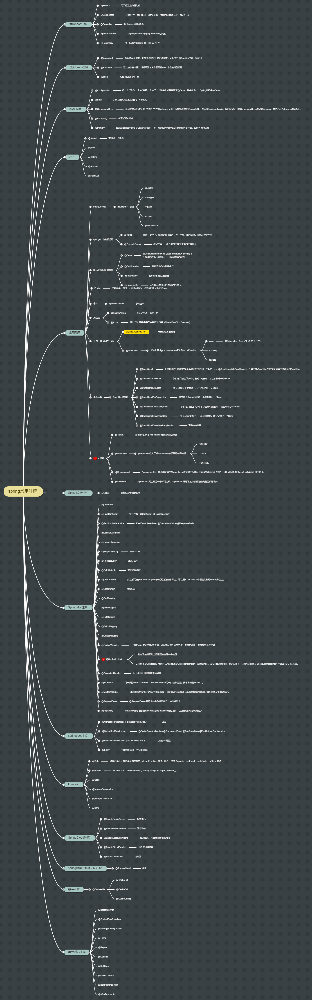

SpringBoot 
===
1. Issues
---
>- [**springboot正常启动访问404**](https://www.jianshu.com/p/0c1d478d9759) ：Springboot会自动扫描启动类同级包及其同级包的子包所有的注解。
如果想自己控制扫描哪些包的话，使用@componentscan注解，多个包的话使用逗号分隔
如：@componentscan("com.package1,cn.package2")

2. 用法
---
>- [配置文件，参数配置,参数引用](http://blog.didispace.com/springbootproperties/)

>>
>- 变量配置:resource中配置两个文件application.properties && application-dev.properties; 分配配置端口server.port为8081 && 8088
>- java运行命令： java ***-Dspring.profiles.active=dev*** -jar target/XXXX.jar 或者 java -jar XX.jar ***--spring.profiles.active=dev***
>- 实际运行端口为application-dev.properties文件中的配置

>- 参数引用：通过@Value将私有变量value1定义为配置文件中com.test.rand对应值

>> ```package com.example.web;
import org.springframework.beans.factory.annotation.Value;  
import org.springframework.web.bind.annotation.RestController;  
import org.springframework.web.bind.annotation.RequestMapping;  
@RestController
public class HelloController {
    @Value("${com.test.rand}")
    private String value1;
    @RequestMapping("/hello")
    public String index(){
        return value1;
    }
}
```

3. spring DI
---

>- spring可以注入class注册到bean
>- spring bean可以由xml文件定义bean
>- 应用程序支持spring注解需要配置app-context-annotation.xml文件,告诉spring扫描代码，找到@Component @Controller @Respository @Service注解的注入bean以及支持在指定包（及所有子包）下使用@Autowired @Inject @Resource注解的bean   
xml文件配置可以被java配置替代(如下代码中的@Configuration) 

>>```
// app-context-annotation.xml文件:
<context:componet-scan  
base-package="com.apress.prospring5.ch3.annotation"/>  
```

>>- app-context-xml.xml文件:

>>```
 <bean id="provider"
class=....HelloWorldMessageProvider/>
<bean id="renderer"
class=.....StandardOutMessageRenderer"
p:messageProvider-ref="provider"/>
```

>- java配置

>``` 
// 注解配置，ctx直接调用该配置，通过bean可以自动实现interface
// 该配置可以获取provider及renderer interface
// java配置可以同过xml文件注入eg: @ImportResource(locations = {"classpath:spring/app-context-xml.xml"})
@ComponentScan(basePackages = {"com.apress.prospring5.ch3.annotation) //必须启动组建扫描
@Configuration
public class HelloWorldConfiguration{
	@Bean
	public MessageProvider provider() {
		return new HelloWorldMessageProvoder(); // provider具体实现class
		}
	@Bean
	public MessageRenderer renderer(){
		// renderer的具体实现class
		MessageRenderer renderer = new StandardOutMessageRenderer(); 
		renderer.setMessageProvider(provider());
		return renderer;
		}
}
// 以上配置替代app-context-xml.xml文件: <bean id="provider"
class=....HelloWorldMessageProvider/>
<bean id="renderer"
class=.....StandardOutMessageRenderer"
p:messageProvider-ref="provider"/>
```

>- ***setter注入***<bean>中指定<property>标记（每个<property>标记注入一个依赖项）代码片段如下:
>
> ```
<bean id="renderer"
	class=.....StandardOutMessageRenderer">
	<property name="messageProvider" ref="provider"/>
</bean>
<bean id="provider"
class=....HelloWorldMessageProvider/>
```
> spring2.5以上：

>```
 <bean id="provider"
class=....HelloWorldMessageProvider/>
<bean id="renderer"
class=.....StandardOutMessageRenderer"
p:messageProvider-ref="provider"/>
```
>- ***setter注入***注解方式：

> ```
@Service("renderer")
public class StandardOutMessageRenderer implements MessageRenderer{
	@Overrider
	@Autowired //可使用@Resource(name="messageProvider")
	public void setMessageProvider(MessageProvoder provoder){
		this.messageProvider = provider;
	}
}
```

>- ***构造函数注入***  
>
> ```
public class ConfigurableMessageProvider implements MessageProvider {
	private String message;
	public ConfigurableMessageProvider(String message){
		this.message=message;
	}
	@Overrider
	public String getMessage(){
		return message;
	}
}
```
>>- 创建ConfigurableMessageProvider需要提供非null的消息值，重定义xml创建实例，使用构造函数注入消息:  
>> 
>> ```
 <bean id="messageProvider"
class=....ConfigurableMessageProvider/>
<constructonr-arg type="String" value="I hope..."/>
</bean>
```
>> 多个构造函数使用index
>> Spring3.1起参数可以用c名称空间，即  
>> 
>> ```
<constructonr-arg value="I hope..."/>
</bean>
修改为：c:message="I I hope..."
```
构造函数使用注解：

>>```
public class ConfigurableMessageProvider implements MessageProvider {
	private String message;
	// @Value能注入值
	@AutoWired
	public ConfigurableMessageProvider(@Value("configurable message") String message){
		this.message=message;
	}
	@Overrider
	public String getMessage(){
		return message;
	}
}
```
>>```
将@Value变为外部文件注入
xml文件变为：
<context:componet-scan  
base-package="com.apress.prospring5.ch3.annotation"/>  
<bean id="message" class="java.lang.String"
	c:_0="I hope ..."/>
其中c:_0中_0为索引
对应代码为：构造函数中value会由bean自动注入
public class ConfigurableMessageProvider implements MessageProvider {
	private String message;
	// @Value能注入值
	@AutoWired
	public ConfigurableMessageProvider(String message){
		this.message=message;
	}
	@Overrider
	public String getMessage(){
		return message;
	}
}
```
>>通过注解指定用于构造的构造方法: 
>>
>>```
@Service
public class ConstructorConfusion(){
private String somevalue
public void ConstructorConfusion(String somevalue){
	System.out.println("ConstructorConfusion(string) called");
	this.somevalue=somevalue;
}
@Autowired //指定了构造函数，只能用于一个
public void ConstructorConfusion(int somevalue){
	System.out.println("ConstructorConfusion(int) called");
	this.somevalue="Number: "+Integer.toString(somevalue);
}
public String toString(){
	return somevalue;
}
public static void main(String... args){
GenericXmlApplicationContext ctx = new GenericXmlApplicationContext();
ctx.load(""classpath:spring/app-context-annotation.xml");
ctx.refresh();
ConstructorConfusion cc=(ConstructorConfusion)ctx.getBean("constructorConfusion");
System.out.println(cc);
ctx.close();
```

>- ***字段注入***:依赖直接注入字段，不需要构造函数及setter,通过@Autowired
>> 不能用于final字段，只能通过构造函数  

>- 注入参数

>>- setter与构造函数分别通过<property>及<constructor-args>标记注入  
>>示例如下：

>>```
public class InjectSimple {
prviate String name;
private int age;
private float height;
public static void main(String... args){
	GenericXmlApplicationContext ctx = new GenericXmlApplicationContext();
ctx.load(""classpath:spring/app-context-xml.xml");
ctx.refresh();
InjectSimple simple = (InjectSimple)ctx.getBean("injectSimple");
System.out.println(simple);
ctx.close();
}
public void setAge(String age){
	this.age=age;
}
public void setName(String name){
	this.name=name;
}
public void setHeight(float height){
	this.height=height;
}
app-context-xml.xml
<beans ...>
	<bean id="injectSimpleConfig"
		class="com.apress.prospring5.ch3.xml.InjectSimpleConfig"/>
	<bean id="injectSimpleSpel" 
		class="com.apress.prospring5.ch3.xml.InjectSimpleSpel"
		p:name="xx"
		p:age="123"
		p:height="1.1"/>
</beans>
```
>>注解方式:

>>```
@Service("injectSimple") //或者spel注入@Service("injectSimpleSpel")
public class InjectSimple {
@Value("xx") //或者spel注入 @Value("#{injectSimpleConfig.name}")
prviate String name;
@Value("11") //或者spel注入 @Value("#{injectSimpleConfig.age +1 }")
private int age;
@Value("1.1")
private float height;
public static void main(String... args){
	GenericXmlApplicationContext ctx = new GenericXmlApplicationContext();
ctx.load(""classpath:spring/app-context-xml.xml");
ctx.refresh();
InjectSimple simple = (InjectSimple)ctx.getBean("injectSimple");
System.out.println(simple);
ctx.close();
}
public void setAge(String age){
	this.age=age;
}
public void setName(String name){
	this.name=name;
}
public void setHeight(float height){
	this.height=height;
}
```


>```
//调用方式：
// 1 xml文件配置
publci class DeclareSpringComponents {
	GenericXmlApplicationContext ctx = new GenericXmlApplicationContext();
	// A、加载app-context-annotation.xml文件 告知spring扫描代码找到注解,   
		interface的具体实现class必须带注解;使用annotation包中注解定义的bean
	// B、 加载app-context-xml.xml
	ctx.load("classpath:spring/app-context-xml.xml);//可以将app-context-xml.xml  
	替换为app-context-annotation.xml，只要class的实现添加了注解，则两者实现完全一致
	ctx.refresh();
	MessageRenderer messageRenderer = ctx.getBean("renderer", MessageRenderer.class);
		messageRenderer.render();
	ctx.close();
}
// 2 配置类
public class HelloWorldAnnotated {
	public static void main(String... args) {
		// 加载配置类
		ApplicationContext ctx = new AnnotationConfigApplicationContext(HelloWorldConfiguration.class);
		MessageRenderer messageRenderer = ctx.getBean("renderer", MessageRenderer.class);
		messageRenderer.render();
```

>- spring框架主要：interface + DI (dependency injection)
>- 通过applicationContext获取interface的具体实现class，通过ctx.getbean自动实现interface，spring 框架自动处理
>- setter注入，java 配置， 构造函数实现
>- java配置 

10 参考查询
===

[spring注解](https://mp.weixin.qq.com/s/RsVGRXiYmTyyi5cTBrk_kg)
<fancybox>

</fancybox>


