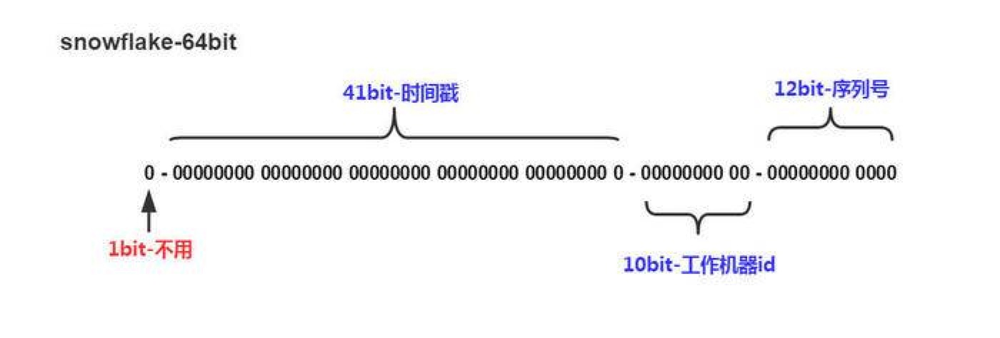

1 分布式uid生成
===
>- 唯一性：确保生成的ID是全网唯一的。
>- 有序递增性：确保生成的ID是对于某个用户或者业务是按一定的数字有序递增的。
>- 高可用性：确保任何时候都能正确的生成ID。
>- 带时间：ID里面包含时间，一眼扫过去就知道哪天的交易。

1.1 uuid
---
>- 算法的核心思想是结合机器的网卡、当地时间、一个随记数来生成UUID。
>- 优点：本地生成，生成简单，性能好，没有高可用风险
>- 缺点：长度过长，存储冗余，且无序不可读，查询效率低

1.2 数据自增ID
---
>- 使用数据库的id自增策略，如 MySQL 的 auto_increment。并且可以使用两台数据库分别设置不同步长，生成不重复ID的策略来实现高可用。
>- 优点：数据库生成的ID绝对有序，高可用实现方式简单
>- 缺点：需要独立部署数据库实例，成本高，有性能瓶颈

1.3 批量生成ID
---
>- 一次按需批量生成多个ID，每次生成都需要访问数据库，将数据库修改为最大的ID值，并在内存中记录当前值及最大值。
>- 优点：避免了每次生成ID都要访问数据库并带来压力，提高性能
>- 缺点：属于本地生成策略，存在单点故障，服务重启造成ID不连续

1.4 redis生成ID
---
>- Redis的所有命令操作都是单线程的，本身提供像 incr 和 increby 这样的自增原子命令，所以能保证生成的 ID 肯定是唯一有序的。
>- 优点：不依赖于数据库，灵活方便，且性能优于数据库；数字ID天然排序，对分页或者需要排序的结果很有帮助。
>- 缺点：如果系统中没有Redis，还需要引入新的组件，增加系统复杂度；需要编码和配置的工作量比较大。
>- 考虑到单节点的性能瓶颈，可以使用 Redis 集群来获取更高的吞吐量。假如一个集群中有5台 Redis。可以初始化每台 Redis 的值分别是1, 2, 3, 4, 5，然后步长都是 5。各个 Redis 生成的 ID 为：
A：1, 6, 11, 16, 21
B：2, 7, 12, 17, 22
C：3, 8, 13, 18, 23
D：4, 9, 14, 19, 24
E：5, 10, 15, 20, 25
>- 复制代码随便负载到哪个机确定好，未来很难做修改。步长和初始值一定需要事先确定。使用 Redis 集群也可以方式单点故障的问题。
另外，比较适合使用 Redis 来生成每天从0开始的流水号。比如订单号 = 日期 + 当日自增长号。可以每天在 Redis 中生成一个 Key ，使用 INCR 进行累加。

1.5 twitter的snowflake算法
---
>- Twitter 利用 zookeeper 实现了一个全局ID生成的服务 Snowflake：github.com/twitter/sno…

>- 1位符号位：
由于 long 类型在 java 中带符号的，最高位为符号位，正数为 0，负数为 1，且实际系统中所使用的ID一般都是正数，所以最高位为 0。
>- 41位时间戳（毫秒级）：需要注意的是此处的 41 位时间戳并非存储当前时间的时间戳，而是存储时间戳的差值（当前时间戳 - 起始时间戳），这里的起始时间戳一般是ID生成器开始使用的时间戳，由程序来指定，所以41位毫秒时间戳最多可以使用 (1 << 41) / (1000x60x60x24x365) = 69年。
>- 10位数据机器位：
包括5位数据标识位和5位机器标识位，这10位决定了分布式系统中最多可以部署 1 << 10 = 1024 s个节点。超过这个数量，生成的ID就有可能会冲突。
>- 12位毫秒内的序列：
这 12 位计数支持每个节点每毫秒（同一台机器，同一时刻）最多生成 1 << 12 = 4096个ID
加起来刚好64位，为一个Long型。
>- 优点：高性能，低延迟，按时间有序，一般不会造成ID碰撞
>- 缺点：需要独立的开发和部署，依赖于机器的时钟

[唯一全局ID生成](https://juejin.im/post/5b3a23746fb9a024e15cad79)

2 分布式锁
===
>- 互斥性：不同节点不同线程的互斥性
>- 可重入性：同一节点，同一线程的可重入性
>- 有高可用的获取锁和释放锁功能
>- 获取锁和释放锁的性能要好
>- 超时处理：避免死锁
>- 实现阻塞锁lock&trylock（一定时间后获取不到则直接返回失败）
>- 两个线程同时获取到一个锁：某个线程获取到锁之后执行时间过久，锁过期，B获得锁，此时需要加长过期时间或者加快程序并性化减少持锁期间程序的执行时间；
>- 分布式锁为轮询式基于mysql主键insert实现（存在无法insert），会大量爆库效果较差，注意强制使用索引，使用不上索引会走表锁；
>- 对于线程唤醒机制：分布式锁大多都是这样轮训获取锁的，所以控制住你的重试频率，也不会导致负载特别高的。可能就是吞吐量低点而已。
>- 对于锁删除失败：分布式锁基本都有这个问题，可以对key设置失效时间。这个超时时间需要把控好，过大那么系统吞吐量低，很容易导致超时。如果过小那么会有并发问题，部分耗时时间比较长的任务就要遭殃了。
>- 乐观锁（读自增id，写自增id，提交时判定是否不一致，不一致有不同的处理方式）&悲观锁
>- 基于数据库：mysql实现方式（加库表、原子操作，同一事务中）、基于缓存：redis实现方式（原子操作）、基于zk实现方式
>- 基于zk实现分布式锁：
>
```
Zookeeper是一个分布式一致性协调框架，主要可以实现选主、配置管理和分布式锁等常用功能，因为Zookeeper的写入都是顺序的，在一个节点创建之后，其他请求再次创建便会失败，同时可以对这个节点进行Watch，如果节点删除会通知其他节点抢占锁。
Zookeeper实现分布式锁虽然是比较重量级的，但实现的锁功能十分健全，由于Zookeeper本身需要维护自己的一致性，所以性能上较Redis还是有一定差距的。
```
>- 分布式锁实现对比：
>
```
Mysql实现比较简单，不需要引入第三个应用，但实现多少有些重，性能不是很好。
Redis的话实现比较简单，同时性能很好，引入集群可以提高可用性。同时定期失效的机制可以解决因网络抖动锁删除失败的问题，所以我比较倾向Redis实现。
Zookeeper实现是有些重的，同时我们还需要维护Zookeeper集群，实现起来还是比较复杂的，实现不好的话还会引起“羊群效应”。如果不是原有系统就依赖Zookeeper，同时压力不大的情况下。一般不使用Zookeeper实现分布式锁。
```
[分布式锁](https://juejin.im/post/5bbb0d8df265da0abd3533a5)
[分布式锁讲解](https://www.jianshu.com/p/c2b4aa7a12f1)
