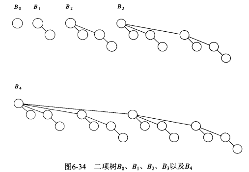
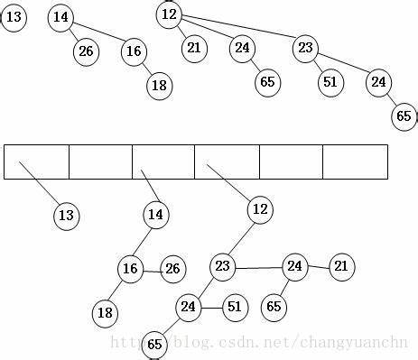

1 表
===
1.1 链表
---
种类
>- 单向
>- 循环
>- 双向
>- 其他

实现方式
>- 指针(find, insert, del；插入删除速度较快；内存不需要连续)
>- 数组(find, insert, del；查找较快，删除插入需要移动较多数据，内存连续，需要提前分配内存或者动态分配内存, golang可用切片)

1.2 栈
---
特点
>- push, pop, top三种方法；o(1)
>- LIFO；后进先出

实现方式：
>- 链表(链表head作为栈顶)
>- 数组（数组最新数据位作为栈顶)

事例用法
>- 平衡符号(语法检查)：{ (等，开放符号入栈，封闭符号栈顶为对应的开放符号则开放符号出栈，否则报错)
>- 后缀表达式：6 5 2 3 + 8 * + 3 + *; 遇到数字入栈，遇到符号则pop两个数字计算后结果入栈；
>- 中缀表达式到后缀表达式转换：
>
>> a. 操作数放入输出中，操作符不输出，暂存（已见到过的操作符入栈，左圆括号入栈）  
>> b. 遇到右括号，栈元素弹出，弹出的符号写出直到遇到对应的左括号，左括号弹出不输出  
>> c. 遇到任何其他符号，从栈中弹出栈元素，直到发现优先级更低的元素，栈中弹出元素后，符号压入栈中；（但除非遇到)绝对不从栈中移除"("）  
>> d. 除非遇到“)”,绝对不从栈中弹出"("  
>> e. 遇到输入的末尾将所有栈元素弹出并输出  
>> 逻辑表达式从中缀表达式转换为后缀表达式然后用栈计算；

>- 函数调用，递归
>
>> [函数栈&递归1](https://blog.csdn.net/cool_oyty/article/details/8100627)
>> [函数栈&递归2](https://blog.csdn.net/github_35681219/article/details/52504782)
>> 等价程序快于递归程序（while&goto），但程序清晰度不足

1.3 队列
---

实现方式
>- 数组、循环数组
>- 链表

2 树
===

深度：从树根到任意节点的唯一路径长，树根深度为0  
高度：从节点ni到一片树叶的最长路径的长，树叶高度为0  
先序遍历：首先处理节点，之后处理节点的子节点；文件名print, tree命令  
后序遍历：儿子节点处理之后才处理本节点；后缀表达式
中序遍历：ni.left->ni->ni.right；（左，节点，右）

2.1 二叉树
---
特点
>- 最多两个儿子
>- 深度平均值为logN
>- 查找、插入、删除（lazy删除）一般为logN
>
示例
>- 表达式树
>
>>- 二元运算符
>>- 中序遍历，左 op 右；递归用到栈
>>- 后序遍历可以得到后缀表达式；递归用到栈
>>- 先序遍历：先打印运算符然后左右，前缀表达式（很少用）；递归用到栈
>>- 层序遍历：所有深度为i的遍历完才会遍历深度为i+1的；非递归，用到队列
>>- 构造表达式树
>>
>>```
a 获得后缀表达式
b 读表达式，若符号不是op则建立单节点树并推入栈中
c 符号为op，从栈中弹出两颗树T1,T2,构造新树，op为root, left为T2, T1为right，将新树压入栈
d 读入最后符号，两颗树合并，表达式树的指针留在栈中
e 整个过程类似，后缀表达式入栈，计算
```

子类
>- 二叉查找树（最昂贵为链表）：每个节点X所有左子树关键值小于X，所有右子树大于X；会形成不平衡树，eg所有子节点均为右节点，类似链表
>- AVL平衡树：每个节点左子树与右子树高度最多差1的二叉查找树
>
>>- 插入可能造成不平衡（左右子树高度相差2）需要旋转获取平衡
>>-
```
a 对a的左儿子的左子树进行插入：左单旋
b 对a的左儿子的右子树进行插入：双旋：右单旋之后左单旋
c 对a的右儿子的左子树进行插入：双旋：左单旋之后右单旋
d 对a的右儿子的右子树进行插入：右单旋
其中a d关于a点镜像需要一次单旋转得到平衡；b c需要双旋转
```

>- 伸展树：从空树开始任意连续M次对树的操作最多话费O(MlogN)时间；节点被访问后通过avl将节点放置在根上，局部性好（访问过的节点，大概率被再次访问）；同时降低树的深度
>
>>- 节点的父节点&祖父节点为zigzag形式，执行类似avl的双旋转；G.left=P;P.right=X
>>- X和P都是左节点或者右节点，把左边的树变成右边的树

2.2 B树
---

特点：阶为M的B树
>- 树的根或者是一片叶子，或者其儿子数目在2和M之间
>- 除根外，所有非树叶节点的儿子数目在[M/2]和M之间
>- 所有树叶都在相同的深度

其他
>- 深度最多为logM/2(N)
>- M的最好选择为3或4
>- B树被占满69%，插入不一定首先分裂，可以先搜索能接纳新儿子的节点，充分利用空间
>- 分裂&合并
[树的遍历](https://blog.csdn.net/My_Jobs/article/details/43451187)
3 散列
===
3.1 散列函数
---
>- 关键字映射到0~tableSize的范围内
>- 均匀、不同关键字最好映射为不同的值（碰撞少）
>- size最好为素数

3.2 解决碰撞问题
---
>- 分离链接法：链表
>- 开放定址法：若碰撞，则按照一定规则顺序找可以填入的空间；eg:线性探测，若碰撞1，则依次查找2 3 4；只能lazy删除；平方探测：或者2的倍数查找；双散列，i*hash2(X)
>- 再散列：两倍原Size大的表，重新hash迁移
>- 可扩散列（适用于磁盘读取，2次读取）：比特位，高位数为N为则根的数目为2**N;每个根下存在M个元素
>
>>- eg: hash散列映射由6比特组成
>>- 高位为2位，00 01 10 11 4个根或者目录；每个根有4个元素（连续磁盘）
>>- 若10已满4个元素并插入100001,则高位变为3位，10分裂 101 100；其他000 001指向同一指针不做分裂移动，直到插入0001001

4 优先队列（堆）
===
特点：
>- 入队
>- 出队，选择最小或者最大出队

4.1 二叉堆
---
4.1.1 堆的性质
***堆的结构性***
>- 堆是一颗被完全填满的二叉树，底层上的元素从左到右填入（完全二叉树）
>- 高为h的二叉树有2的h次方到2的h+1次方-1个节点
>- 完全二叉树高度为logN
>- 堆元素可以用数组存储，0不放置元素，位置i的元素的left child为2i,right child 为(2i+1)，父亲为i/2
>- 堆由数组、最大元素数(cap)、当前元素数(len)组成
***堆序性***:使操作快速执行的性质(最大堆、最小堆)举例最小堆
>- 任意子树为堆
>- 每个节点X，X父亲的关键字<=X中关键字
4.1.2 堆的基本操作
>- 插入:上滤，堆元素在堆中上滤直到找出正确的位置 平均2.607次比较最差O(logN)，移动1.607层
>
>>- X插入到队的下一个空闲区且不影响堆序
>>- 在堆的下一个空闲位置创建空穴，eg heap[len+1]位置
>>- 若X插入空穴满足堆的性质为将X放置在空穴
>>- 若X小于空穴父节点(len+1/2)，则父节点放入空穴，X递归上滤直到找到合适的位置
>>
```
//堆定义
type heap {
Len int //堆大小
Cap int //堆容量
Elem []ElemType //堆元素
}
// h.Elem[0]是sentinel标记信息或者哑信息 为堆中最小值
func Insert(x ElemType, h *heap) error {
	if h == nil || len(h.Elem) == 0 {
		return nil
	}
	if IsFull(h){
		return errors.("heap is full")
	}
	for i := h.Len+1; h.Elem[i/2]>x;i=i/2{
		if i == h.len+1{
			h=appen(h, h.Elem[i/2] //上滤
		}
		h.Elem[i]=h.Elem[i/2]
	}
	h.Elem[i]=x
	return nil
}
```

>- 删除最小元：最后一个元素X移动置最小元空穴处 平均O(logN)最坏O(logN)
>
>>- 若X可以放置在空穴中不破坏堆序，则直接将x放入其中
>>- 比较空穴的left child 和 right child，将较小的元素放入空穴，判定是否可以将x放入新的空穴，递归
>>- 下滤直到找到适合X的位置：将x置入沿着从根开始包含最小儿子的一条路径上正确位置

>- 降低关键字的值：上滤调整堆序 
>- 增加关键字的值：下滤调整堆序 
>- 删除堆中位置P上节点：执行Decrease(P,inf,H)之后执行DeleteMin(H)
>- 构建堆，N次插入，每次插入平均运行时间O(1)最坏O(logN)

4.2 优先队列的应用
---
>- 选择问题：
>
```
方法一：N个元素组成最大堆，燃火删除直到第k个最大元素，O(N)+klogN
方法二：k个元素的最小堆，堆首为第k个最大元，剩余元素与堆首比较，大于堆首相当于将堆首增加一个值，执行下滤；O(k)+(n-k)logk；构建k元素堆时间复杂度为o(k)
```

4.3 d堆
---
多个子节点的堆，类似B_树，4堆优于二叉堆
d个子节点的d堆，删除最小元，每层比较d次，时间复杂度最高dlogdN,平均也是

4.4 左式堆：减少合并复杂度；指针形式，存储npl;二叉堆为最差左式堆
---
保持堆序性，二叉堆，不是理想平衡的，或者说不平衡的二叉堆

4.4.1 ***左式堆性质***
---
>- 零路径长：Null path length, NPL
>
```
NPL(X):任一节点X的零路径长
从X到一个没有两个儿子的节点的最短路径长
具有0个或者1个儿子的节点的npl为0
NUll的npl为-1
任一节点的npl比儿子节点最小npl多1
```
>- 左式堆中每个节点X，左儿子npl>=右儿子npl
>- 向左增加深度，存在左节点长路径构成的树
>- 左式堆的右路径是该堆中最短路径
>- 左式堆操作放在右路径（减小树深）
>- 右路径插入merger破坏左式堆需要恢复左式堆性质
>- 右路径上有r个节点的左式树必然至少有2的r次方-1节点

4.4.2 ***左式堆的操作***
---
>- 合并:插入为合并的特殊形式；H1 H2；与右路径长有关系，时间界O(logN)
>
```
任一堆为null返回另一堆
比较H1与H2根值，较大堆与较小堆的右子树合并
递归实现
交换左儿子右儿子，并更新npl恢复左式堆（合并后根处的堆序破坏需要递归恢复堆序）
```
>- delemin为除掉根，并合并两个子节点 O(logN)

4.5 斜堆
---
与左式堆比较类似伸展树与AVl树的区别
除右路径上所有节点的最大者不交换左右子树，交换左右子树无条件

4.6 二项队列
---
4.6.1 性质
---
支持插入、合并、删除
最坏操作平均运行时间O(logN)，平均为常数运行时间
二项队列为堆序树的集合即森林
堆序树中每棵树有约束形式，称为二项树
每个高度上至多存在一个二项树
高度为0的二项树为一颗单节点树
高度为k的二项树Bk通过将一颗二项树Bk-1附接到另一颗二项树Bk-1的根上形成
高度为k的二项树有2的k次方个节点: 111表示为B0 B1 B2则节点数目为1+2+4个；类比0 1二进制，1代表存在该二项树
优先队列可以用森林表示
二线队列按高度排序


4.6.2 操作
---
>- 查找最小元：比较所有二项树根节点，O(logN)；最多logN个不同的二项树
>- 合并二项队列：按高度合并，组成新的队列O(logN)
```
森林 f1 f2 
森林中二项树按高度存在于数组中：每个高度最多一个
f1的二项树为H1 f2的二项树为H2 上次合并遗留的二项树为carry
8种情况：
H1 H2 carry全null 为null
任一不为null 新森林f3对应二项树为该树，carry清空
任一两个，合并赋值为carry
三个，carry赋值给新二项队列对应树，carry=merge(h1,h2)
```
>- 插入为合并二项队列
>- 删除min，找到最小元二项树，删除root，组成新的二项队列，合并二项队列

5 图
===
图论中：
>-节点度是指和该节点相关联的边的条数，又称关联度。  
特别地，对于有向图:  
节点的入度 是指进入该节点的边的条数；  
节点的出度是指从该节点出发的边的条数。  
入度是图论算法中重要的概念之一。它通常指有向图中某点作为图中边的终点的次数之和。  
入度的常见情况：入度为0，顾名思义，入度为0指有向图中的点不作为任何边的终点，也就是说，这一点所连接的边都把这一点作为起点。  
度的相关定理：  
定理1 无向图中所有顶点的度之和等于边数的2倍，有向图中所有顶点的入度之和等于所有顶点的出度之和。  
定理2 任意一个无向图一定有偶数个（或0个）奇点（度为奇数的顶点）。  
定理3 无论无向图还是有向图，顶点数n，边数e和度之间又如下关系：  
E=(d[v1]+d[v2]+…+d[vn])/2;
[参考图的度](https://blog.csdn.net/why850901938/article/details/51365832)
5.1 判定有向图中是否存在环
---
>- 利用图的入度：广度优先搜索O(V+E)
>
```
入度为0的节点入队q1
节点总数目为n
从q1中出队节点a,n--且a的所有临接点的入度-1；若入度变为0则入队q1
递归循环
若q1为空时，n为0，则无环，否则存在环
```
>- 深度优先遍历：O(V+E)
>
```
从源点出发若已遍历过标记为1， 若未遍历过记为0，若被其他源节点出发遍历过记为-1
遍历节点集，获取节点a
深度优先遍历节点a，若遇到标记为1则存在环，为0则更改为1；从源点出发无环则全部修改为-1；若为-1则其他源遍历过且无环直接返回无环
```
[查看有向图中是否存在环](https://blog.csdn.net/login_sonata/article/details/78002042)
