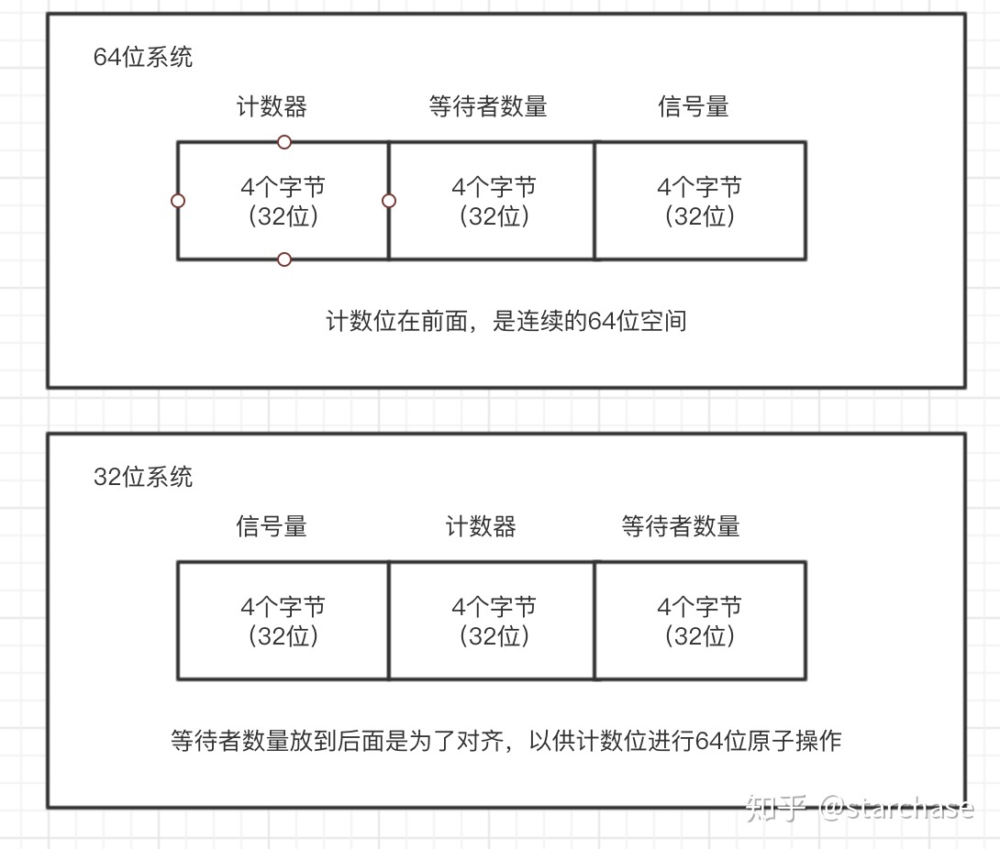
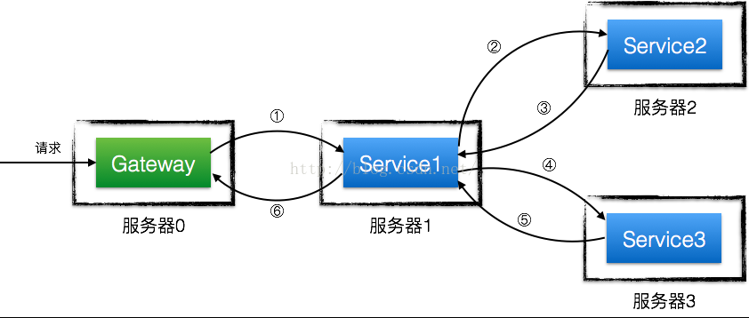
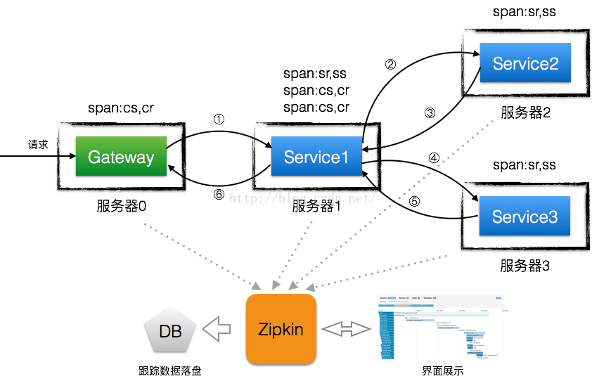

1 redis相关（已完成）
===

>- 布隆过滤器: 查询性能弱、空间利用效率低、不支持反向操作（删除）以及不支持计数、误判率高，无法删除元素；[布谷鸟过滤器](https://juejin.im/post/5cfb9c74e51d455d6d5357db)
>- cluster集群：主从、sentel、proxy代理、cluster(bus)、codis
>- codis（p2)级别
>- redis持久化 RDB AOF：哪个文件更小；RDB文件更小[redis持久化](https://juejin.im/post/5bdc20116fb9a049ca36c6e9)
>- redis list实现：基于ziplist的双向链表，ziplist内存利用率高不至于产生过多小的碎片内存，ziplist没有pre next指针空间占用少，ziplist过大无法分配过多内存，不利于内存利用；
>- redis分区集群，哪些命令不可以用分区：不支持多key命令，mget mset；
>- 布隆过滤器的升级版
>- redis ziplist结构：entry里包括前一个数据的len, 本身的len，自身的值，均为可变长度，利用内存极限；


2 mysql相关(已完成)
===
2.1 较基础
---
>- ACID
>- 隔离级别：解决的问题
>- redo log undo log binlog
>- mvcc的实现：提交时间(commit id)、删除时间(commit id)；还是redo log实现;
>- 架构，插件式设计
>- 
>


3 算法
===

3.1 二叉树的中序遍历双向链表按照中序遍历


3.2 文件中url滤重文件较大：布隆过滤取，分治算法


3.3 给定一个整数，求整数位随机变化，找到比该整数大的最小的整数
>- 常见算法：
[链表](https://blog.csdn.net/luckyxiaoqiang/article/details/7393134)
[单链表](https://juejin.im/post/5aa299c1518825557b4c5806)
[单链表问题大全](https://blog.csdn.net/xidiancoder/article/details/73556101)
[高频算法题](https://juejin.im/post/5d9fca66e51d45782315d70a)
[leetcode数组算法分析](https://kanghaov.com/291.html)
>- 循环数组的二分查找：判定转折出现的位置，对非转折段进行判定查找else为转折段；
[循环数组的二分查找](https://blog.csdn.net/ojshilu/article/details/17485787)
>- 生成循环数组：[循环数组](https://blog.csdn.net/geekmanong/article/details/51164382)；[数组移位的几种算法](https://blog.csdn.net/mayh554024289/article/details/47914237)

4 待看
===
4.1 架构相关
---
>- 秒杀系统设计
>- 美团点单系统设计
>- 滴滴打车系统
>- 微博
>- 工作流引擎
>


5 语言类golang(优先级p0)周四（已完成）
===
>- golang atom包: 机器指令支持的原子操作，swap返回旧值， compareAndSwap比较相等后swap返回是否相等；LoadStore存储值并返回指针；原子加，增加delat返回新值；
>- golang sync包:信号量 锁 条件变量
>- golang context
>- 常用设计模式:策略模式、工厂模式、代理模式、适配器模式、单例模式；
>- waitgroup的实现: 请求计数， wait计数，信号量(发送等于等待计数个的信号量)
>
```
WaitGroup主要是三个方法，Add(int),Done()和Wait(), 其中Done()是调用了Add(-1)，推荐使用方法是，先统一Add，在goroutine里并发的Done，然后Wait
WaitGroup主要维护了2个计数器，一个是请求计数器 v，一个是等待计数器 w，二者组成一个64bit的值，请求计数器占高32bit，等待计数器占低32bit。
简单来说，当Add(n)执行时，请求计数器 v 就会加n，当Done()执行时，v 就会减1，可以想到，v 为0时就是结束，可以触发Wait()执行了，所谓的触发Wait()是通过信号量实现的。
那么等待计数器拿来干嘛？是因为Wait()方法支持并发，每一次Wait()方法执行，等待计数器 w 就会加1，而等待v为0触发Wait()时，要根据w的数量发送w份的信号量，正确的触发所有的Wait()。
同时，WaitGroup里还有对使用逻辑进行了严格的检查，比如Wait()一旦开始不能Add().
```
[waitgroup的实现解析](https://www.cnblogs.com/jiangz222/p/10348763.html)

>- 
>- grpc的客户端负载均衡: grpc dial返回首先返回连接的地址；
>- grpc健康检查的实现：check&watch；watch基于channel(go routine通信)、stream实现；
>- etcd watch的实现：v2 http轮询， v3 grpc stream channel
>- golang并发模型：channel、waitgroup、锁、select（实现非堵塞channel）、context（done也是channel）
>- map的实现：kkvv对齐需求，64 8 64 8
>- golang MPG模型;
>- timer的实现：
>- golang主线程退出，则所有go退出；
>- golang并发：如何保证go的公平性（系统调用堵塞，MG一起，P找新的M执行，从其他P中偷G，队列的形式，函数调用抢占式），如果一个go routine正在执行如何抢占？主线程中执行go for{};是否会退出，能否进入死循环；没到一个函数有机会抢占；只有一个P的情况下，一直循环无法退出
>
```
func Test_My(t *testing.T) {
	runtime.GOMAXPROCS(1)
	t.Logf("entry: %d\n", 1)
	i := 0
	go func() {
		for {
			i++
			//fmt.Printf("i: %d\n", i) // 加上该函数会被抢占执行
		}
	}()
	time.Sleep(1 * time.Millisecond)
	time.Sleep(1 * time.Millisecond)
	t.Logf("end i: %d\n", i)
}
```
>- golang tick的实现：runtime不断的通过for select通知系统时间，达到通知时间间隔则返回用户chan一个事件通知；
>
```
func sendTime(c interface{}, seq uintptr) {
	// Non-blocking send of time on c.
	// Used in NewTimer, it cannot block anyway (buffer).
	// Used in NewTicker, dropping sends on the floor is
	// the desired behavior when the reader gets behind,
	// because the sends are periodic.
	select {
	case c.(chan Time) <- Now():
	default:
	}
}
```
[golang tick的实现](https://my.oschina.net/renhc/blog/3037760)


6 腾讯体育（优先级p0)周六
===
>- 自己的项目（已完成）
>- golang基础（已完成）
>- 其他基础（已完成）
>- linux系统基本命令：日志查询；（周日）[linux基本命令](https://blog.csdn.net/zlx312/article/details/79398557)    [linux日志常用命令](https://blog.csdn.net/hellozpc/article/details/72859152) [linux命令](https://man.linuxde.net/sed)
>- [linux常用命令较基础](https://www.jianshu.com/p/0056d671ea6d)
>- [linux基础命令](https://blog.csdn.net/ljianhui/article/details/11100625)
>- [sed命令](https://www.thegeekstuff.com/2009/10/unix-sed-tutorial-advanced-sed-substitution-examples/)
>- sed为stream editor的简称
>- [sed print模式](https://www.thegeekstuff.com/2009/09/unix-sed-tutorial-printing-file-lines-using-address-and-patterns/)
>- [sed del](https://www.thegeekstuff.com/2009/09/unix-sed-tutorial-delete-file-lines-using-address-and-patterns/)
>- sed几种模式: np;m,np;/xx/,/yy/p;/xx/,$p;指定行，满足匹配模式，指定行区间
>
```
#sed 'ADDRESSs/REGEXP/REPLACEMENT/FLAGS' filename
#sed 'PATTERNs/REGEXP/REPLACEMENT/FLAGS' filename
s is substitute command
/ is a delimiter
REGEXP is regular expression to match
REPLACEMENT is a value to replace
g Replace all the instance of REGEXP with REPLACEMENT
n Could be any number,replace nth instance of the REGEXP with REPLACEMENT.
p If substitution was made, then prints the new pattern space.
i match REGEXP in a case-insensitive manner.
w file If substitution was made, write out the result to the given file.
We can use different delimiters ( one of @ % ; : ) instead of /
// 仅替代第一行
sed 's/Linux/Linux-Unix/' thegeekstuff.txt
// 替代所有行
sed 's/Linux/Linux-Unix/g' thegeekstuff.txt
// 仅替换第2个
Substitute Only 2nd Occurrence of a Word Using sed s//2
Write Changes to a File and Print the Changes Using sed s//gpw
// 全部替换，并打印，同时输出到文件output
sed -n 's/Linux/Linux-Unix/gpw output' thegeekstuff.txt
```
>- [sed替换](https://www.thegeekstuff.com/2009/09/unix-sed-tutorial-replace-text-inside-a-file-using-substitute-command/)
>- [sed写文件](https://www.thegeekstuff.com/2009/10/unix-sed-tutorial-how-to-write-to-a-file-using-sed/)
>- [sed用法进阶版](https://www.thegeekstuff.com/2009/10/unix-sed-tutorial-advanced-sed-substitution-examples/)
>- [awk命令](https://www.runoob.com/linux/linux-comm-awk.html)
>- [linux系统crontab，定时任务](https://www.runoob.com/linux/linux-comm-crontab.html)
>- [50个常见linux命令](https://gywbd.github.io/posts/2014/8/50-linux-commands.html)
>- [nl命令](https://man.linuxde.net/nl)
>- 算法：leetcode&常见面试题刷题集中(周日)

6.2 linux常见命令(优先级p0)周六周日（周日）
---
>- tar:
>
```
// 压缩文件或者文件夹
tar -czvf test.tar.gz a.c 
c:生成新的archive
z:gzip压缩，仅使用于c存在
f:涞源或者压缩为文件， The filename can be - for standard input or standard output.
v:verbose output, very detail
// 列出压缩文件内容
tar -tzvf test.tar.gz 
t:List archive contents to stdout.
// 解压文件
tar -xzvf test.tar.gz 
x:解压到磁盘，相同文件会不断解压，后解压副本覆盖之前解压的副本
```
>- link:ln命令，分为软连接&硬连接；不需要copy重复占用磁盘空间；hard links and symbolic links: 硬链接的意思是一个档案可以有多个名称，而软链接的方式则是产生一个特殊的档案，该档案的内容是指向另一个档案的位置。硬链接是存在同一个文件系统中，而软链接却可以跨越不同的文件系统。不论是硬链接或软链接都不会将原本的档案复制一份，只会占用非常少量的磁碟空间。
>
```
-b 删除，覆盖以前建立的链接
-d 允许超级用户制作目录的硬链接
-f 强制执行
-i 交互模式，文件存在则提示用户是否覆盖
-n 把符号链接视为一般目录
-s 软链接(符号链接)
-v 显示详细的处理过程
```
>- tail: 按字节、行、512字节block位置输出，+某某数字， 代表从开头输出,``-c +2'' starts the display at the second byte of the input.  -某某数字或者不带符号，代表从末尾开始输出，输出某某数字量，``-n 2'' displays the last two lines of the input.  The default starting location is ``-n 10'', or the last 10 lines of the input.默认输出最后10行
>
```
-f 循环读取
-q 不显示处理信息
-v 显示详细的处理信息
-b 按512 block
-c<数目> 显示的字节数
-n<行数> 显示文件的尾部 n 行内容
--pid=PID 与-f合用,表示在进程ID,PID死掉之后结束
-q, --quiet, --silent 从不输出给出文件名的首部
-s, --sleep-interval=S 与-f合用,表示在每次反复的间隔休眠S秒
```
>- head:用于显示文件（或者标准输出）的前几行或者字节，默认为10行；
>
```
head -n 3 hell.txt h.txt
```
>- find: 递归查询；find   path   -option   [   -print ]   [ -exec   -ok   command ]   {} \;
>
```
-mount, -xdev : 只检查和指定目录在同一个文件系统下的文件，避免列出其它文件系统中的文件
-amin n : 在过去 n 分钟内被读取过
-anewer file : 比文件 file 更晚被读取过的文件
-atime n : 在过去n天内被读取过的文件
-cmin n : 在过去 n 分钟内被修改过
-cnewer file :比文件 file 更新的文件
-ctime n : 在过去n天内被修改过的文件
-empty : 空的文件-gid n or -group name : gid 是 n 或是 group 名称是 name
-ipath p, -path p : 路径名称符合 p 的文件，ipath 会忽略大小写
-name name, -iname name : 文件名称符合 name 的文件。iname 会忽略大小写
-size n : 文件大小 是 n 单位，b 代表 512 位元组的区块，c 表示字元数，k 表示 kilo bytes，w 是二个位元组。-type c : 文件类型是 c 的文件。
d: 目录
c: 字型装置文件
b: 区块装置文件
p: 具名贮列
f: 一般文件
l: 符号连结
s: socket
-pid n : process id 是 n 的文件
// 常用
find . -name "*.c"
// 列出所有一般文件
find . -type f
// 最近20天更新过的文件
find . -ctime -20
// 查找/var/log目录中更改时间在7日以前的普通文件，并在删除之前询问它们：
find /var/log -type f -mtime +7 -ok rm {} \;
// 查找前目录中文件属主具有读、写权限，并且文件所属组的用户和其他用户具有读权限的文件：
find . -type f -perm 644 -exec ls -l {} \;
// 为了查找系统中所有文件长度为0的普通文件，并列出它们的完整路径：
find / -type f -size 0 -exec ls -l {} \;
```
>- man命令：可以用来显示其他命令的说明应用页，eg: man ifconfig
>- cat命令：The cat utility reads files sequentially, writing them to the standard
     output.  The file operands are processed in command-line order.  If file
     is a single dash (`-') or absent, cat reads from the standard input.  If
     file is a UNIX domain socket, cat connects to it and then reads it until
     EOF.  This complements the UNIX domain binding capability available in
     inetd(8).
>
```
cat -n hell.txt| grep 12
// more or less用于分页，按空格即可
cat -n test.log |grep "debug" |more
// 保存到文件
cat -n test.log |grep "debug" >debug.txt
```
>- [more命令](https://www.cnblogs.com/peida/archive/2012/11/02/2750588.html)
>- [less命令:带搜索功能，比more强大，随意浏览不会全部加载文件](https://www.cnblogs.com/peida/archive/2012/11/05/2754477.html)
>- sed:
>
```
// 依据日期来看日志
sed -n '/2017-06-04 14:06:27/,/2017-06-04 14:06:34/p'  test.log
```
>- [linux日志查询常用命令](https://blog.csdn.net/hellozpc/article/details/72859152)

[50个常见linux命令](http://gywbd.github.io/posts/2014/8/50-linux-commands.html)


7 kafka
===
>- kafka为何快
>- kafka的限制：磁盘读取速度、网卡、
>- kafka单机性能如何，上限是啥？
>- kafka是否一定为顺序写，多个topic 多个partition,多个请求写不同的partition，则写在不同的磁盘位，非顺序写，需要用到pagecache,延迟写；充分利用磁盘能力
>- kafka send on file零copy跟正常比多了哪些步骤，哪些可以省略，多少内核态用户态切换？
>- 

8 网络相关
===
>- 一个server的最大长链接数量限制：client IP + Port; 内存限制(socket为fd文件，其可指向相应的缓冲区域，知道fd即可发送至网卡)；单进程可以打开的最大fd限制；listen 一个， 每accept新建一个；网络传输文件化；
>- epool的实现： 新建epool fd， 需要检测的文件集合fd注册到epool，每个fd带回调函数，fd达到一定事件会通过回调函数将fd加入相应的epool队列；epool wait只需要从就绪队列返回相应的fd集合，返回的都是已经就绪的fd集合；epool是被动模式，不会主动轮询；
>

9 分布式
===
>- 分布式锁的实现：文件、mysql、redis
>- 分布式锁：A持有锁（redis setNX设置了超时），超时后是否继续执行（超时需要回滚的回滚不需要的不回滚）？什么方式判定超时？B此时可否持有锁（无感知A超时）？
>- 超时判定：timer信号？每执行一段代码前首先判定是否超时？循环判定？可否用信号？
>- 秒杀系统的设计
>- cap原理为何不可三全：partition为网络分区，网络分区若非保证一致性则可用性降低因为需要等待分区结束可用性差，若考虑高可用则一致性降低；
>- 高性能、高可用、高扩展
>- 超时重试、限流、熔断、降级
>
10 常用工具
===
>- zipkin:分布式链路追踪，低侵入性；
>

>- traceID：整条链路的标识
>- spanID：span的id，理论上来说，span的id只要做到一个traceId下唯一就可以，比如说阿里的鹰眼系统巧妙用span的id来体现调用层次关系（例如0，0.1，0.2，0.1.1等），但Zipkin中的span的id则没有什么实际含义。
>- 父span的id，调用有层级关系，所以span作为调用节点的存储结构，也有层级关系，就像图3所示，跟踪链是采用跟踪树的形式来展现的，树的根节点就是调用调用的顶点，从开发者的角度来说，顶级span是从接入了Zipkin的应用中最先接触到服务调用的应用中采集的。所以，顶级span是没有parentId字段的，拿图2所展现的例子来说，顶级span由Gateway来采集，Service1的span是它的子span，而Service2和Service3的span是Service1的span的子span，很显然Service2和Service3的span是平级关系。
>- name：span的名称，主要用于在界面上展示，一般是接口方法名，name的作用是让人知道它是哪里采集的span，不然某个span耗时高我都不知道是哪个服务节点耗时高。
>- timestamp：span创建时的时间戳，用来记录采集的时刻。
>- duration：持续时间，即span的创建到span完成最终的采集所经历的时间，除去span自己逻辑处理的时间，该时间段可以理解成对于该跟踪埋点来说服务调用的总耗时。
>- 事件类型：cs（客户端/消费者发起请求）、cr（客户端/消费者接收到应答）、sr（服务端/生产者接收到请求）和ss（服务端/生产者发送应答）。可以看出，这四种事件类型的统计都应该是Zipkin提供客户端来做的，因为这些事件和业务无关，这也是为什么跟踪数据的采集适合放到中间件或者公共库来做的原因。
>- binaryAnnotations：业务标注列表，如果某些跟踪埋点需要带上部分业务数据（比如url地址、返回码和异常信息等），可以将需要的数据以键值对的形式放入到这个字段中。

```
annotations：基本标注列表，一个标注可以理解成span生命周期中重要时刻的数据快照，比如一个标注中一般包含发生时刻（timestamp）、事件类型（value）、端点（endpoint）等信息，这里给出一个标注的json结构：

{
            "timestamp":1476197069680000,

            "value": "cs",

            "endpoint": {

                "serviceName": "service1",

                "ipv4": "xxx.xxx.xxx.111"

            }

 }
```

>- 请求总耗时，网络总耗时均可监控；
>
```
需要注意的是，并不是每个span上都会完整的发生cs、cr、sr和ss这四种事件，比如图4中Gateway上的span只会有cs和cr，因为Gateway没有上游应用，Service2和Service3上的span有sr和ss，但不会有cs和cr，因为对于此次服务调用来说，Service2和Service3并不依赖下游任何应用服务。但对于Service1来说就复杂得多，它将产生三个Span，接收和应答Gateway是一个span，调用和接收Service2是一个span，调用和接收Service3是第三个span，注意，一个span只能用于记录两个应用之间的服务调用，所以不能将这三个span信息合成一个。由cs、cr、sr和ss事件的时间，可以得出很多时间数据，例如：
请求总耗时 =Gateway.cr - Gateway.cs
①的网络耗时 = Service1.sr - Gateway.cs
Service1的调用Service2的耗时 = Service1.cr - Service1.cs （图4中Service1节点上的第二个span中的cr和cs）
Service1的调用Service3的耗时 = Service1.cr - Service1.cs （图4中Service1节点上的第三个span中的cr和cs）
④的网络耗时 = Service3.sr - Service1.cs （图4中Service1节点上的第三个span中的cs）
可以这样说，如果采集到这些span，几乎所有阶段的耗时都可以计算出来。
```
[zipkin](https://blog.csdn.net/manzhizhen/article/details/52811600)
[zipkin的span模型](https://blog.csdn.net/manzhizhen/article/details/53865368)
>- kong
[kong网关](https://juejin.im/post/5d09c307e51d4510a73280c4)
